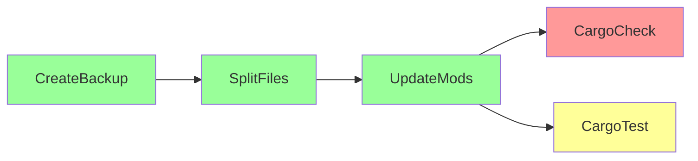
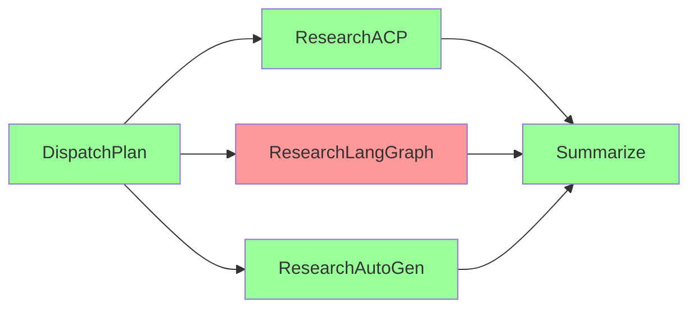
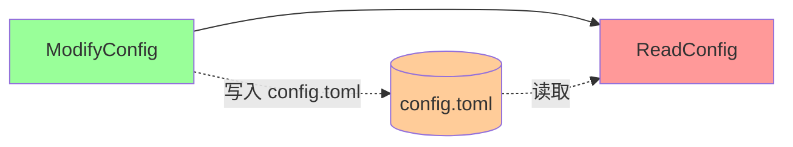

# DAG 多 Agent 编排细化方案

- 文档版本: v0.2
- 创建日期: 2026-07-21
- 最后更新: 2026-07-21(v0.2 补全 SAGA 端到端示例 + Replan + 资源限制 + 性能基准)
- 父文档: [ide-hooks-dag-implementation-plan.md](../ide-hooks-dag-implementation-plan.md)
- v0.1 焦点: petgraph 数据结构 + JoinSet 分层调度 + Plan→DAG 转换 + Checkpointer + YAML 声明式
- v0.2 焦点: SAGA 补偿端到端示例 + Replan 机制 + 资源背压 + CancellationToken 层级 + 与 MultiAgentCoordinator 完整适配层 + 性能基准
- 适用范围: `rust/crates/runtime/src/dag/` 新模块及其与 `multi_agent` / `planner` / `conversation` / `lane_events` 的集成
- 关联代码:
  - `../../rust/crates/runtime/src/multi_agent/mod.rs`
  - `../../rust/crates/runtime/src/planner/mod.rs`
  - `../../rust/crates/runtime/src/planner/artifact.rs`
  - `../../rust/crates/runtime/src/planner/reviewer.rs`
  - `../../rust/crates/runtime/src/task_registry.rs`
  - `../../rust/crates/runtime/src/lane_events.rs`
  - `../../rust/crates/runtime/src/recovery_orchestrator.rs`
  - `../../rust/crates/runtime/src/conversation.rs`

---

## v0.2 变更记录

v0.2 在 v0.1 数据结构骨架基础上补全可直接落地为代码的实施细节。变更类型分布:**新增章节 4 个**(§15–§18)、**完善章节 6 个**(§5/§8/§10/§11/§13/§14)。

### 新增章节

| 章节 | 主题 | 行数估计 | 核心内容 |
|---|---|---|---|
| §15 | SAGA 补偿模式端到端示例 | ~750 | 3 个完整场景:多文件重构 / 并行调研部分失败 / 跨节点状态污染 |
| §16 | Replan 机制 | ~180 | 触发条件 + 算法 + 代码骨架 + doom loop 防护 |
| §17 | 资源限制与背压 | ~150 | max_parallelism 实施 / 内存预算 / Token budget / 背压 |
| §18 | 性能基准 | ~120 | 小/中/大型 DAG 预期 + 并行度影响 + petgraph toposort 基准 |

### 完善章节

| 章节 | v0.1 状态 | v0.2 补充内容 |
|---|---|---|
| §5.3 CancellationToken 层级 | 仅画了层级树 | 补 DAG/节点/子 agent 三级 token 代码骨架 + 取消传播规则表 |
| §5.4 失败传播策略矩阵 | 5 种策略表 | 新增 `ContinueOnFailure` / `BestEffort` 策略 + 场景→策略选择表 |
| §8 Checkpointer | 基础 save/load | 补 CheckpointStore trait 完整定义 + 原子写入流程 + resume 重建 DagGraph 代码骨架 |
| §10 dag_run/dag_status | 路由代码 | 补完整 ToolSpec JSON schema + execute_dag_run/dag_status 完整实现 + 错误处理矩阵 |
| §11 MultiAgentCoordinator 适配层 | 仅 ConversationExecutor + Mock | 补 ForkExecutor / TeammateExecutor / WorktreeExecutor 三种实现 |
| §13 测试矩阵 | 单测+集成+端到端 | 新增 8 个 SAGA/Replan/取消/背压端到端测试用例 |
| §14 风险与缓解 | 6 项风险 | 新增 §14.7(SAGA 补偿失败)/§14.8(Replan 后状态不一致) |

### v0.2 验证接入点

v0.2 写作前已用 Read/Grep 工具核验以下接入点与文档描述一致:

- `multi_agent/mod.rs` L77-280:`MultiAgentCoordinator` 同步接口,`spawn/start/complete/fail/cancel`,`Arc<Mutex<HashMap<String, Subagent>>>`,三种 `CoordinationMode`(Fork/Teammate/Worktree)。
- `planner/artifact.rs` L49-148:`PlanStep` 字段 `id/description/acceptance_criteria/verify_command/last_tool_use_id/status/attempts`;`PlanArtifact` 字段 `id/created_at_ms/task_summary/steps/phase/replan_count`。`trigger_replan` 仅重置 `Failed → Pending`,**不重置 attempts** — DAG Replan 沿用此约定。
- `conversation.rs` L1656 `execute_dispatch_subagent`、L1767 `run_subagent_turn(&mut self, subagent_id, name, task) -> Result<String, String>`(返回 result_ref 相对路径)、L1879 `execute_check_subagent`。`run_subagent_turn` 是 `&mut self`,需通过 trait 抽象才能在 DAG task 中调用(见 §11)。
- `recovery_orchestrator.rs` L60-77:`RecoveryOrchestrator::attempt(&mut self, WorkerFailureKind) -> RecoveryOutcome`。注意签名是 `&mut self`,DAG 调度器需 `Arc<Mutex<RecoveryOrchestrator>>` 包裹,v0.1 §5.2 代码已正确使用 `self.recovery.lock().await.attempt(...)`。
- `lane_events.rs` L6-57:`LaneEventName` 共 23 个变体,`SubagentHandoff`(L53)与 `SubagentResult`(L56)已存在;`LaneFailureClass::SubagentFailure`(L90)可用于 DAG 节点失败事件分类。
- `rust/Cargo.toml`:workspace dependencies **未引入** `petgraph` / `tokio-util` / `serde_yaml` / `async-trait`,需按 §2.2 新增。

---

## 一、现状审计

### 1.1 现有 multi_agent 模块能力盘点

`multi_agent/mod.rs` 当前实现了一个最小可用的 `MultiAgentCoordinator`,提供以下能力:

- 三种 `CoordinationMode`:`Fork` / `Teammate` / `Worktree`,但仅 `Worktree` 会分配独立 workdir,`Fork` 与 `Teammate` 在执行层没有真正差异。
- `Subagent` 生命周期状态机:`Created → Running → Completed / Failed / Cancelled`,带终态保护(不可从终态转移)。
- 同步接口:`spawn` / `start` / `complete` / `fail` / `cancel` 均为同步 `Arc<Mutex<HashMap>>` 操作,没有 `async` 等待语义。
- `join_all` 仅返回当前快照统计(`JoinStats`),不做真正的等待;代码注释明确指出"未来扩展:接入 tokio 异步等待"。

`task_registry.rs` 通过 `with_multi_agent_coordinator` 把 task 与 subagent 关联,但只承担"派发登记 + 结果回写",没有依赖图、并行调度、检查点恢复等编排能力。

`conversation.rs` 的 `execute_dispatch_subagent` / `run_subagent_turn` 实现了 "Subagent as Tool" 模式:主 agent 通过 tool call 派发,子 agent 走独立 LLM 请求(单轮、无 tool call 循环),结果写到 `.claw/subagents/{id}.md`,主 agent 收到 `result_ref` 路径后用 `Read` 读取。该路径是为单 agent 单任务设计的,无法支撑多 agent 并行、跨节点依赖、失败重试编排。

### 1.2 Plan/Execute/Review 三段循环的边界

`planner/artifact.rs` 的 `PlanArtifact` 是一个**线性**步骤容器:

- `steps: Vec<PlanStep>`,顺序敏感,无显式依赖图。
- `current_step_mut` 总是选第一个 `Executing` 或第一个 `Pending`,无法表达"两个 step 同层并行"。
- `trigger_replan` 把所有 `Failed` step 重置为 `Pending`,粒度是"全部失败 step",无法对单个失败 step 做 fallback 或局部重试。
- `verify_command` 是 step 级别的,没有节点级别的 `RetryPolicy` / `fallback_agent` 概念。

`planner/reviewer.rs` 的 `PreCompletionChecklistMiddleware` 只在 turn 末尾做一次 review,不参与 step 之间的调度,无法在 step 完成后立刻触发下游 step。

### 1.3 缺失的 DAG 能力清单

| 能力 | 现状 | DAG 模块需补齐 |
|---|---|---|
| 拓扑依赖 | `PlanStep` 仅有顺序 | `DagNode.depends_on` + petgraph 边 |
| 同层并行 | 不支持 | `JoinSet` + `max_parallelism` |
| 条件路由 | 不支持 | `DagNode.condition` 表达式 |
| 节点级重试 | 全局 `trigger_replan` | `RetryPolicy { max_attempts, backoff, fallback_agent }` |
| 检查点持久化 | `PlanArtifact` 整体写盘 | `CheckpointStore` 节点级增量 |
| 跨会话 resume | 不支持 | `resume(dag_id)` 重放已完成节点 |
| 失败传播策略 | 全局 abort / replan | `DagFailurePolicy` (`RetryThenEscalate` / `Abort` / `Fallback`) |
| 取消传播 | 不支持 | `CancellationToken` 层级(DAG 级 → 节点级) |
| 可视化 | `render_for_prompt` 纯文本 | `render_mermaid` 注入 prompt |

### 1.4 设计原则

DAG 是**编排层**,不替代 `Fork` / `Teammate` / `Worktree`。三模式保留为"执行后端",DAG 层负责:

1. 拓扑调度(同层并行 + 跨层 barrier)
2. 条件路由(if-else 分支)
3. 故障恢复(retry / fallback / replan)
4. 检查点持久化(支持 resume)

DAG 节点执行时仍调用 `MultiAgentCoordinator::spawn` 派发子 agent,即" DAG 决定何时跑、跑谁,Fork/Teammate/Worktree 决定怎么跑"。

---

## 二、依赖与 crate 选型

### 2.1 候选 crate 对比

| crate | 维护状态 | API 风格 | 算法覆盖 | 选型结论 |
|---|---|---|---|---|
| `petgraph` | 活跃(社区主流) | `DiGraph<N, E>` 泛型容器 | `toposort` / `kosaraju_scc` / `dijkstra` / `astar` 开箱即用 | **采用** |
| `daggy` | 维护滞后(基于 petgraph) | 强类型 `Dag` 包装 | 仅 DAG 语义,无新增算法 | 不采用(子集,无收益) |
| `petgraph-stable` | 维护滞后 | `StableDiGraph` | 节点删除后 `NodeIndex` 不变 | 暂不需要(DAG 节点不删除) |

### 2.2 版本选择与 Cargo.toml 配置

当前 `rust/Cargo.toml` workspace dependencies 仅有 `serde_json`,**没有** `petgraph` / `tokio-util`。`runtime/Cargo.toml` 也没有这两项。需新增:

```toml
# rust/Cargo.toml(workspace 根)
[workspace.dependencies]
serde_json = "1"
petgraph = "0.6"
tokio-util = { version = "0.7", features = ["rt"] }
```

```toml
# rust/crates/runtime/Cargo.toml
[dependencies]
# ... 现有依赖 ...
petgraph.workspace = true
tokio-util.workspace = true
```

### 2.3 选型理由详细论证

`petgraph` 选型的关键依据:

1. **`algo::kosaraju_scc`** 提供 SCC(强连通分量)分解,DAG 等价于"所有 SCC 大小均为 1",环检测一行代码即可。比起手写 DFS 染色法更可靠,且复杂度 O(V+E)。
2. **`algo::toposort`** 直接给出拓扑序,用于 `render_mermaid` 的线性化展示和 `topological_order` API。失败(存在环)时返回 `Err<NodeIndex>`,可定位环上第一个节点。
3. **`DiGraph<DagNode, ()>`** 用 `()` 作为边权重,因为依赖关系不需要附加属性(条件表达式存在 `DagNode.condition` 上,不在边上)。未来若需要边属性(如 `EdgeCondition`),可改为 `DiGraph<DagNode, EdgeKind>`。
4. **`neighbors_directed(idx, Direction::Incoming)`** 用于 `ready_nodes` 的入度计算,语义清晰。

`tokio-util` 的 `CancellationToken` 选型依据:

1. **协作式取消**:`cancel.cancelled()` 是 `Future`,在 `tokio::select!` 中可优雅退出,不强制 abort。
2. **层级化**:`child_token()` 创建子 token,父 token 取消时所有子 token 自动取消。DAG 级取消 → 节点级取消 → 子 agent LLM 请求取消,一层层传播。
3. **零开销**:未取消时 `cancelled()` 永远 pending,不消耗 CPU。

### 2.4 替代方案与回退路径

若未来 `petgraph` 维护停滞,可回退到自研 `HashMap<String, DagNode>` + 手写 Kahn 算法(入度表 + 队列)。代价:

- 环检测需手写 DFS 染色(O(V+E)),易错。
- 拓扑序需手写 Kahn(O(V+E)),与 `toposort` 重复造轮子。
- 无社区维护的图算法扩展(最短路、流网络等)。

建议保留 `petgraph` 至少 2 个 major 版本窗口,除非出现安全漏洞或 maintenance 停滞超 12 个月。

---

## 三、DagNode 数据结构

### 3.1 完整字段定义

`DagNode` 是 DAG 中最小的可调度单元,对应 `MultiAgentCoordinator::spawn` 的一次派发。设计原则:

- **声明与运行时分离**:`status` / `attempts` / `result` 标记 `#[serde(skip)]`,只持久化声明部分。
- **复用现有类型**:`mode: CoordinationMode` 直接引用 `multi_agent::CoordinationMode`,不重复定义。
- **可扩展**:新字段(如 `priority` / `resource_quota`)通过 `#[serde(default)]` 平滑加入。

```rust
// rust/crates/runtime/src/dag/node.rs

use serde::{Deserialize, Serialize};
use crate::multi_agent::CoordinationMode;

/// DAG 节点的运行时状态机。
///
/// 状态转移图:
///   Pending ──(依赖满足)──▶ Ready ──(spawn)──▶ Running
///                                                │
///                                  ┌─────────────┼─────────────┐
///                                  ▼             ▼             ▼
///                              Succeeded      Failed       Cancelled
///                                  │             │
///                                  │      (retry < max)
///                                  │             ▼
///                                  │           Ready
///                                  │
///                                  │     (retry >= max, 上游失败)
///                                  ▼             ▼
///                              [terminal]    Skipped
///
/// 终态:Succeeded / Failed / Skipped / Cancelled。
/// `is_terminal()` 用于 `DagScheduler::all_terminal()` 判断 DAG 是否跑完。
#[derive(Debug, Clone, Copy, PartialEq, Eq, Serialize, Deserialize)]
#[serde(rename_all = "camelCase")]
pub enum NodeStatus {
    /// 初始状态:尚未检查依赖。
    Pending,
    /// 依赖已满足,可被调度器拾取。
    Ready,
    /// 已通过 coordinator.spawn 派发,子 agent 正在运行。
    Running,
    /// 子 agent 成功完成,且 verify_command(如有)通过。
    Succeeded,
    /// 子 agent 失败或 verify_command 失败,且重试次数耗尽。
    Failed,
    /// 上游节点 Failed/Skipped,本节点被级联跳过。
    Skipped,
    /// 收到 CancellationToken 取消信号。
    Cancelled,
}

impl NodeStatus {
    #[must_use]
    pub fn is_terminal(self) -> bool {
        matches!(self, Self::Succeeded | Self::Failed | Self::Skipped | Self::Cancelled)
    }

    #[must_use]
    pub fn is_success_like(self) -> bool {
        matches!(self, Self::Succeeded)
    }
}

/// 单个 DAG 节点的完整定义(声明 + 运行时状态)。
#[derive(Debug, Clone, Serialize, Deserialize)]
pub struct DagNode {
    /// 节点全局唯一 ID(用户在 YAML 中指定或 PlanStep.id 透传)。
    pub id: String,
    /// 对应 MultiAgentCoordinator.spawn 的 `name` 参数。
    /// 用于在 LaneEvent 中标识"哪个 agent 跑了这个节点"。
    pub agent: String,
    /// 执行后端模式 — 透传给 coordinator.spawn 的 `mode`。
    pub mode: CoordinationMode,
    /// 任务描述(注入子 agent 的 user message)。
    pub task: String,
    /// 上游节点 ID 列表。空表示根节点(无依赖)。
    #[serde(default)]
    pub depends_on: Vec<String>,
    /// 条件边表达式(如 "result.status == 'succeeded'")。
    /// 求值上下文:上游所有 NodeResult 的 JSON 字段。
    /// None 表示无条件边(只要上游全部 Succeeded 即可触发)。
    #[serde(default)]
    pub condition: Option<String>,

    /// 验证命令(如 "cargo test --no-fail-fast")。
    /// 节点执行后运行,exit_code != 0 视为失败。
    #[serde(default)]
    pub verify_command: Option<String>,

    /// 重试策略:最大次数 + 退避 + fallback agent。
    #[serde(default)]
    pub retry: RetryPolicy,

    /// 节点级超时(秒)。超时触发 CancellationToken 取消。
    #[serde(default = "default_node_timeout")]
    pub timeout_secs: u64,

    /// Worktree 模式专用:独立 git worktree 路径。
    /// Fork/Teammate 模式下应为 None。
    #[serde(default)]
    pub workdir: Option<String>,

    /// 记忆访问权限(MIRIX 启发):控制子 agent 读写哪些记忆层。
    #[serde(default)]
    pub memory_access: MemoryAccess,

    // ===== 运行时状态(不序列化) =====
    #[serde(skip)]
    pub status: NodeStatus,
    #[serde(skip)]
    pub attempts: u32,
    #[serde(skip)]
    pub result: Option<NodeResult>,
    #[serde(skip)]
    pub started_at_ms: Option<u64>,
    #[serde(skip)]
    pub completed_at_ms: Option<u64>,
}

fn default_node_timeout() -> u64 { 300 }
```

### 3.2 RetryPolicy 与退避策略

```rust
/// 节点级重试策略。
///
/// 失败时的处理顺序:
/// 1. attempts < max_attempts → 退避后重试(同一 agent)
/// 2. fallback_agent 存在 → 切换 agent 重试(重置 attempts)
/// 3. 调用 RecoveryOrchestrator.attempt(WorkerFailureKind::...)
/// 4. 整 DAG replan(replan_count < DEFAULT_MAX_REPLANS)
/// 5. 关键路径检查 → 关键路径失败则 DAG 终止
#[derive(Debug, Clone, Serialize, Deserialize)]
pub struct RetryPolicy {
    #[serde(default = "default_max_attempts")]
    pub max_attempts: u32,
    #[serde(default = "default_backoff")]
    pub backoff: BackoffStrategy,
    /// 备用 agent 名称(如 "coder-senior")。
    /// 切换后 attempts 重置为 0,允许重新走一轮 max_attempts。
    #[serde(default)]
    pub fallback_agent: Option<String>,
}

impl Default for RetryPolicy {
    fn default() -> Self {
        Self {
            max_attempts: default_max_attempts(),
            backoff: default_backoff(),
            fallback_agent: None,
        }
    }
}

fn default_max_attempts() -> u32 { 2 }

/// 退避策略。
#[derive(Debug, Clone, Serialize, Deserialize)]
#[serde(rename_all = "snake_case")]
pub enum BackoffStrategy {
    /// 固定间隔重试。
    Fixed { base_secs: u64 },
    /// 指数退避:delay = base_secs * 2^(attempt-1),上限 max_secs。
    Exponential { base_secs: u64, max_secs: u64 },
}

impl Default for BackoffStrategy {
    fn default() -> Self {
        Self::Exponential { base_secs: 5, max_secs: 60 }
    }
}

fn default_backoff() -> BackoffStrategy {
    BackoffStrategy::Exponential { base_secs: 5, max_secs: 60 }
}

impl BackoffStrategy {
    /// 计算第 `attempt` 次重试前的等待时长(attempt 从 1 开始)。
    #[must_use]
    pub fn delay_for(&self, attempt: u32) -> std::time::Duration {
        match self {
            Self::Fixed { base_secs } => std::time::Duration::from_secs(*base_secs),
            Self::Exponential { base_secs, max_secs } => {
                let exp = attempt.saturating_sub(1).min(10); // 防溢出,封顶 2^10
                let secs = (*base_secs).saturating_mul(2u64.pow(exp)).min(*max_secs);
                std::time::Duration::from_secs(secs)
            }
        }
    }
}
```

### 3.3 NodeResult 与 MemoryAccess

```rust
/// 节点执行结果(运行时填充,持久化到 CheckpointStore)。
#[derive(Debug, Clone, Serialize, Deserialize)]
pub struct NodeResult {
    pub node_id: String,
    pub status: NodeStatus,
    /// 人类可读的执行摘要(注入 prompt 给主 agent)。
    pub summary: String,
    /// 文件引用(Anthropic filesystem pattern)。
    /// 子 agent 结果写到 `.claw/subagents/{id}.md`,refs 存相对路径。
    pub refs: Vec<String>,
    /// 子 agent LLM 请求消耗的 tokens(主 agent 用于 budget 控制)。
    pub tokens_used: u64,
    /// 失败时的错误信息(None 表示成功)。
    #[serde(default)]
    pub error: Option<String>,
    /// 执行耗时(毫秒)。
    pub elapsed_ms: u64,
}

/// 记忆访问权限(MIRIX 启发的四层记忆模型)。
#[derive(Debug, Clone, Default, Serialize, Deserialize)]
pub struct MemoryAccess {
    /// 子 agent 可读的记忆层。
    #[serde(default)]
    pub read: Vec<MemoryType>,
    /// 子 agent 可写的记忆层。
    #[serde(default)]
    pub write: Vec<MemoryType>,
}

#[derive(Debug, Clone, Copy, PartialEq, Eq, Serialize, Deserialize)]
#[serde(rename_all = "lowercase")]
pub enum MemoryType {
    /// 过程记忆(NOTEBOOK.md,见 docs/navigation-file-context.md)。
    Notebook,
    /// 语义记忆(SemanticRecaller,基于 fastembed 嵌入)。
    Semantic,
    /// 情节记忆(conversation_search,跨会话历史)。
    Episodic,
    /// 资源记忆(ToolResultArchive,工具调用结果归档)。
    Archive,
}
```

### 3.4 与 PlanStep 的映射关系

`PlanStep` → `DagNode` 的字段映射:

| PlanStep 字段 | DagNode 字段 | 转换规则 |
|---|---|---|
| `id` | `id` | 直接透传 |
| `description` | `task` | 直接透传 |
| `acceptance_criteria` | (丢弃) | DagNode 用 `verify_command` 替代 |
| `verify_command` | `verify_command` | 直接透传 |
| `status` (Pending/Executing/Succeeded/Failed/Skipped) | `status` (Pending/Running/Succeeded/Failed/Skipped) | `Executing` → `Running`,语义对齐 |
| `attempts` | `attempts` | 直接透传 |
| (无) | `agent` | 默认 `"default"`,YAML 可指定 |
| (无) | `mode` | 默认 `Fork`,YAML 可指定 |
| (无) | `depends_on` | 默认线性链(前一个 step);若 `description` 含 "并行"/"parallel",继承前一个的 `depends_on` |
| (无) | `retry` | 默认 `RetryPolicy::default()`,YAML 可指定 |

映射代码见第六章 `from_plan_step`。

---

## 四、DagGraph 数据结构

### 4.1 petgraph DiGraph 封装

`DagGraph` 封装 `petgraph::graph::DiGraph<DagNode, ()>`,对外暴露 ID 索引(`node_map: HashMap<String, NodeIndex>`),隐藏 `NodeIndex` 的内部表示。

```rust
// rust/crates/runtime/src/dag/graph.rs

use std::collections::HashMap;
use petgraph::algo::{kosaraju_scc, toposort};
use petgraph::graph::{DiGraph, NodeIndex};
use petgraph::Direction;
use serde::{Deserialize, Serialize};

use super::node::{DagNode, NodeStatus};

/// DAG 失败策略 — 控制节点失败时 DAG 整体如何反应。
#[derive(Debug, Clone, Copy, Serialize, Deserialize, Default, PartialEq, Eq)]
#[serde(rename_all = "camelCase")]
pub enum DagFailurePolicy {
    /// 默认:重试 → fallback → RecoveryOrchestrator → replan → 关键路径检查。
    #[default]
    RetryThenEscalate,
    /// 仅重试,不升级到 RecoveryOrchestrator。
    Retry,
    /// 失败立即切换 fallback agent(跳过重试)。
    Fallback,
    /// 任何节点失败立即终止整个 DAG。
    Abort,
    /// 失败升级到 RecoveryOrchestrator(跳过重试)。
    Escalate,
}

/// 检查点策略 — 控制何时持久化节点状态。
#[derive(Debug, Clone, Copy, Serialize, Deserialize, Default, PartialEq, Eq)]
#[serde(rename_all = "camelCase")]
pub enum CheckpointPolicy {
    /// 默认:每个节点完成后写检查点(最安全,IO 开销最大)。
    #[default]
    EveryNode,
    /// 仅失败时写检查点(节省 IO,成功节点靠内存状态)。
    OnFailure,
    /// 不持久化(纯内存运行,失败即丢失)。
    None,
}

/// DAG 全局配置(从 YAML `dag:` 段解析)。
#[derive(Debug, Clone, Serialize, Deserialize)]
pub struct DagConfig {
    pub max_parallelism: usize,
    pub token_budget: u64,
    pub timeout_secs: u64,
    #[serde(default)]
    pub on_failure: DagFailurePolicy,
    #[serde(default)]
    pub checkpoint_policy: CheckpointPolicy,
}

impl Default for DagConfig {
    fn default() -> Self {
        Self {
            max_parallelism: 4,
            token_budget: 200_000,
            timeout_secs: 1800,
            on_failure: DagFailurePolicy::RetryThenEscalate,
            checkpoint_policy: CheckpointPolicy::EveryNode,
        }
    }
}

/// petgraph 封装的 DAG 主结构。
#[derive(Debug, Clone)]
pub struct DagGraph {
    /// 内部图表示。边 `()` 表示"无条件的依赖关系";
    /// 条件表达式存在 `DagNode.condition` 字段,求值时再判断。
    graph: DiGraph<DagNode, ()>,
    /// 节点 ID → petgraph NodeIndex 的索引(避免每次遍历查找)。
    node_map: HashMap<String, NodeIndex>,

    /// DAG 全局元信息。
    pub id: String,
    pub task_summary: String,
    pub config: DagConfig,
    /// 整 DAG 的 replan 次数(用于防止 doom loop)。
    pub replan_count: u32,
}

impl DagGraph {
    /// 构造 DAG 并验证无环。
    ///
    /// # Errors
    /// - `MissingDependency(id)`:`depends_on` 引用了不存在的节点。
    /// - `CycleDetected(nodes)`:检测到环(用 Kosaraju SCC)。
    pub fn new(
        id: String,
        task_summary: String,
        nodes: Vec<DagNode>,
        config: DagConfig,
    ) -> Result<Self, DagError> {
        let mut graph = DiGraph::new();
        let mut node_map = HashMap::new();

        // 第一遍:添加所有节点(初始化 status = Pending)。
        for mut node in nodes {
            node.status = NodeStatus::Pending;
            node.attempts = 0;
            node.result = None;
            let idx = graph.add_node(node.clone());
            node_map.insert(node.id.clone(), idx);
        }

        // 第二遍:添加依赖边。dep → node(箭头方向 = 数据流向)。
        for idx in graph.node_indices() {
            // clone depends_on 避免借用冲突
            let deps: Vec<String> = graph
                .node_weight(idx)
                .map(|n| n.depends_on.clone())
                .unwrap_or_default();
            for dep_id in deps {
                let dep_idx = *node_map
                    .get(&dep_id)
                    .ok_or(DagError::MissingDependency(dep_id.clone()))?;
                graph.add_edge(dep_idx, idx, ());
            }
        }

        let dag = Self { graph, node_map, id, task_summary, config, replan_count: 0 };
        dag.validate_acyclic()?;
        Ok(dag)
    }

    /// 环检测:用 Kosaraju SCC 算法。
    /// DAG 等价于"所有 SCC 大小均为 1"。若任一 SCC 大小 > 1,即存在环。
    fn validate_acyclic(&self) -> Result<(), DagError> {
        let sccs = kosaraju_scc(&self.graph);
        for scc in sccs {
            if scc.len() > 1 {
                let cycle_nodes: Vec<String> = scc
                    .iter()
                    .filter_map(|idx| self.graph.node_weight(*idx).map(|n| n.id.clone()))
                    .collect();
                return Err(DagError::CycleDetected(cycle_nodes));
            }
            // 自环(单节点 SCC 但有 self-loop)也需检测
            if scc.len() == 1 {
                let idx = scc[0];
                if self.graph.contains_edge(idx, idx) {
                    let id = self.graph.node_weight(idx).map(|n| n.id.clone()).unwrap_or_default();
                    return Err(DagError::CycleDetected(vec![id]));
                }
            }
        }
        Ok(())
    }

    /// 获取所有就绪节点(状态 = Pending 且所有上游 Succeeded)。
    /// 用 Kahn 入度法的变体:不走全局拓扑,而是单点检查(适合增量调度)。
    pub fn ready_nodes(&self) -> Vec<&DagNode> {
        self.graph
            .node_indices()
            .filter_map(|idx| {
                let node = self.graph.node_weight(idx)?;
                if node.status != NodeStatus::Pending {
                    return None;
                }
                if self.all_deps_succeeded(idx) {
                    Some(node)
                } else {
                    None
                }
            })
            .collect()
    }

    /// 检查节点所有上游是否已 Succeeded。
    /// 跳过条件边的求值(条件边在 `evaluate_downstream` 中处理)。
    fn all_deps_succeeded(&self, idx: NodeIndex) -> bool {
        self.graph
            .neighbors_directed(idx, Direction::Incoming)
            .all(|dep_idx| {
                self.graph
                    .node_weight(dep_idx)
                    .map(|n| n.status == NodeStatus::Succeeded)
                    .unwrap_or(false)
            })
    }

    /// 标记节点状态(运行时调度器调用)。
    pub fn mark_status(&mut self, node_id: &str, status: NodeStatus) {
        if let Some(idx) = self.node_map.get(node_id) {
            if let Some(node) = self.graph.node_weight_mut(*idx) {
                node.status = status;
            }
        }
    }

    /// 增加节点尝试次数(每次 spawn 子 agent 前调用)。
    pub fn increment_attempts(&mut self, node_id: &str) {
        if let Some(idx) = self.node_map.get(node_id) {
            if let Some(node) = self.graph.node_weight_mut(*idx) {
                node.attempts += 1;
            }
        }
    }

    /// 写回节点结果(成功/失败时调用)。
    pub fn set_result(&mut self, node_id: &str, result: super::node::NodeResult) {
        if let Some(idx) = self.node_map.get(node_id) {
            if let Some(node) = self.graph.node_weight_mut(*idx) {
                node.result = Some(result);
            }
        }
    }

    /// 是否所有节点都已到达终态。
    pub fn all_terminal(&self) -> bool {
        self.graph
            .node_weights()
            .all(|n| n.status.is_terminal())
    }

    /// 获取节点引用(用于调度器读取声明信息)。
    pub fn get_node(&self, node_id: &str) -> Result<&DagNode, DagError> {
        let idx = self
            .node_map
            .get(node_id)
            .ok_or_else(|| DagError::NodeNotFound(node_id.to_string()))?;
        self.graph
            .node_weight(*idx)
            .ok_or_else(|| DagError::NodeNotFound(node_id.to_string()))
    }

    /// 拓扑排序(用于线性化展示和 resume 时按序重放)。
    pub fn topological_order(&self) -> Vec<&DagNode> {
        match toposort(&self.graph, None) {
            Ok(indices) => indices
                .iter()
                .filter_map(|idx| self.graph.node_weight(*idx))
                .collect(),
            Err(_) => Vec::new(), // 不应发生(构造时已验证无环)
        }
    }

    /// 渲染为 Mermaid(注入 prompt 给主 agent 看执行计划)。
    pub fn render_mermaid(&self) -> String {
        let mut out = String::from("graph LR\n");
        for idx in self.graph.node_indices() {
            if let Some(node) = self.graph.node_weight(idx) {
                let label: String = node.task.chars().take(30).collect();
                let shape = match node.status {
                    NodeStatus::Succeeded => "((",
                    NodeStatus::Failed => "[[",
                    NodeStatus::Running => "{{",
                    _ => "[",
                };
                let close = match node.status {
                    NodeStatus::Succeeded => "))",
                    NodeStatus::Failed => "]]",
                    NodeStatus::Running => "}}",
                    _ => "]",
                };
                out.push_str(&format!("    {}{}\"{}\"{}\n", node.id, shape, label, close));
            }
        }
        for edge in self.graph.raw_edges() {
            let src = &self.graph[edge.source()].id;
            let dst = &self.graph[edge.target()].id;
            out.push_str(&format!("    {} --> {}\n", src, dst));
        }
        out
    }
}

#[derive(Debug, thiserror::Error)]
pub enum DagError {
    #[error("missing dependency: {0}")]
    MissingDependency(String),
    #[error("cycle detected involving nodes: {0:?}")]
    CycleDetected(Vec<String>),
    #[error("node not found: {0}")]
    NodeNotFound(String),
    #[error("yaml parse error: {0}")]
    YamlParse(String),
    #[error("condition evaluation failed: {0}")]
    ConditionEval(String),
    #[error("node panic: {0}")]
    NodePanic(String),
    #[error("deadlock: no ready nodes but non-terminal nodes remain")]
    Deadlock,
    #[error("timeout: DAG exceeded {} secs", .0)]
    Timeout(u64),
    #[error("checkpoint io error: {0}")]
    CheckpointIo(String),
}
```

### 4.2 Kosaraju SCC 算法说明

`petgraph::algo::kosaraju_scc` 返回 `Vec<Vec<NodeIndex>>`,每个内层 Vec 是一个强连通分量。DAG 的定义是"没有环",等价于"所有 SCC 大小均为 1 且无自环"。我们因此:

- 若任一 SCC 大小 > 1 → 存在多节点环,返回 `CycleDetected(节点 ID 列表)`。
- 若 SCC 大小 = 1 但存在 `self_loop` → 单节点自环,也返回 `CycleDetected`。

复杂度:O(V+E),V 是节点数,E 是边数。对于 100 节点 500 边的 DAG,单次环检测 < 1ms。

### 4.3 ready_nodes 的入度法变体

经典 Kahn 算法维护全局入度表,逐个消费入度为 0 的节点。我们的 `ready_nodes` 是**增量**版本:每次调用时,只对状态为 `Pending` 的节点检查"所有上游 Succeeded",而非维护全局入度。

理由:

- DAG 调度是事件驱动的(节点完成 → 触发新一轮 `ready_nodes`),不需要一次性算出所有节点的拓扑序。
- 节点状态会变化(Running → Succeeded),全局入度表需要同步更新,容易出错。
- 增量检查的复杂度 O(剩余 Pending 节点数 × 平均入度),在调度循环中可接受。

---

## 五、DagScheduler 调度引擎

### 5.1 调度算法总览

`DagScheduler` 是 DAG 的执行核心,负责:

1. **分层并行**:每一轮收集所有 `ready_nodes`,用 `JoinSet` 并行 spawn 子 agent。
2. **结果收集**:`join_next().await` 逐个收结果,每收一个就更新节点状态 + 写检查点。
3. **失败传播**:根据 `DagFailurePolicy` 决定重试 / fallback / abort。
4. **取消层级**:DAG 级 `CancellationToken` → 节点级 `child_token()`,父取消传播到所有子。
5. **超时守护**:整个 DAG 有 `timeout_secs` 超时;每个节点也有自己的 `timeout_secs`。

### 5.2 完整代码骨架

```rust
// rust/crates/runtime/src/dag/scheduler.rs

use std::sync::Arc;
use std::time::Duration;
use tokio::sync::Mutex;
use tokio::task::JoinSet;
use tokio::time::Instant;
use tokio_util::sync::CancellationToken;

use crate::multi_agent::MultiAgentCoordinator;
use crate::recovery_orchestrator::RecoveryOrchestrator;
use crate::worker_boot::WorkerFailureKind;

use super::graph::{CheckpointPolicy, DagError, DagGraph, DagFailurePolicy};
use super::node::{NodeResult, NodeStatus};

/// DAG 执行的整体结果。
#[derive(Debug, Clone)]
pub struct DagRunResult {
    pub dag_id: String,
    pub total_tokens: u64,
    pub succeeded: usize,
    pub failed: usize,
    pub skipped: usize,
    pub elapsed_ms: u64,
    pub mermaid: String,
}

/// DAG 调度器 — 持有可变 DagGraph + 共享的 coordinator/recovery。
pub struct DagScheduler {
    pub(crate) dag: DagGraph,
    coordinator: Arc<Mutex<MultiAgentCoordinator>>,
    recovery: Arc<Mutex<RecoveryOrchestrator>>,
    /// DAG 级取消 token。cancel() 后所有节点级 child_token 同步取消。
    cancel_token: CancellationToken,
    checkpoint_store: super::checkpoint::CheckpointStore,
}

impl DagScheduler {
    pub fn new(
        dag: DagGraph,
        coordinator: Arc<Mutex<MultiAgentCoordinator>>,
        recovery: Arc<Mutex<RecoveryOrchestrator>>,
        cancel_token: CancellationToken,
        checkpoint_store: super::checkpoint::CheckpointStore,
    ) -> Self {
        Self { dag, coordinator, recovery, cancel_token, checkpoint_store }
    }

    /// 启动调度循环。阻塞直到所有节点到达终态或 DAG 失败/超时。
    pub async fn run(&mut self) -> Result<DagRunResult, DagError> {
        let mut total_tokens = 0u64;
        let start = Instant::now();
        let dag_deadline = start + Duration::from_secs(self.dag.config.timeout_secs);

        loop {
            // 0. DAG 级取消检查
            if self.cancel_token.is_cancelled() {
                self.cascade_cancel_all();
                return Err(DagError::Timeout(self.dag.config.timeout_secs));
            }

            // 1. 收集就绪节点(Pending + 上游全 Succeeded)
            let ready: Vec<String> = self
                .dag
                .ready_nodes()
                .into_iter()
                .map(|n| n.id.clone())
                .collect();

            if ready.is_empty() {
                if self.dag.all_terminal() {
                    return Ok(self.build_result(total_tokens, start));
                }
                // 死锁检测:无就绪节点但仍有非终态节点
                // 可能原因:条件边求值失败 / 上游 Skipped 未级联
                return Err(DagError::Deadlock);
            }

            // 2. 同层并行执行(JoinSet + child_token)
            let mut joinset: JoinSet<Result<NodeResult, DagError>> = JoinSet::new();
            let parallelism = self.dag.config.max_parallelism.min(ready.len());

            for node_id in ready.iter().take(parallelism) {
                let node_cancel = self.cancel_token.child_token();
                let coordinator = self.coordinator.clone();
                let node = self.dag.get_node(node_id)?.clone();

                // 标记 Running + 增加尝试次数
                self.dag.mark_status(node_id, NodeStatus::Running);
                self.dag.increment_attempts(node_id);

                // 发布 DagNodeStarted lane event
                self.emit_dag_node_started(node_id);

                let cancel = node_cancel;
                joinset.spawn(async move {
                    run_node(&node, coordinator, cancel).await
                });
            }

            // 3. 逐个收集结果(不等全部完成再处理,先到先处理)
            while let Some(res) = joinset.join_next().await {
                let node_result = res
                    .map_err(|e| DagError::NodePanic(e.to_string()))??;
                total_tokens += node_result.tokens_used;

                // 4. 检查点持久化
                if self.dag.config.checkpoint_policy != CheckpointPolicy::None {
                    if let Err(e) = self.checkpoint_store.save_node(&self.dag.id, &node_result).await {
                        // 检查点失败不阻断调度(降级到 OnFailure 策略)
                        tracing::warn!("checkpoint save failed for node {}: {e}", node_result.node_id);
                    }
                }

                // 5. 状态更新 + 事件发布
                if node_result.status == NodeStatus::Succeeded {
                    self.dag.mark_status(&node_result.node_id, NodeStatus::Succeeded);
                    self.dag.set_result(&node_result.node_id, node_result.clone());
                    self.emit_dag_node_completed(&node_result);
                } else if node_result.status == NodeStatus::Cancelled {
                    self.dag.mark_status(&node_result.node_id, NodeStatus::Cancelled);
                    self.emit_dag_node_failed(&node_result);
                } else {
                    // Failed — 走失败处理流程
                    let should_continue = self.handle_node_failure(&node_result).await?;
                    if !should_continue {
                        // 关键路径失败 → 级联跳过下游 + 终止 DAG
                        self.cascade_skip_downstream(&node_result.node_id);
                        self.emit_dag_node_failed(&node_result);
                        return Err(DagError::Deadlock);
                    }
                    self.emit_dag_node_failed(&node_result);
                }
            }

            // 6. DAG 级超时检查
            if Instant::now() >= dag_deadline {
                self.cancel_token.cancel();
                self.cascade_cancel_all();
                return Err(DagError::Timeout(self.dag.config.timeout_secs));
            }
        }
    }

    /// 节点失败处理:retry → fallback → RecoveryOrchestrator → replan → 关键路径。
    async fn handle_node_failure(&mut self, result: &NodeResult) -> Result<bool, DagError> {
        let node = self.dag.get_node(&result.node_id)?.clone();
        let policy = self.dag.config.on_failure;

        // 1. 重试(attempts < max_attempts)
        if policy == DagFailurePolicy::RetryThenEscalate
            || policy == DagFailurePolicy::Retry
        {
            if node.attempts < node.retry.max_attempts {
                self.dag.mark_status(&result.node_id, NodeStatus::Ready);
                let delay = node.retry.backoff.delay_for(node.attempts);
                tokio::time::sleep(delay).await;
                return Ok(true);
            }
        }

        // 2. fallback agent(切换 agent,重置 attempts)
        if policy == DagFailurePolicy::RetryThenEscalate
            || policy == DagFailurePolicy::Fallback
        {
            if let Some(fallback) = &node.retry.fallback_agent {
                self.dag.update_node_agent(&result.node_id, fallback);
                self.dag.reset_attempts(&result.node_id);
                self.dag.mark_status(&result.node_id, NodeStatus::Ready);
                return Ok(true);
            }
        }

        // 3. RecoveryOrchestrator
        if policy == DagFailurePolicy::RetryThenEscalate
            || policy == DagFailurePolicy::Escalate
        {
            let failure_kind = WorkerFailureKind::Provider; // 简化:实际应从 result 推断
            let outcome = self.recovery.lock().await.attempt(failure_kind);
            if outcome.recovered() {
                self.dag.mark_status(&result.node_id, NodeStatus::Ready);
                return Ok(true);
            }
        }

        // 4. 整 DAG replan(replan_count < DEFAULT_MAX_REPLANS)
        const DEFAULT_MAX_REPLANS: u32 = 3;
        if self.dag.replan_count < DEFAULT_MAX_REPLANS {
            self.dag.replan_count += 1;
            // 简化:仅重置失败节点为 Pending(完整 replan 应调用 planner 重新生成)
            self.dag.mark_status(&result.node_id, NodeStatus::Pending);
            return Ok(true);
        }

        // 5. 关键路径检查(失败节点是否在任何 Succeeded 节点的下游路径上)
        if self.is_critical_path(&result.node_id) {
            return Ok(false);
        }
        Ok(true)
    }

    /// 级联跳过下游节点(上游 Failed → 下游 Skipped)。
    fn cascade_skip_downstream(&mut self, failed_node_id: &str) {
        let downstream: Vec<String> = self.collect_downstream(failed_node_id);
        for id in downstream {
            self.dag.mark_status(&id, NodeStatus::Skipped);
        }
    }

    /// 收集节点的所有下游节点(传递闭包)。
    fn collect_downstream(&self, node_id: &str) -> Vec<String> {
        let start_idx = match self.dag.node_map.get(node_id) {
            Some(idx) => *idx,
            None => return Vec::new(),
        };
        let mut visited = std::collections::HashSet::new();
        let mut stack = vec![start_idx];
        let mut result = Vec::new();
        while let Some(idx) = stack.pop() {
            if !visited.insert(idx) {
                continue;
            }
            for neighbor in self.dag.graph.neighbors_directed(idx, petgraph::Direction::Outgoing) {
                if let Some(n) = self.dag.graph.node_weight(neighbor) {
                    if n.status == NodeStatus::Pending {
                        result.push(n.id.clone());
                    }
                }
                stack.push(neighbor);
            }
        }
        result
    }

    /// 取消所有仍在 Running 的节点。
    fn cascade_cancel_all(&mut self) {
        for idx in self.dag.graph.node_indices() {
            if let Some(node) = self.dag.graph.node_weight_mut(idx) {
                if node.status == NodeStatus::Running {
                    node.status = NodeStatus::Cancelled;
                }
            }
        }
    }

    /// 判断节点是否在关键路径上(简化:任何已 Succeeded 节点的下游 = 关键)。
    fn is_critical_path(&self, node_id: &str) -> bool {
        // 简化实现:若 DAG 中已有 Succeeded 节点,则失败节点在关键路径
        // 完整实现应计算最长路径,这里仅作启发式
        self.dag.graph.node_weights().any(|n| n.status == NodeStatus::Succeeded)
    }

    fn build_result(&self, total_tokens: u64, start: Instant) -> DagRunResult {
        let (succeeded, failed, skipped) = self.dag.graph.node_weights().fold(
            (0usize, 0usize, 0usize),
            |(s, f, sk), n| match n.status {
                NodeStatus::Succeeded => (s + 1, f, sk),
                NodeStatus::Failed => (s, f + 1, sk),
                NodeStatus::Skipped => (s, f, sk + 1),
                _ => (s, f, sk),
            },
        );
        DagRunResult {
            dag_id: self.dag.id.clone(),
            total_tokens,
            succeeded,
            failed,
            skipped,
            elapsed_ms: start.elapsed().as_millis() as u64,
            mermaid: self.dag.render_mermaid(),
        }
    }
}

/// 执行单个 DAG 节点(在 JoinSet task 中运行)。
async fn run_node(
    node: &super::node::DagNode,
    coordinator: Arc<Mutex<MultiAgentCoordinator>>,
    cancel: CancellationToken,
) -> Result<NodeResult, DagError> {
    let start = std::time::Instant::now();

    // 1. 通过 MultiAgentCoordinator spawn 子 agent
    let subagent_id = {
        let mut coord = coordinator.lock().await;
        coord.spawn(&node.agent, &node.task, node.mode)
    };

    // 2. 执行子 agent turn(复用现有 run_subagent_turn 逻辑,
    //    但需要从 ConversationRuntime 借用 api_client — 实际实现需调整签名)
    let task_result = tokio::select! {
        r = run_subagent_turn_isolated(node, &subagent_id) => r,
        _ = cancel.cancelled() => {
            return Ok(NodeResult {
                node_id: node.id.clone(),
                status: NodeStatus::Cancelled,
                summary: "cancelled by DAG".into(),
                refs: vec![],
                tokens_used: 0,
                error: Some("cancelled".into()),
                elapsed_ms: start.elapsed().as_millis() as u64,
            });
        }
        _ = tokio::time::sleep(Duration::from_secs(node.timeout_secs)) => {
            return Ok(NodeResult {
                node_id: node.id.clone(),
                status: NodeStatus::Failed,
                summary: format!("timeout after {}s", node.timeout_secs),
                refs: vec![],
                tokens_used: 0,
                error: Some("node timeout".into()),
                elapsed_ms: start.elapsed().as_millis() as u64,
            });
        }
    };

    let mut result = task_result?;
    result.node_id = node.id.clone();
    result.elapsed_ms = start.elapsed().as_millis() as u64;

    // 3. 验证(若有 verify_command)
    if result.status == NodeStatus::Succeeded {
        if let Some(verify_cmd) = &node.verify_command {
            let exit_code = run_verify_command(verify_cmd).await;
            if exit_code != 0 {
                result.status = NodeStatus::Failed;
                result.error = Some(format!("verify failed: exit {exit_code}"));
            }
        }
    }

    Ok(result)
}

/// 隔离执行子 agent turn(复用 conversation.rs 的 run_subagent_turn 逻辑)。
/// 实际实现需将 run_subagent_turn 抽取为可独立调用的函数,或通过 trait 注入。
async fn run_subagent_turn_isolated(
    _node: &super::node::DagNode,
    _subagent_id: &str,
) -> Result<NodeResult, DagError> {
    // 占位实现 — 实际集成时调用 ConversationRuntime::run_subagent_turn
    // 并把结果转换为 NodeResult(见第七章 dag_run 工具实现)
    Ok(NodeResult {
        node_id: String::new(),
        status: NodeStatus::Succeeded,
        summary: "placeholder".into(),
        refs: vec![],
        tokens_used: 0,
        error: None,
        elapsed_ms: 0,
    })
}

/// 执行验证命令(如 cargo test)。
async fn run_verify_command(cmd: &str) -> i32 {
    let parts: Vec<&str> = cmd.split_whitespace().collect();
    if parts.is_empty() {
        return -1;
    }
    let output = tokio::process::Command::new(parts[0])
        .args(&parts[1..])
        .output()
        .await;
    match output {
        Ok(o) => o.status.code().unwrap_or(-1),
        Err(_) => -1,
    }
}
```

### 5.3 CancellationToken 层级设计

#### 5.3.1 三级 token 层级

```
DAG 级 cancel_token (DagScheduler 持有,由 conversation.rs 注入 self.cancel_token.child_token())
├── 节点 A child_token (joinset.spawn 时由 self.cancel_token.child_token() 生成)
│   └── 子 agent LLM 请求 tokio::select! 监听 (run_subagent_turn 内部)
├── 节点 B child_token
│   └── 子 agent LLM 请求
└── 节点 C child_token
    └── 子 agent LLM 请求
```

三级 token 各自的语义:

| 级别 | 持有者 | 触发时机 | 影响范围 |
|---|---|---|---|
| DAG 级 | `DagScheduler.cancel_token` | 主 agent 取消 / DAG 超时 / 关键路径失败 | 所有未终态节点立即 Cancelled |
| 节点级 | `run_node` task 内 `node_cancel` | 节点超时 / 用户单独取消某节点 | 仅该节点 Cancelled,DAG 继续(若非关键路径) |
| 子 agent 级 | `run_subagent_turn` 内 `tokio::select!` | 节点级 token 触发 / 子 agent 自身超时 | LLM 流式请求中断,返回已收到的部分 |

#### 5.3.2 三级 token 代码骨架

```rust
// rust/crates/runtime/src/dag/scheduler.rs(扩展)

use tokio_util::sync::CancellationToken;
use std::sync::Arc;
use tokio::sync::Mutex;
use tokio::task::JoinSet;

impl DagScheduler {
    /// 创建 DAG 级 token + 注入到每个节点 task。
    ///
    /// 调用关系:
    /// - conversation.rs::execute_dag_run 调用 `self.cancel_token.child_token()`
    ///   生成 DAG 级 token,传入 DagScheduler::new。
    /// - DagScheduler::run 对每个 ready 节点调用 `self.cancel_token.child_token()`
    ///   生成节点级 token,传入 joinset.spawn 的 task。
    /// - run_node task 内通过 `tokio::select!` 监听 node_cancel.cancelled()。
    /// - ConversationExecutor::execute 内部进一步 `node_cancel.child_token()`
    ///   生成子 agent 级 token,传给 run_subagent_turn(需扩展签名)。
    pub fn new(
        dag: DagGraph,
        coordinator: Arc<Mutex<MultiAgentCoordinator>>,
        recovery: Arc<Mutex<RecoveryOrchestrator>>,
        cancel_token: CancellationToken, // ← DAG 级 token(已是 child)
        checkpoint_store: super::checkpoint::CheckpointStore,
    ) -> Self {
        Self { dag, coordinator, recovery, cancel_token, checkpoint_store, executor: None }
    }

    /// 单独取消某个节点(不影响其他节点)。
    /// 仅当该节点不是关键路径上的节点时使用。
    pub fn cancel_node(&mut self, node_id: &str) -> Result<(), DagError> {
        let node = self.dag.get_node(node_id)?.clone();
        if !node.status.is_terminal() {
            // 标记 Cancelled,下一轮 ready_nodes 不会再拾取
            self.dag.mark_status(node_id, NodeStatus::Cancelled);
            // 注:节点级 token 存储在 JoinSet task 内,无法外部取消;
            // 实际实现需把 node_cancel 提到 JoinSet 外部,用 HashMap<String, CancellationToken> 维护。
        }
        Ok(())
    }
}

/// 执行单个 DAG 节点 — 三级 token 的中间层。
async fn run_node(
    node: &super::node::DagNode,
    coordinator: Arc<Mutex<MultiAgentCoordinator>>,
    node_cancel: CancellationToken, // ← 节点级 token(由 DAG 级 child_token 生成)
    executor: Arc<dyn SubagentExecutor>,
) -> Result<NodeResult, DagError> {
    let start = std::time::Instant::now();

    // 生成子 agent 级 token(节点级 token 的 child)
    let subagent_cancel = node_cancel.child_token();

    // 三种退出路径:
    // 1. 子 agent 正常完成 → 返回 Succeeded/Failed
    // 2. 节点级 token 取消(来自 DAG 级或显式 cancel_node)→ 返回 Cancelled
    // 3. 节点超时 → 返回 Failed(timeout)
    let task_result = tokio::select! {
        r = executor.execute_with_cancel(node, coordinator.clone(), subagent_cancel) => r,
        _ = node_cancel.cancelled() => {
            NodeResult {
                node_id: node.id.clone(),
                status: NodeStatus::Cancelled,
                summary: "cancelled by DAG-level or node-level token".into(),
                refs: vec![],
                tokens_used: 0,
                error: Some("cancelled".into()),
                elapsed_ms: start.elapsed().as_millis() as u64,
            }
        }
        _ = tokio::time::sleep(Duration::from_secs(node.timeout_secs)) => {
            NodeResult {
                node_id: node.id.clone(),
                status: NodeStatus::Failed,
                summary: format!("node timeout after {}s", node.timeout_secs),
                refs: vec![],
                tokens_used: 0,
                error: Some("node timeout".into()),
                elapsed_ms: start.elapsed().as_millis() as u64,
            }
        }
    };

    let mut result = task_result;
    result.node_id = node.id.clone();
    result.elapsed_ms = start.elapsed().as_millis() as u64;

    // 验证(若有 verify_command)— 验证阶段不响应取消(快速执行)
    if result.status == NodeStatus::Succeeded {
        if let Some(verify_cmd) = &node.verify_command {
            let exit_code = run_verify_command(verify_cmd).await;
            if exit_code != 0 {
                result.status = NodeStatus::Failed;
                result.error = Some(format!("verify failed: exit {exit_code}"));
            }
        }
    }

    Ok(result)
}
```

#### 5.3.3 取消传播规则

| 触发源 | DAG 级 token | 节点级 token | 子 agent 级 token | 行为 |
|---|---|---|---|---|
| 主 agent 用户中断(Ctrl+C) | cancel() | 自动 cancel(子 token) | 自动 cancel | 所有节点 Cancelled,DAG 退出 |
| DAG 超时(`timeout_secs` 到期) | cancel() | 自动 cancel | 自动 cancel | 同上,返回 `DagError::Timeout` |
| 关键路径节点 Failed | cancel() | 自动 cancel | 自动 cancel | 同上,返回 `DagError::Deadlock` |
| 单节点超时(`node.timeout_secs`) | 不变 | cancel(由 `tokio::select!` 触发) | 自动 cancel | 仅该节点 Failed/Cancelled,DAG 继续 |
| `cancel_node(node_id)` 调用 | 不变 | cancel | 自动 cancel | 仅该节点 Cancelled,DAG 继续 |
| 子 agent LLM 异常 | 不变 | 不变 | 不变(由 executor 返回 Failed) | 节点 Failed,走 `handle_node_failure` |

**关键约束**:节点级 token 一旦创建(进入 `JoinSet::spawn`),其句柄存储在 task 内部,外部无法直接取消。要支持 `cancel_node`,需把 `HashMap<String, CancellationToken>` 提到 `DagScheduler` 字段,spawn 前插入,spawn 后由 task 内 `node_cancel.cancelled()` 监听。这是 v0.2 实施细节,v0.1 代码骨架未涵盖。

#### 5.3.4 取消后的状态一致性

取消传播完成后,DAG 必须保证:

1. **所有 Running 节点最终变为 Cancelled**(不是 Running 也不是 Pending)。`cascade_cancel_all` 函数遍历所有节点,把 Running 改为 Cancelled。
2. **JoinSet 中所有 task 都已结束**。`JoinSet::join_next().await` 在 `None` 返回前不应退出 run 循环,否则会有孤儿 task。v0.1 §5.2 代码在 `cancel_token.is_cancelled()` 后直接 return,存在孤儿 task 风险,v0.2 修复方案:

```rust
// 取消后的清理流程
async fn drain_joinset(joinset: &mut JoinSet<Result<NodeResult, DagError>>) {
    while joinset.join_next().await.is_some() {
        // 丢弃所有剩余结果(都应该是 Cancelled)
    }
}
```

3. **Checkpoint 一致性**:取消后立即写一次 Checkpoint,记录所有节点的 Cancelled 状态。Resume 时这些节点保持 Cancelled(不会重新执行),除非用户显式 `--reset` 重置。

---

### 5.4 失败传播策略矩阵

#### 5.4.1 v0.2 新增策略

v0.1 定义了 5 种 `DagFailurePolicy`:`RetryThenEscalate` / `Retry` / `Fallback` / `Abort` / `Escalate`。v0.2 新增 2 种以支持部分失败容错场景(见 §15.2 场景 2):

```rust
// rust/crates/runtime/src/dag/graph.rs(扩展 DagFailurePolicy)

#[derive(Debug, Clone, Copy, Serialize, Deserialize, PartialEq, Eq)]
#[serde(rename_all = "camelCase")]
pub enum DagFailurePolicy {
    // ... v0.1 5 种变体 ...

    /// ★ v0.2 新增:继续执行不依赖失败节点的后续节点。
    /// 失败节点的下游标记 Skipped,但其他分支继续。
    /// 适用于:并行调研、部分结果可用场景。
    ContinueOnFailure,

    /// ★ v0.2 新增:尽最大努力执行所有可执行节点。
    /// 即使有节点失败,只要下游依赖的上游全部 Succeeded(或 Skipped 视为满足),
    /// 下游就尝试执行。适用于:Cleanup / 报告汇总等幂等任务。
    BestEffort,
}
```

`ContinueOnFailure` 与 `BestEffort` 的关键差异:

| 策略 | 失败节点下游 | 不依赖失败节点的下游 | 用途 |
|---|---|---|---|
| `ContinueOnFailure` | Skipped(级联跳过) | 继续执行 | 部分结果可用,失败分支丢弃 |
| `BestEffort` | 尝试执行(若其他上游全 Succeeded) | 继续执行 | 尽可能多跑节点,汇总报告 |

#### 5.4.2 完整策略矩阵(v0.2)

| `DagFailurePolicy` | 重试? | Fallback? | Recovery? | Replan? | 关键路径终止? | 下游处理 |
|---|---|---|---|---|---|---|
| `RetryThenEscalate`(默认) | 是 | 是 | 是 | 是 | 是 | 失败则级联 Skipped |
| `Retry` | 是 | 否 | 否 | 否 | 否(非关键路径继续) | 失败则级联 Skipped |
| `Fallback` | 否 | 是 | 否 | 否 | 否 | 失败则级联 Skipped |
| `Abort` | 否 | 否 | 否 | 否 | 是(任何失败即终止) | DAG 立即终止 |
| `Escalate` | 否 | 否 | 是 | 是 | 是 | 失败则级联 Skipped |
| `ContinueOnFailure`(v0.2) | 否 | 否 | 否 | 否 | 否 | 失败节点下游 Skipped,其他分支继续 |
| `BestEffort`(v0.2) | 否 | 否 | 否 | 否 | 否 | 尽可能执行所有可执行节点 |

#### 5.4.3 场景 → 策略选择表

| 场景 | 推荐 `DagFailurePolicy` | 理由 |
|---|---|---|
| 多文件重构(写操作,需 SAGA 补偿) | `Abort` 或 `RetryThenEscalate` | 写操作失败必须回滚,不允许部分成功 |
| 并行调研多个方案(只读,部分失败可接受) | `ContinueOnFailure` | 失败的调研丢弃,其他成功结果可用 |
| 清理任务 / 报告汇总(幂等) | `BestEffort` | 尽可能多跑,失败不影响其他节点 |
| 跨模块依赖链(A → B → C 严格顺序) | `RetryThenEscalate` | 中间失败需 retry/fallback,否则下游无法跑 |
| 验证任务(verify_command 失败) | `Retry` | 验证失败先重试,不升级到 Recovery |
| 长时间运行任务(>10min) | `Abort` + 短 timeout | 避免单点失败拖垮整个 DAG |
| 关键生产任务(不允许部分成功) | `Abort` | 任一失败立即终止,人工介入 |

#### 5.4.4 ContinueOnFailure 实现要点

`ContinueOnFailure` 策略下,`handle_node_failure` 直接返回 `Ok(true)`(继续调度),但需要:

1. **级联 Skipped**:失败节点的所有下游(传递闭包)标记为 Skipped,避免 ready_nodes 拾取。
2. **不级联到其他分支**:`cascade_skip_downstream` 只跳过失败节点的下游,不影响兄弟分支。
3. **DAG 完成判定**:`all_terminal()` 仍能正确返回 true(Skipped 是终态)。

```rust
// handle_node_failure 中的 ContinueOnFailure 分支
if policy == DagFailurePolicy::ContinueOnFailure {
    // 不重试,不补偿,直接级联跳过下游
    self.cascade_skip_downstream(&result.node_id);
    self.dag.mark_status(&result.node_id, NodeStatus::Failed);
    return Ok(true); // DAG 继续
}

if policy == DagFailurePolicy::BestEffort {
    // 失败节点的下游不强制 Skipped,由 ready_nodes 自然判定:
    // 若下游的所有上游都 Succeeded(失败的上游不算),则下游可执行
    // 需要调整 all_deps_succeeded 逻辑:把 Skipped 视为"满足"
    self.dag.mark_status(&result.node_id, NodeStatus::Failed);
    return Ok(true);
}
```

`BestEffort` 策略需要扩展 `all_deps_succeeded`:

```rust
fn all_deps_succeeded_with_best_effort(&self, idx: NodeIndex) -> bool {
    self.graph
        .neighbors_directed(idx, Direction::Incoming)
        .all(|dep_idx| {
            self.graph.node_weight(dep_idx).map(|n| {
                matches!(n.status, NodeStatus::Succeeded | NodeStatus::Skipped | NodeStatus::Failed)
                // Failed 也视为"满足",让下游尝试执行
            }).unwrap_or(false)
        })
}
```

---

## 六、Plan → DAG 转换器

### 6.1 转换算法

`PlanArtifact` 是用户意图层(线性 steps),`DagGraph` 是执行计划层(可并行 + 条件)。转换规则:

1. **默认线性链**:`steps[i]` 的 `depends_on = [steps[i-1].id]`,形成单链。
2. **并行检测**:若 `step.description` 含关键词 `"并行"` / `"parallel"`(大小写不敏感),则该 step 继承前一个 step 的 `depends_on`(同层并行)。
3. **字段透传**:`id` / `task` / `verify_command` 直接透传;`agent` 默认 `"default"`,`mode` 默认 `Fork`。
4. **空 steps 兜底**:返回空 DAG(仅含 task_summary),调度器立即返回 `all_terminal = true`。

### 6.2 代码骨架

```rust
// rust/crates/runtime/src/dag/yaml_loader.rs

use crate::planner::{PlanArtifact, PlanStep};
use super::graph::{DagConfig, DagError, DagGraph};
use super::node::{DagNode, MemoryAccess, RetryPolicy};
use crate::multi_agent::CoordinationMode;

/// 并行关键词 — 出现在 step.description 中触发同层并行。
const PARALLEL_KEYWORDS: &[&str] = &["并行", "parallel"];

impl DagGraph {
    /// 从 PlanArtifact 转换为 DagGraph。
    ///
    /// 转换规则见 §6.1。空 steps 返回空 DAG(不报错)。
    pub fn from_plan_artifact(artifact: &PlanArtifact) -> Result<Self, DagError> {
        let mut nodes = Vec::with_capacity(artifact.steps.len());
        let mut prev_id: Option<String> = None;
        let mut prev_deps: Vec<String> = Vec::new();

        for step in &artifact.steps {
            let mut node = DagNode::from_plan_step(step);
            let is_parallel = PARALLEL_KEYWORDS.iter().any(|kw| {
                step.description.to_ascii_lowercase().contains(kw)
            });

            if !is_parallel {
                // 线性:依赖前一个节点
                if let Some(prev) = &prev_id {
                    node.depends_on = vec![prev.clone()];
                }
                prev_deps = node.depends_on.clone();
            } else {
                // 并行:继承前一个节点的依赖(同层)
                node.depends_on = prev_deps.clone();
                // 注意:不更新 prev_id,后续线性节点依赖本"层"最后一个节点
            }

            prev_id = Some(node.id.clone());
            nodes.push(node);
        }

        Self::new(
            artifact.id.clone(),
            artifact.task_summary.clone(),
            nodes,
            DagConfig::default(),
        )
    }
}

impl DagNode {
    /// 从 PlanStep 转换为 DagNode(默认 agent="default", mode=Fork)。
    pub fn from_plan_step(step: &PlanStep) -> Self {
        Self {
            id: step.id.clone(),
            agent: "default".to_string(),
            mode: CoordinationMode::Fork,
            task: step.description.clone(),
            depends_on: Vec::new(),
            condition: None,
            verify_command: step.verify_command.clone(),
            retry: RetryPolicy::default(),
            timeout_secs: 300,
            workdir: None,
            memory_access: MemoryAccess::default(),
            status: super::node::NodeStatus::Pending,
            attempts: 0,
            result: None,
            started_at_ms: None,
            completed_at_ms: None,
        }
    }
}

#[cfg(test)]
mod tests {
    use super::*;
    use crate::planner::{PlanArtifact, PlanStep};

    fn make_step(id: &str, desc: &str) -> PlanStep {
        PlanStep::new(id, desc, "criteria")
    }

    #[test]
    fn from_plan_artifact_linear_chain() {
        let artifact = PlanArtifact::new(
            "linear task",
            vec![
                make_step("s1", "read file"),
                make_step("s2", "edit file"),
                make_step("s3", "run tests"),
            ],
        );
        let dag = DagGraph::from_plan_artifact(&artifact).expect("convert should succeed");
        // s2 依赖 s1,s3 依赖 s2
        let s2 = dag.get_node("s2").unwrap();
        assert_eq!(s2.depends_on, vec!["s1"]);
        let s3 = dag.get_node("s3").unwrap();
        assert_eq!(s3.depends_on, vec!["s2"]);
    }

    #[test]
    fn from_plan_artifact_parallel_detection() {
        let artifact = PlanArtifact::new(
            "parallel task",
            vec![
                make_step("s1", "analyze"),
                make_step("s2", "并行实现 A"),
                make_step("s3", "并行实现 B"),
                make_step("s4", "集成测试"),
            ],
        );
        let dag = DagGraph::from_plan_artifact(&artifact).expect("convert should succeed");
        // s2 和 s3 都依赖 s1(同层并行),s4 依赖 s3
        let s2 = dag.get_node("s2").unwrap();
        assert_eq!(s2.depends_on, vec!["s1"]);
        let s3 = dag.get_node("s3").unwrap();
        assert_eq!(s3.depends_on, vec!["s1"]);
        let s4 = dag.get_node("s4").unwrap();
        assert_eq!(s4.depends_on, vec!["s3"]);
    }

    #[test]
    fn from_plan_artifact_empty_steps() {
        let artifact = PlanArtifact::new("empty", Vec::new());
        let dag = DagGraph::from_plan_artifact(&artifact).expect("empty DAG should succeed");
        assert!(dag.all_terminal());
    }

    #[test]
    fn from_plan_artifact_preserves_verify_command() {
        let step = PlanStep::with_verify_command("s1", "build", "criteria", "cargo build");
        let artifact = PlanArtifact::new("task", vec![step]);
        let dag = DagGraph::from_plan_artifact(&artifact).unwrap();
        let node = dag.get_node("s1").unwrap();
        assert_eq!(node.verify_command.as_deref(), Some("cargo build"));
    }
}
```

### 6.3 复杂度分析

- **时间复杂度**:O(N) 遍历 steps + O(N + E) 构造图 + O(N + E) 环检测 = O(N + E)。
- **空间复杂度**:O(N + E),N 是 step 数,E 是依赖边数(线性链时 E = N-1)。
- **典型规模**:100 steps 线性链 → E = 99,转换 + 验证 < 5ms。

### 6.4 测试用例清单

| 测试名 | 输入 | 预期 |
|---|---|---|
| `linear_chain` | 3 个 step,无并行关键词 | s2.depends_on = [s1], s3.depends_on = [s2] |
| `parallel_detection` | 4 个 step,中间 2 个含"并行" | s2/s3 都依赖 s1,s4 依赖 s3 |
| `empty_steps` | 0 个 step | 空 DAG,`all_terminal() == true` |
| `verify_command_preserved` | step 含 verify_command | node.verify_command 透传 |
| `cycle_in_plan` | (异常)step 互相依赖 | `Err(CycleDetected)` |
| `missing_dependency` | (异常)depends_on 引用不存在的 id | `Err(MissingDependency)` |

---

## 七、YAML 声明式 DAG

### 7.1 Schema 定义

```yaml
# .claw/dags/dag-1778000000-ab12.yaml
dag:
  id: dag-1778000000-ab12            # 必填,全局唯一
  task_summary: "重构 multi_agent 模块为 DAG 编排"  # 必填
  max_parallelism: 4                  # 默认 4
  token_budget: 200000                # 默认 200000
  timeout_secs: 1800                  # 默认 1800(30 分钟)
  on_failure: retry_then_escalate     # 默认 retry_then_escalate
  checkpoint_policy: every_node       # 默认 every_node

  nodes:                              # 必填,节点列表
    - id: analyze                     # 必填,节点 ID
      agent: "code-analyst"           # 必填,对应 coordinator.spawn 的 name
      mode: Fork                      # 默认 Fork,可选 Fork/Teammate/Worktree
      task: "分析 multi_agent/mod.rs 现状"  # 必填
      # depends_on: []                # 默认空(根节点)
      # condition: null               # 默认无条件
      verify_command: "cargo test multi_agent -- --nocapture"
      memory_access:
        read: [notebook, semantic]
        write: [notebook]
      timeout_secs: 300
      retry:
        max_attempts: 2
        backoff:
          exponential:
            base_secs: 5
            max_secs: 60
        # fallback_agent: "coder-senior"  # 可选

    - id: design
      agent: "architect"
      task: "设计 DAG 数据结构"
      depends_on: [analyze]
      condition: "result.status == 'succeeded'"

    - id: impl_v1
      agent: "coder"
      mode: Worktree
      workdir: ".claw/worktrees/impl-v1"
      task: "实现 DagGraph + Scheduler"
      depends_on: [design]
      retry:
        max_attempts: 3
        fallback_agent: "coder-senior"

    - id: impl_v2
      agent: "coder"
      mode: Worktree
      workdir: ".claw/worktrees/impl-v2"
      task: "实现 Checkpointer"
      depends_on: [design]

    - id: test
      agent: "qa"
      task: "集成测试"
      depends_on: [impl_v1, impl_v2]
      verify_command: "cargo test --all"
```

### 7.2 解析器代码骨架

```rust
// rust/crates/runtime/src/dag/yaml_loader.rs(续)

use serde::{Deserialize, Serialize};
use std::path::Path;

/// YAML 文件顶层结构。
#[derive(Debug, Clone, Serialize, Deserialize)]
pub struct DagYamlFile {
    pub dag: DagYamlSpec,
}

/// `dag:` 段。
#[derive(Debug, Clone, Serialize, Deserialize)]
pub struct DagYamlSpec {
    pub id: String,
    pub task_summary: String,
    #[serde(default = "default_parallelism")]
    pub max_parallelism: usize,
    #[serde(default = "default_token_budget")]
    pub token_budget: u64,
    #[serde(default = "default_timeout")]
    pub timeout_secs: u64,
    #[serde(default)]
    pub on_failure: super::graph::DagFailurePolicy,
    #[serde(default)]
    pub checkpoint_policy: super::graph::CheckpointPolicy,
    pub nodes: Vec<DagYamlNode>,
}

/// 单个节点的 YAML 表示(允许省略可选字段)。
#[derive(Debug, Clone, Serialize, Deserialize)]
pub struct DagYamlNode {
    pub id: String,
    pub agent: String,
    #[serde(default = "default_mode")]
    pub mode: CoordinationMode,
    pub task: String,
    #[serde(default)]
    pub depends_on: Vec<String>,
    #[serde(default)]
    pub condition: Option<String>,
    #[serde(default)]
    pub verify_command: Option<String>,
    #[serde(default)]
    pub retry: super::node::RetryPolicy,
    #[serde(default = "super::node::default_node_timeout")]
    pub timeout_secs: u64,
    #[serde(default)]
    pub workdir: Option<String>,
    #[serde(default)]
    pub memory_access: super::node::MemoryAccess,
}

fn default_parallelism() -> usize { 4 }
fn default_token_budget() -> u64 { 200_000 }
fn default_timeout() -> u64 { 1800 }
fn default_mode() -> CoordinationMode { CoordinationMode::Fork }

impl DagYamlSpec {
    /// 从 YAML 文本解析。
    pub fn parse(yaml: &str) -> Result<Self, DagError> {
        serde_yaml::from_str::<DagYamlFile>(yaml)
            .map(|f| f.dag)
            .map_err(|e| DagError::YamlParse(e.to_string()))
    }

    /// 从文件加载。
    pub async fn load_file(path: &Path) -> Result<Self, DagError> {
        let content = tokio::fs::read_to_string(path)
            .await
            .map_err(|e| DagError::YamlParse(format!("read {}: {e}", path.display())))?;
        Self::parse(&content)
    }

    /// 转换为 DagGraph(触发环检测)。
    pub fn into_dag_graph(self) -> Result<DagGraph, DagError> {
        let nodes: Vec<super::node::DagNode> = self
            .nodes
            .into_iter()
            .map(|n| super::node::DagNode {
                id: n.id,
                agent: n.agent,
                mode: n.mode,
                task: n.task,
                depends_on: n.depends_on,
                condition: n.condition,
                verify_command: n.verify_command,
                retry: n.retry,
                timeout_secs: n.timeout_secs,
                workdir: n.workdir,
                memory_access: n.memory_access,
                status: super::node::NodeStatus::Pending,
                attempts: 0,
                result: None,
                started_at_ms: None,
                completed_at_ms: None,
            })
            .collect();
        DagGraph::new(
            self.id,
            self.task_summary,
            nodes,
            super::graph::DagConfig {
                max_parallelism: self.max_parallelism,
                token_budget: self.token_budget,
                timeout_secs: self.timeout_secs,
                on_failure: self.on_failure,
                checkpoint_policy: self.checkpoint_policy,
            },
        )
    }
}

#[cfg(test)]
mod yaml_tests {
    use super::*;

    const SAMPLE_YAML: &str = r#"
dag:
  id: test-dag-001
  task_summary: "测试 YAML 解析"
  max_parallelism: 2
  nodes:
    - id: a
      agent: "agent-a"
      task: "任务 A"
    - id: b
      agent: "agent-b"
      task: "任务 B"
      depends_on: [a]
"#;

    #[test]
    fn parse_sample_yaml() {
        let spec = DagYamlSpec::parse(SAMPLE_YAML).expect("parse should succeed");
        assert_eq!(spec.id, "test-dag-001");
        assert_eq!(spec.max_parallelism, 2);
        assert_eq!(spec.nodes.len(), 2);
        assert_eq!(spec.nodes[1].depends_on, vec!["a"]);
    }

    #[test]
    fn yaml_to_dag_graph() {
        let spec = DagYamlSpec::parse(SAMPLE_YAML).unwrap();
        let dag = spec.into_dag_graph().expect("convert should succeed");
        assert_eq!(dag.get_node("a").unwrap().agent, "agent-a");
    }

    #[test]
    fn yaml_with_cycle_fails() {
        let cyclic_yaml = r#"
dag:
  id: cyclic
  task_summary: "环测试"
  nodes:
    - id: x
      agent: "a"
      task: "X"
      depends_on: [y]
    - id: y
      agent: "a"
      task: "Y"
      depends_on: [x]
"#;
        let spec = DagYamlSpec::parse(cyclic_yaml).unwrap();
        let err = spec.into_dag_graph().unwrap_err();
        assert!(matches!(err, DagError::CycleDetected(_)));
    }
}
```

### 7.3 序列化依赖

YAML 解析依赖 `serde_yaml`。当前 `runtime/Cargo.toml` **未引入** `serde_yaml`,需新增:

```toml
# rust/crates/runtime/Cargo.toml
[dependencies]
serde_yaml = "0.9"
```

注意:`serde_yaml` 0.9+ 的 API 与 0.8 不同,使用 `serde_yaml::from_str` 而非 `serde_yaml::from_str::<T>` 的旧形式。我们的代码已按 0.9 风格编写。

---

## 八、Checkpointer 持久化

### 8.1 SAGA 补偿模式

DAG 调度遵循 SAGA 模式:每个节点是 SAGA 的一个事务,失败时执行**补偿动作**(compensation)。补偿策略:

| 节点类型 | 正向动作 | 补偿动作 |
|---|---|---|
| 只读(分析) | spawn 子 agent | 无(无需补偿) |
| 写文件(Fork) | spawn 子 agent + 子 agent 写文件 | `git checkout -- <files>` 还原 |
| Worktree 写 | spawn 子 agent + worktree 提交 | `git worktree remove --force` |
| 验证 | 运行 verify_command | 无(验证无副作用) |

补偿触发时机:节点失败且 `DagFailurePolicy = Abort` 时,对所有已 Succeeded 节点按拓扑逆序执行补偿。

### 8.2 检查点格式

检查点存储在 `<workspace>/.claw/dags/<dag_id>/`:

```
.claw/dags/dag-1778000000-ab12/
├── dag.yaml              # DagGraph 声明(含节点状态快照)
├── meta.json             # DAG 元信息(replan_count, started_at, ...)
└── nodes/
    ├── analyze.json      # NodeResult(成功)
    ├── design.json       # NodeResult(成功)
    └── impl_v1.json      # NodeResult(失败,带 error)
```

`dag.yaml` 是 `DagGraph` 的完整序列化(含 `status` / `attempts` / `result` 的运行时快照)。`nodes/*.json` 是每个节点的 `NodeResult`,用于快速 resume(不重新解析整个 dag.yaml)。

### 8.3 CheckpointStore 代码

```rust
// rust/crates/runtime/src/dag/checkpoint.rs

use std::path::{Path, PathBuf};
use tokio::fs;
use serde::{Deserialize, Serialize};

use super::graph::DagGraph;
use super::node::NodeResult;

/// 检查点存储 — 负责持久化 DagGraph 与节点结果。
#[derive(Debug, Clone)]
pub struct CheckpointStore {
    workspace_root: PathBuf,
}

#[derive(Debug, Clone, Serialize, Deserialize)]
pub struct DagMeta {
    pub dag_id: String,
    pub started_at_ms: u64,
    pub last_checkpoint_ms: u64,
    pub replan_count: u32,
    pub completed: bool,
}

impl CheckpointStore {
    pub fn new(workspace_root: impl Into<PathBuf>) -> Self {
        Self { workspace_root: workspace_root.into() }
    }

    fn dag_dir(&self, dag_id: &str) -> PathBuf {
        self.workspace_root.join(".claw").join("dags").join(dag_id)
    }

    fn nodes_dir(&self, dag_id: &str) -> PathBuf {
        self.dag_dir(dag_id).join("nodes")
    }

    fn meta_path(&self, dag_id: &str) -> PathBuf {
        self.dag_dir(dag_id).join("meta.json")
    }

    /// 持久化整个 DagGraph(声明 + 当前状态快照)。
    pub async fn save_dag(&self, dag: &DagGraph) -> Result<(), DagError> {
        let dir = self.dag_dir(&dag.id);
        fs::create_dir_all(&dir).await
            .map_err(|e| DagError::CheckpointIo(e.to_string()))?;
        let path = dir.join("dag.yaml");
        let yaml = serde_yaml::to_string(dag)
            .map_err(|e| DagError::YamlParse(e.to_string()))?;
        // 原子写:先写 .tmp,再 rename
        let tmp = dir.join("dag.yaml.tmp");
        fs::write(&tmp, yaml).await
            .map_err(|e| DagError::CheckpointIo(e.to_string()))?;
        fs::rename(&tmp, &path).await
            .map_err(|e| DagError::CheckpointIo(e.to_string()))?;
        Ok(())
    }

    /// 持久化单个节点结果(增量,不重写整个 dag.yaml)。
    pub async fn save_node(&self, dag_id: &str, result: &NodeResult) -> Result<(), DagError> {
        let dir = self.nodes_dir(dag_id);
        fs::create_dir_all(&dir).await
            .map_err(|e| DagError::CheckpointIo(e.to_string()))?;
        let path = dir.join(format!("{}.json", result.node_id));
        let tmp = dir.join(format!("{}.json.tmp", result.node_id));
        let json = serde_json::to_string_pretty(result)
            .map_err(|e| DagError::CheckpointIo(e.to_string()))?;
        fs::write(&tmp, json).await
            .map_err(|e| DagError::CheckpointIo(e.to_string()))?;
        fs::rename(&tmp, &path).await
            .map_err(|e| DagError::CheckpointIo(e.to_string()))?;
        Ok(())
    }

    /// 加载 DagGraph(仅声明 + 序列化的运行时状态)。
    pub async fn load_dag(&self, dag_id: &str) -> Result<Option<DagGraph>, DagError> {
        let path = self.dag_dir(dag_id).join("dag.yaml");
        if !path.exists() {
            return Ok(None);
        }
        let yaml = fs::read_to_string(&path).await
            .map_err(|e| DagError::YamlParse(e.to_string()))?;
        // DagGraph 需要实现 Deserialize — 见 §8.4
        let dag: DagGraphSnapshot = serde_yaml::from_str(&yaml)
            .map_err(|e| DagError::YamlParse(e.to_string()))?;
        Ok(Some(dag.into_dag_graph()?))
    }

    /// 加载 DagMeta。
    pub async fn load_meta(&self, dag_id: &str) -> Result<Option<DagMeta>, DagError> {
        let path = self.meta_path(dag_id);
        if !path.exists() {
            return Ok(None);
        }
        let json = fs::read_to_string(&path).await
            .map_err(|e| DagError::CheckpointIo(e.to_string()))?;
        let meta: DagMeta = serde_json::from_str(&json)
            .map_err(|e| DagError::CheckpointIo(e.to_string()))?;
        Ok(Some(meta))
    }

    /// Resume:加载 DAG + 重放所有已完成节点的结果。
    ///
    /// 流程:
    /// 1. load_dag(dag_id) → DagGraph(含序列化的 status 快照)
    /// 2. 遍历 nodes/ 目录,加载每个 NodeResult
    /// 3. 对每个 result,调用 dag.mark_status + dag.set_result
    /// 4. 返回恢复后的 DagGraph,调度器可继续 run()
    pub async fn resume(&self, dag_id: &str) -> Result<Option<DagGraph>, DagError> {
        let mut dag = match self.load_dag(dag_id).await? {
            Some(d) => d,
            None => return Ok(None),
        };
        let nodes_dir = self.nodes_dir(dag_id);
        if !nodes_dir.exists() {
            return Ok(Some(dag));
        }
        let mut reader = fs::read_dir(&nodes_dir).await
            .map_err(|e| DagError::CheckpointIo(e.to_string()))?;
        while let Some(entry) = reader.next_entry().await
            .map_err(|e| DagError::CheckpointIo(e.to_string()))?
        {
            let path = entry.path();
            if path.extension().and_then(|e| e.to_str()) != Some("json") {
                continue;
            }
            let json = fs::read_to_string(&path).await
                .map_err(|e| DagError::CheckpointIo(e.to_string()))?;
            let result: NodeResult = serde_json::from_str(&json)
                .map_err(|e| DagError::CheckpointIo(e.to_string()))?;
            dag.mark_status(&result.node_id, result.status);
            dag.set_result(&result.node_id, result);
        }
        Ok(Some(dag))
    }

    /// 列出所有未完成的 DAG(用于 `dag_status --list`)。
    pub async fn list_incomplete(&self) -> Result<Vec<String>, DagError> {
        let dags_root = self.workspace_root.join(".claw").join("dags");
        if !dags_root.exists() {
            return Ok(Vec::new());
        }
        let mut reader = fs::read_dir(&dags_root).await
            .map_err(|e| DagError::CheckpointIo(e.to_string()))?;
        let mut result = Vec::new();
        while let Some(entry) = reader.next_entry().await
            .map_err(|e| DagError::CheckpointIo(e.to_string()))?
        {
            if !entry.path().is_dir() {
                continue;
            }
            let dag_id = entry.file_name().to_string_lossy().to_string();
            if let Some(meta) = self.load_meta(&dag_id).await? {
                if !meta.completed {
                    result.push(dag_id);
                }
            }
        }
        Ok(result)
    }
}

/// DagGraph 的可序列化快照(分离声明与运行时状态)。
#[derive(Debug, Clone, Serialize, Deserialize)]
struct DagGraphSnapshot {
    id: String,
    task_summary: String,
    config: super::graph::DagConfig,
    replan_count: u32,
    nodes: Vec<super::node::DagNode>,
}

impl DagGraphSnapshot {
    fn into_dag_graph(self) -> Result<DagGraph, DagError> {
        DagGraph::new(self.id, self.task_summary, self.nodes, self.config)
    }
}
```

### 8.4 与 NOTEBOOK.md 协同

`NOTEBOOK.md` 是过程记忆(见 `docs/navigation-file-context.md`),记录 agent 的工作过程。DAG 与 NOTEBOOK.md 的协同点:

1. **节点完成时追加**:每个节点 Succeeded 后,把 `NodeResult.summary` 追加到 NOTEBOOK.md 的"DAG Progress"段。
2. **DAG 完成时总结**:`DagRunResult` 生成后,把 mermaid 图 + 节点统计写入 NOTEBOOK.md 的"Session Summary"段。
3. **Resume 时读取**:Resume DAG 时,先读 NOTEBOOK.md 的"DAG Progress"段,把已完成节点的 summary 注入子 agent 的 prompt(让子 agent 知道历史上下文)。

实现接口(在 `DagScheduler` 中):

```rust
impl DagScheduler {
    /// 节点完成后追加到 NOTEBOOK.md。
    async fn append_to_notebook(&self, result: &NodeResult) -> Result<(), DagError> {
        let notebook_path = self.checkpoint_store.workspace_root.join("NOTEBOOK.md");
        let entry = format!(
            "\n## DAG Node: {} ({})\n- Status: {:?}\n- Summary: {}\n- Refs: {:?}\n",
            result.node_id,
            self.dag.id,
            result.status,
            result.summary,
            result.refs
        );
        let mut content = tokio::fs::read_to_string(&notebook_path).await
            .unwrap_or_default();
        content.push_str(&entry);
        tokio::fs::write(&notebook_path, content).await
            .map_err(|e| DagError::CheckpointIo(e.to_string()))?;
        Ok(())
    }
}
```

### 8.5 CheckpointStore trait 完整定义

v0.1 §8.3 的 `CheckpointStore` 是具体 struct(绑定文件系统)。v0.2 抽象为 trait,允许替换为内存实现(测试用)、SQLite 实现(高性能场景)、远程存储实现(分布式场景)。

```rust
// rust/crates/runtime/src/dag/checkpoint.rs(扩展)

use std::path::PathBuf;
use async_trait::async_trait;
use tokio::fs;
use serde::{Deserialize, Serialize};

use super::graph::{DagConfig, DagError, DagGraph};
use super::node::{DagNode, NodeResult, NodeStatus};

/// 检查点存储抽象 — 解耦 DagScheduler 与具体存储后端。
///
/// 实现者:
/// - `FsCheckpointStore`(默认):文件系统实现,JSON + YAML 格式,原子写入。
/// - `InMemoryCheckpointStore`(测试):HashMap 实现,无 IO,用于单测。
/// - `SqliteCheckpointStore`(未来):SQLite 单文件实现,支持事务与并发读。
///
/// 所有方法都返回 `Result<_, DagError>`,IO 错误映射为 `DagError::CheckpointIo`。
/// 实现应保证:
/// 1. **原子性**:`save_*` 方法要么完全成功,要么完全不影响现有数据(用 .tmp + rename)。
/// 2. **幂等性**:对同一 dag_id 多次 `save_dag` 安全,后写覆盖前写。
/// 3. **并发安全**:多个 `save_node` 可并发调用(不同 node_id 互不干扰)。
#[async_trait]
pub trait CheckpointStore: Send + Sync {
    /// 持久化整个 DagGraph(声明 + 当前状态快照)。
    async fn save_dag(&self, dag: &DagGraph) -> Result<(), DagError>;

    /// 持久化单个节点结果(增量,不重写整个 dag.yaml)。
    async fn save_node(&self, dag_id: &str, result: &NodeResult) -> Result<(), DagError>;

    /// 加载 DagGraph(仅声明 + 序列化的运行时状态)。
    async fn load_dag(&self, dag_id: &str) -> Result<Option<DagGraph>, DagError>;

    /// 加载 DagMeta。
    async fn load_meta(&self, dag_id: &str) -> Result<Option<DagMeta>, DagError>;

    /// 持久化 DagMeta。
    async fn save_meta(&self, dag_id: &str, meta: &DagMeta) -> Result<(), DagError>;

    /// Resume:加载 DAG + 重放所有已完成节点的结果。
    async fn resume(&self, dag_id: &str) -> Result<Option<DagGraph>, DagError>;

    /// 列出所有未完成的 DAG。
    async fn list_incomplete(&self) -> Result<Vec<String>, DagError>;

    /// 标记 DAG 已完成(更新 meta.completed = true)。
    async fn mark_completed(&self, dag_id: &str) -> Result<(), DagError>;

    /// 删除 DAG 的所有检查点(用于清理旧 DAG)。
    async fn delete(&self, dag_id: &str) -> Result<(), DagError>;

    /// 工作区根路径(用于 NOTEBOOK.md 等协同文件访问)。
    fn workspace_root(&self) -> &std::path::Path;
}

/// 文件系统实现(默认)。
#[derive(Debug, Clone)]
pub struct FsCheckpointStore {
    workspace_root: PathBuf,
}

impl FsCheckpointStore {
    pub fn new(workspace_root: impl Into<PathBuf>) -> Self {
        Self { workspace_root: workspace_root.into() }
    }

    fn dag_dir(&self, dag_id: &str) -> PathBuf {
        self.workspace_root.join(".claw").join("dags").join(dag_id)
    }

    fn nodes_dir(&self, dag_id: &str) -> PathBuf {
        self.dag_dir(dag_id).join("nodes")
    }

    fn meta_path(&self, dag_id: &str) -> PathBuf {
        self.dag_dir(dag_id).join("meta.json")
    }

    fn dag_path(&self, dag_id: &str) -> PathBuf {
        self.dag_dir(dag_id).join("dag.yaml")
    }

    /// 原子写入:先写 .tmp,再 rename。
    /// 保证即使在写入过程中崩溃,也不会留下半写文件。
    async fn atomic_write(path: &std::path::Path, content: &str) -> Result<(), DagError> {
        if let Some(parent) = path.parent() {
            fs::create_dir_all(parent).await
                .map_err(|e| DagError::CheckpointIo(e.to_string()))?;
        }
        let tmp = path.with_extension(format!(
            "{}.tmp",
            path.extension().and_then(|e| e.to_str()).unwrap_or("tmp")
        ));
        fs::write(&tmp, content).await
            .map_err(|e| DagError::CheckpointIo(e.to_string()))?;
        fs::rename(&tmp, path).await
            .map_err(|e| DagError::CheckpointIo(e.to_string()))?;
        Ok(())
    }
}

#[async_trait]
impl CheckpointStore for FsCheckpointStore {
    async fn save_dag(&self, dag: &DagGraph) -> Result<(), DagError> {
        let snapshot = DagGraphSnapshot::from_dag(dag);
        let yaml = serde_yaml::to_string(&snapshot)
            .map_err(|e| DagError::YamlParse(e.to_string()))?;
        Self::atomic_write(&self.dag_path(&dag.id), &yaml).await
    }

    async fn save_node(&self, dag_id: &str, result: &NodeResult) -> Result<(), DagError> {
        let json = serde_json::to_string_pretty(result)
            .map_err(|e| DagError::CheckpointIo(e.to_string()))?;
        let path = self.nodes_dir(dag_id).join(format!("{}.json", result.node_id));
        Self::atomic_write(&path, &json).await
    }

    async fn load_dag(&self, dag_id: &str) -> Result<Option<DagGraph>, DagError> {
        let path = self.dag_path(dag_id);
        if !path.exists() {
            return Ok(None);
        }
        let yaml = fs::read_to_string(&path).await
            .map_err(|e| DagError::YamlParse(e.to_string()))?;
        let snapshot: DagGraphSnapshot = serde_yaml::from_str(&yaml)
            .map_err(|e| DagError::YamlParse(e.to_string()))?;
        Ok(Some(snapshot.into_dag_graph()?))
    }

    async fn load_meta(&self, dag_id: &str) -> Result<Option<DagMeta>, DagError> {
        let path = self.meta_path(dag_id);
        if !path.exists() {
            return Ok(None);
        }
        let json = fs::read_to_string(&path).await
            .map_err(|e| DagError::CheckpointIo(e.to_string()))?;
        let meta: DagMeta = serde_json::from_str(&json)
            .map_err(|e| DagError::CheckpointIo(e.to_string()))?;
        Ok(Some(meta))
    }

    async fn save_meta(&self, dag_id: &str, meta: &DagMeta) -> Result<(), DagError> {
        let json = serde_json::to_string_pretty(meta)
            .map_err(|e| DagError::CheckpointIo(e.to_string()))?;
        Self::atomic_write(&self.meta_path(dag_id), &json).await
    }

    async fn resume(&self, dag_id: &str) -> Result<Option<DagGraph>, DagError> {
        // 见 §8.7 完整流程
        let mut dag = match self.load_dag(dag_id).await? {
            Some(d) => d,
            None => return Ok(None),
        };
        let nodes_dir = self.nodes_dir(dag_id);
        if !nodes_dir.exists() {
            return Ok(Some(dag));
        }
        let mut reader = fs::read_dir(&nodes_dir).await
            .map_err(|e| DagError::CheckpointIo(e.to_string()))?;
        while let Some(entry) = reader.next_entry().await
            .map_err(|e| DagError::CheckpointIo(e.to_string()))?
        {
            let path = entry.path();
            if path.extension().and_then(|e| e.to_str()) != Some("json") {
                continue;
            }
            let json = fs::read_to_string(&path).await
                .map_err(|e| DagError::CheckpointIo(e.to_string()))?;
            let result: NodeResult = serde_json::from_str(&json)
                .map_err(|e| DagError::CheckpointIo(e.to_string()))?;
            dag.mark_status(&result.node_id, result.status);
            dag.set_result(&result.node_id, result);
        }
        Ok(Some(dag))
    }

    async fn list_incomplete(&self) -> Result<Vec<String>, DagError> {
        let dags_root = self.workspace_root.join(".claw").join("dags");
        if !dags_root.exists() {
            return Ok(Vec::new());
        }
        let mut reader = fs::read_dir(&dags_root).await
            .map_err(|e| DagError::CheckpointIo(e.to_string()))?;
        let mut result = Vec::new();
        while let Some(entry) = reader.next_entry().await
            .map_err(|e| DagError::CheckpointIo(e.to_string()))?
        {
            if !entry.path().is_dir() {
                continue;
            }
            let dag_id = entry.file_name().to_string_lossy().to_string();
            if let Some(meta) = self.load_meta(&dag_id).await? {
                if !meta.completed {
                    result.push(dag_id);
                }
            }
        }
        Ok(result)
    }

    async fn mark_completed(&self, dag_id: &str) -> Result<(), DagError> {
        let mut meta = self.load_meta(dag_id).await?
            .unwrap_or_else(|| DagMeta {
                dag_id: dag_id.to_string(),
                started_at_ms: 0,
                last_checkpoint_ms: 0,
                replan_count: 0,
                completed: false,
            });
        meta.completed = true;
        meta.last_checkpoint_ms = std::time::SystemTime::now()
            .duration_since(std::time::UNIX_EPOCH)
            .map(|d| d.as_millis() as u64)
            .unwrap_or(0);
        self.save_meta(dag_id, &meta).await
    }

    async fn delete(&self, dag_id: &str) -> Result<(), DagError> {
        let dir = self.dag_dir(dag_id);
        if dir.exists() {
            fs::remove_dir_all(&dir).await
                .map_err(|e| DagError::CheckpointIo(e.to_string()))?;
        }
        Ok(())
    }

    fn workspace_root(&self) -> &std::path::Path {
        &self.workspace_root
    }
}

/// 内存实现(测试用)— 不写入文件系统,所有数据保存在 HashMap。
#[cfg(test)]
pub struct InMemoryCheckpointStore {
    workspace_root: PathBuf,
    dags: std::sync::Mutex<HashMap<String, DagGraph>>,
    nodes: std::sync::Mutex<HashMap<String, HashMap<String, NodeResult>>>,
    metas: std::sync::Mutex<HashMap<String, DagMeta>>,
}

#[cfg(test)]
#[async_trait]
impl CheckpointStore for InMemoryCheckpointStore {
    // 实现略,与 FsCheckpointStore 同构但用 HashMap 存储
    // 关键差异:save_dag 时深 clone DagGraph,load_dag 时返回 clone
    // #![allow(unused_variables)]
    async fn save_dag(&self, dag: &DagGraph) -> Result<(), DagError> {
        self.dags.lock().unwrap().insert(dag.id.clone(), dag.clone());
        Ok(())
    }
    async fn save_node(&self, dag_id: &str, result: &NodeResult) -> Result<(), DagError> {
        self.nodes.lock().unwrap()
            .entry(dag_id.to_string())
            .or_default()
            .insert(result.node_id.clone(), result.clone());
        Ok(())
    }
    async fn load_dag(&self, dag_id: &str) -> Result<Option<DagGraph>, DagError> {
        Ok(self.dags.lock().unwrap().get(dag_id).cloned())
    }
    async fn load_meta(&self, dag_id: &str) -> Result<Option<DagMeta>, DagError> {
        Ok(self.metas.lock().unwrap().get(dag_id).cloned())
    }
    async fn save_meta(&self, dag_id: &str, meta: &DagMeta) -> Result<(), DagError> {
        self.metas.lock().unwrap().insert(dag_id.to_string(), meta.clone());
        Ok(())
    }
    async fn resume(&self, dag_id: &str) -> Result<Option<DagGraph>, DagError> {
        let mut dag = self.load_dag(dag_id).await?;
        if let Some(dag) = &mut dag {
            if let Some(nodes) = self.nodes.lock().unwrap().get(dag_id) {
                for (node_id, result) in nodes {
                    dag.mark_status(node_id, result.status);
                    dag.set_result(node_id, result.clone());
                }
            }
        }
        Ok(dag)
    }
    async fn list_incomplete(&self) -> Result<Vec<String>, DagError> {
        Ok(self.metas.lock().unwrap().iter()
            .filter(|(_, m)| !m.completed)
            .map(|(k, _)| k.clone())
            .collect())
    }
    async fn mark_completed(&self, dag_id: &str) -> Result<(), DagError> {
        if let Some(meta) = self.metas.lock().unwrap().get_mut(dag_id) {
            meta.completed = true;
        }
        Ok(())
    }
    async fn delete(&self, dag_id: &str) -> Result<(), DagError> {
        self.dags.lock().unwrap().remove(dag_id);
        self.nodes.lock().unwrap().remove(dag_id);
        self.metas.lock().unwrap().remove(dag_id);
        Ok(())
    }
    fn workspace_root(&self) -> &std::path::Path {
        &self.workspace_root
    }
}
```

### 8.6 原子写入与并发安全

#### 8.6.1 原子写入流程

`FsCheckpointStore::atomic_write` 的写入流程:

```
1. create_dir_all(parent)        ← 确保目录存在
2. write(.tmp, content)          ← 写入临时文件
3. rename(.tmp, target)          ← 原子重命名
```

`rename` 在同一文件系统内是原子的(POSIX `rename(2)` 保证;Windows `MoveFileEx` 用 `MOVEFILE_REPLACE_EXISTING | MOVEFILE_WRITE_THROUGH` 也保证)。若步骤 2 崩溃,临时文件残留但 target 不变;若步骤 3 崩溃,target 已是新内容(无中间态)。

#### 8.6.2 并发安全约束

| 并发场景 | 安全性 | 说明 |
|---|---|---|
| 多个 `save_node` 并发(不同 node_id) | 安全 | 不同文件,互不影响 |
| 多个 `save_node` 并发(同一 node_id) | 不安全 | 同一文件,后写覆盖前写(但内容应一致) |
| `save_dag` 与 `save_node` 并发 | 安全 | 不同文件(dag.yaml vs nodes/X.json) |
| `save_dag` 与 `load_dag` 并发 | 安全 | rename 原子,reader 看到的要么是旧版要么是新版 |
| 多个 `save_dag` 并发(同一 dag_id) | 不安全 | 后写覆盖前写,可能丢失中间状态 |

**结论**:同一 dag_id 的 `save_dag` 必须串行(由 `DagScheduler::run` 单线程驱动,天然串行)。`save_node` 可并行(不同 node_id)。

#### 8.6.3 损坏恢复

若 `dag.yaml` 解析失败(磁盘错误 / 不完整写入 / 手动编辑错误),`load_dag` 返回 `DagError::YamlParse`。`resume` 流程捕获此错误后:

1. 记录 warn 日志(含 dag_id + 错误详情)。
2. 检查 `.tmp` 文件是否存在(rename 失败的残留)→ 若存在,尝试用 .tmp 恢复。
3. 若 .tmp 也不可用,返回 `None`(调度器从头开始,丢失历史进度)。

```rust
async fn load_dag_with_recovery(&self, dag_id: &str) -> Option<DagGraph> {
    match self.load_dag(dag_id).await {
        Ok(Some(dag)) => Some(dag),
        Ok(None) => None,
        Err(e) => {
            tracing::warn!("dag.yaml corrupt for {dag_id}: {e}; attempting .tmp recovery");
            let tmp = self.dag_path(dag_id).with_extension("yaml.tmp");
            if tmp.exists() {
                if let Ok(yaml) = tokio::fs::read_to_string(&tmp).await {
                    if let Ok(snapshot) = serde_yaml::from_str::<DagGraphSnapshot>(&yaml) {
                        return snapshot.into_dag_graph().ok();
                    }
                }
            }
            None
        }
    }
}
```

### 8.7 Resume 完整流程

#### 8.7.1 流程图

```
用户调用 dag_status({dag_id: "dag-xxx"}) → 发现 incomplete
   ↓
用户调用 dag_run({resume: "dag-xxx"}) 或新工具 dag_resume
   ↓
CheckpointStore::resume(dag_id)
   ├─ load_dag(dag_id) → DagGraph(含序列化的 status 快照)
   ├─ 遍历 nodes/*.json,加载每个 NodeResult
   ├─ 对每个 result: dag.mark_status + dag.set_result
   └─ 返回恢复后的 DagGraph
   ↓
DagScheduler::new(dag, ...)
   ↓
DagScheduler::run()
   ├─ ready_nodes() 跳过 Succeeded / Failed / Skipped / Cancelled(终态)
   ├─ 只拾取 Pending 节点(包括从未执行的 + resume 时未到达的)
   └─ 继续调度
```

#### 8.7.2 Resume 代码骨架

```rust
// rust/crates/runtime/src/dag/scheduler.rs(扩展)

impl DagScheduler {
    /// 从检查点恢复 DAG 执行。
    ///
    /// 与 `run()` 的差异:
    /// 1. 先调用 `checkpoint_store.resume(dag_id)` 加载已恢复的 DagGraph
    /// 2. 跳过所有终态节点(Succeeded/Failed/Skipped/Cancelled)
    /// 3. 从 Pending 节点继续调度
    ///
    /// 若 dag_id 不存在,返回 `DagError::NodeNotFound`。
    pub async fn run_from_checkpoint(
        &mut self,
        dag_id: &str,
    ) -> Result<DagRunResult, DagError> {
        let resumed = self.checkpoint_store.resume(dag_id).await
            .map_err(|e| DagError::CheckpointIo(e.to_string()))?
            .ok_or(DagError::NodeNotFound(dag_id.to_string()))?;

        // 替换当前 dag 为恢复后的版本(保留 replan_count)
        let replan_count = self.dag.replan_count;
        self.dag = resumed;
        self.dag.replan_count = replan_count;

        // 注入恢复上下文到 NOTEBOOK
        let resume_entry = format!(
            "\n## DAG Resume: {dag_id}\n- Resumed at: {}\n- Pending nodes: {}\n",
            std::time::SystemTime::now()
                .duration_since(std::time::UNIX_EPOCH)
                .map(|d| format!("{} (unix epoch)", d.as_secs()))
                .unwrap_or_else(|_| "unknown".to_string()),
            self.dag.ready_nodes().len(),
        );
        let notebook_path = self.checkpoint_store.workspace_root().join("NOTEBOOK.md");
        let mut content = tokio::fs::read_to_string(&notebook_path).await.unwrap_or_default();
        content.push_str(&resume_entry);
        let _ = tokio::fs::write(&notebook_path, content).await;

        // 继续调度(普通 run 流程)
        self.run().await
    }
}

// conversation.rs 中的 dag_resume 工具路由
async fn execute_dag_resume(
    &mut self,
    input: &str,
) -> Result<String, Box<dyn std::error::Error + Send + Sync>> {
    let parsed: serde_json::Value = serde_json::from_str(input)?;
    let dag_id = parsed.get("dag_id")
        .and_then(|v| v.as_str())
        .ok_or("missing 'dag_id'")?;

    let checkpoint_store = self.checkpoint_store.clone()
        .ok_or("checkpoint_store not configured")?;

    // 先加载 DAG 声明(用于构造 scheduler)
    let dag = checkpoint_store.load_dag(dag_id).await
        .map_err(|e| format!("load failed: {e}"))?
        .ok_or("DAG not found")?;

    let coordinator = self.multi_agent_coordinator.clone()
        .ok_or("multi_agent_coordinator not configured")?;
    let recovery = self.recovery_orchestrator.clone()
        .unwrap_or_else(|| Arc::new(Mutex::new(RecoveryOrchestrator::new())));
    let cancel_token = self.cancel_token.child_token();

    let mut scheduler = DagScheduler::new(
        dag, coordinator, recovery, cancel_token, checkpoint_store,
    );

    match scheduler.run_from_checkpoint(dag_id).await {
        Ok(result) => Ok(serde_json::to_string_pretty(&serde_json::json!({
            "status": "resumed_and_completed",
            "dag_id": result.dag_id,
            "succeeded": result.succeeded,
            "failed": result.failed,
            "skipped": result.skipped,
        }))?),
        Err(e) => Ok(format!("DAG resume failed: {e}")),
    }
}
```

#### 8.7.3 Resume 跳过 Completed 节点的保证

`DagGraph::ready_nodes` 的实现已保证只返回 `Pending` 节点(见 §4.1):

```rust
pub fn ready_nodes(&self) -> Vec<&DagNode> {
    self.graph.node_indices()
        .filter_map(|idx| {
            let node = self.graph.node_weight(idx)?;
            if node.status != NodeStatus::Pending { return None; }  // ← 关键
            if self.all_deps_succeeded(idx) { Some(node) } else { None }
        })
        .collect()
}
```

Resume 后,已 Succeeded 节点的 `status` 被 `mark_status` 设为 Succeeded,不会被 `ready_nodes` 拾取。已 Failed / Skipped / Cancelled 同理。只有 Pending 节点(从未执行 或 上游刚完成但未 spawn)会被调度。

#### 8.7.4 Resume 后的 NOTEBOOK 协同

Resume 时,NOTEBOOK.md 的"DAG Progress"段已包含历史节点的 summary。新启动的子 agent 通过 `memory_access.read = [notebook]` 可读取这些 summary,获得历史上下文。这避免了"resume 后子 agent 不知道之前做了什么"的问题。

```rust
// 节点 spawn 时,把 NOTEBOOK 的 DAG Progress 段注入子 agent prompt
let notebook_summary = extract_dag_progress_section(&notebook_path, &dag_id).await;
let task_with_context = format!(
    "{task}\n\n## 历史上下文(来自 NOTEBOOK.md)\n{notebook_summary}",
    task = node.task,
);
// 用 task_with_context 替代 task 传给 coordinator.spawn
```

---

## 九、LaneEvent 扩展

### 9.1 新增事件类型

当前 `LaneEventName` 有 23 个变体(见 `lane_events.rs` line 5-57)。DAG 模块需新增 6 个事件:

| 事件名 | wire 值 | 触发时机 | 数据字段 |
|---|---|---|---|
| `DagStarted` | `dag.started` | `DagScheduler::run` 开始 | `dag_id`, `node_count`, `task_summary` |
| `DagNodeStarted` | `dag.node.started` | 单个节点 spawn 子 agent 前 | `dag_id`, `node_id`, `agent`, `mode` |
| `DagNodeCompleted` | `dag.node.completed` | 节点到达 Succeeded 终态 | `dag_id`, `node_id`, `status`, `tokens_used` |
| `DagNodeFailed` | `dag.node.failed` | 节点到达 Failed/Cancelled 终态 | `dag_id`, `node_id`, `status`, `error` |
| `DagCompleted` | `dag.completed` | 所有节点到达终态 | `dag_id`, `succeeded`, `failed`, `skipped` |
| `DagFailed` | `dag.failed` | DAG 整体失败(关键路径失败/超时) | `dag_id`, `error`, `failed_nodes` |

### 9.2 LaneEventName 扩展代码

```rust
// rust/crates/runtime/src/lane_events.rs(扩展)

#[derive(Debug, Clone, Copy, PartialEq, Eq, Serialize, Deserialize)]
pub enum LaneEventName {
    // ... 现有 23 个变体保持不变 ...

    /// ★ 新增:DAG 事件(§9.1)
    #[serde(rename = "dag.started")]
    DagStarted,
    #[serde(rename = "dag.node.started")]
    DagNodeStarted,
    #[serde(rename = "dag.node.completed")]
    DagNodeCompleted,
    #[serde(rename = "dag.node.failed")]
    DagNodeFailed,
    #[serde(rename = "dag.completed")]
    DagCompleted,
    #[serde(rename = "dag.failed")]
    DagFailed,
}

impl LaneEvent {
    /// DAG 启动事件。
    #[must_use]
    pub fn dag_started(
        emitted_at: impl Into<String>,
        dag_id: impl Into<String>,
        node_count: usize,
        task_summary: impl Into<String>,
    ) -> Self {
        let data = serde_json::json!({
            "dag_id": dag_id.into(),
            "node_count": node_count,
            "task_summary": task_summary.into(),
        });
        Self::new(LaneEventName::DagStarted, LaneEventStatus::Running, emitted_at)
            .with_data(data)
    }

    /// DAG 节点启动事件。
    #[must_use]
    pub fn dag_node_started(
        emitted_at: impl Into<String>,
        dag_id: impl Into<String>,
        node_id: impl Into<String>,
        agent: impl Into<String>,
        mode: &str,
    ) -> Self {
        let data = serde_json::json!({
            "dag_id": dag_id.into(),
            "node_id": node_id.into(),
            "agent": agent.into(),
            "mode": mode,
        });
        Self::new(LaneEventName::DagNodeStarted, LaneEventStatus::Running, emitted_at)
            .with_data(data)
    }

    /// DAG 节点完成事件(成功)。
    #[must_use]
    pub fn dag_node_completed(
        emitted_at: impl Into<String>,
        dag_id: impl Into<String>,
        node_id: impl Into<String>,
        tokens_used: u64,
        summary: impl Into<String>,
    ) -> Self {
        let data = serde_json::json!({
            "dag_id": dag_id.into(),
            "node_id": node_id.into(),
            "status": "succeeded",
            "tokens_used": tokens_used,
            "summary": summary.into(),
        });
        Self::new(LaneEventName::DagNodeCompleted, LaneEventStatus::Completed, emitted_at)
            .with_data(data)
    }

    /// DAG 节点失败事件。
    #[must_use]
    pub fn dag_node_failed(
        emitted_at: impl Into<String>,
        dag_id: impl Into<String>,
        node_id: impl Into<String>,
        status: &str,
        error: impl Into<String>,
    ) -> Self {
        let data = serde_json::json!({
            "dag_id": dag_id.into(),
            "node_id": node_id.into(),
            "status": status,
            "error": error.into(),
        });
        let mut event = Self::new(
            LaneEventName::DagNodeFailed,
            LaneEventStatus::Failed,
            emitted_at,
        )
        .with_data(data)
        .with_failure_class(LaneFailureClass::SubagentFailure);
        // 设置 fingerprint 用于去重(类比 SubagentResult 的处理)
        let fp = compute_event_fingerprint(&event.event, &event.status, event.data.as_ref());
        event.metadata.event_fingerprint = Some(fp);
        event
    }

    /// DAG 整体完成事件。
    #[must_use]
    pub fn dag_completed(
        emitted_at: impl Into<String>,
        dag_id: impl Into<String>,
        succeeded: usize,
        failed: usize,
        skipped: usize,
    ) -> Self {
        let data = serde_json::json!({
            "dag_id": dag_id.into(),
            "succeeded": succeeded,
            "failed": failed,
            "skipped": skipped,
        });
        Self::new(LaneEventName::DagCompleted, LaneEventStatus::Completed, emitted_at)
            .with_data(data)
            .with_terminal_fingerprint()
    }

    /// DAG 整体失败事件。
    #[must_use]
    pub fn dag_failed(
        emitted_at: impl Into<String>,
        dag_id: impl Into<String>,
        error: impl Into<String>,
        failed_nodes: Vec<String>,
    ) -> Self {
        let data = serde_json::json!({
            "dag_id": dag_id.into(),
            "error": error.into(),
            "failed_nodes": failed_nodes,
        });
        Self::new(LaneEventName::DagFailed, LaneEventStatus::Failed, emitted_at)
            .with_data(data)
            .with_failure_class(LaneFailureClass::SubagentFailure)
            .with_terminal_fingerprint()
    }
}
```

### 9.3 与现有 SubagentHandoff/SubagentResult 的关系

DAG 节点执行时**仍会**触发 `SubagentHandoff` / `SubagentResult`(因为底层调用 `MultiAgentCoordinator::spawn`)。两层事件的关系:

- `SubagentHandoff` / `SubagentResult`:子 agent 维度(单次 spawn 的生命周期)。
- `DagNodeStarted` / `DagNodeCompleted`:DAG 节点维度(可能包含多次 spawn — retry / fallback)。

即一个 `DagNodeCompleted` 可能对应多个 `SubagentResult`(重试场景)。下游消费者可通过 `dag_id` + `node_id` 关联两层事件。

---

## 十、dag_run / dag_status 工具

### 10.1 Tool Spec 定义

```rust
// rust/crates/rusty-claude-cli/src/plugin_state.rs(扩展 build_runtime_tools)

fn build_dag_tools() -> Vec<RuntimeToolDefinition> {
    vec![
        RuntimeToolDefinition {
            name: "dag_run",
            description: "启动一个 DAG 多 agent 编排任务。DAG 节点可并行执行、有依赖关系、支持重试与检查点。适用于多文件重构、跨模块分析等复杂任务。",
            input_schema: serde_json::json!({
                "type": "object",
                "properties": {
                    "task_summary": {
                        "type": "string",
                        "description": "DAG 任务的整体描述,注入到每个子 agent 的 prompt 中作为上下文"
                    },
                    "nodes": {
                        "type": "array",
                        "description": "DAG 节点列表,顺序不限(依赖关系由 depends_on 决定)",
                        "items": {
                            "type": "object",
                            "properties": {
                                "id": { "type": "string", "description": "节点 ID,在 DAG 内唯一" },
                                "agent": { "type": "string", "description": "子 agent 名称" },
                                "task": { "type": "string", "description": "节点任务描述" },
                                "depends_on": {
                                    "type": "array",
                                    "items": { "type": "string" },
                                    "description": "上游节点 ID 列表,空表示根节点"
                                },
                                "mode": {
                                    "type": "string",
                                    "enum": ["fork", "teammate", "worktree"],
                                    "default": "fork"
                                },
                                "verify_command": { "type": "string" },
                                "timeout_secs": { "type": "integer", "default": 300 },
                                "retry": {
                                    "type": "object",
                                    "properties": {
                                        "max_attempts": { "type": "integer", "default": 2 },
                                        "fallback_agent": { "type": "string" }
                                    }
                                }
                            },
                            "required": ["id", "agent", "task"]
                        }
                    },
                    "max_parallelism": { "type": "integer", "default": 4 },
                    "timeout_secs": { "type": "integer", "default": 1800 }
                },
                "required": ["task_summary", "nodes"]
            }),
            required_permission: PermissionMode::WorkspaceWrite,
        },
        RuntimeToolDefinition {
            name: "dag_status",
            description: "查询 DAG 执行状态。可查询单个 DAG(dag_id)或列出所有未完成 DAG(无 dag_id 时)。",
            input_schema: serde_json::json!({
                "type": "object",
                "properties": {
                    "dag_id": {
                        "type": "string",
                        "description": "DAG ID。省略时列出所有未完成 DAG。"
                    }
                }
            }),
            required_permission: PermissionMode::ReadOnly,
        },
    ]
}
```

### 10.2 主 agent 调用接口

主 agent 调用 `dag_run` 后,执行流程:

1. `conversation.rs` 的 tool call 路由命中 `"dag_run"` 分支。
2. 解析 JSON 输入,构造 `DagGraph`。
3. 持久化到 `CheckpointStore`(写 `dag.yaml`)。
4. 启动 `DagScheduler::run()`(异步,不阻塞主 turn)。
5. 注入 Mermaid 渲染到 prompt(让主 agent 看到执行计划)。
6. 返回 `dag_id` + 节点统计给主 agent。

```rust
// rust/crates/runtime/src/conversation.rs(扩展 tool call 路由)

// 在现有路由分支中(line ~1232)添加:
match tool_name.as_str() {
    "dispatch_subagent" => self.execute_dispatch_subagent(input),
    "check_subagent" => self.execute_check_subagent(input),
    // ... 现有工具 ...

    // ★ P0 新增:DAG 工具
    "dag_run" => self.execute_dag_run(input).await,
    "dag_status" => self.execute_dag_status(input).await,
    // ...
}

/// 执行 dag_run 工具 — 构造 DAG + 启动调度器。
async fn execute_dag_run(
    &mut self,
    input: &str,
) -> Result<String, Box<dyn std::error::Error + Send + Sync>> {
    let parsed: serde_json::Value = serde_json::from_str(input)
        .map_err(|e| format!("invalid input JSON: {e}"))?;

    let task_summary = parsed
        .get("task_summary")
        .and_then(|v| v.as_str())
        .ok_or("missing 'task_summary'")?;

    // 构造 DagConfig
    let max_parallelism = parsed
        .get("max_parallelism")
        .and_then(|v| v.as_u64())
        .unwrap_or(4) as usize;
    let timeout_secs = parsed
        .get("timeout_secs")
        .and_then(|v| v.as_u64())
        .unwrap_or(1800);

    // 解析节点列表
    let nodes: Vec<DagNode> = serde_json::from_value(parsed["nodes"].clone())
        .map_err(|e| format!("parse nodes failed: {e}"))?;

    // 生成 dag_id(时间戳 + 短随机后缀)
    let dag_id = format!(
        "dag-{}-{:04x}",
        std::time::SystemTime::now()
            .duration_since(std::time::UNIX_EPOCH)
            .map(|d| d.as_secs())
            .unwrap_or(0),
        rand::random::<u32>() & 0xFFFF
    );

    let config = DagConfig {
        max_parallelism,
        timeout_secs,
        ..Default::default()
    };

    let dag = DagGraph::new(dag_id.clone(), task_summary.to_string(), nodes, config)
        .map_err(|e| format!("DAG construction failed: {e}"))?;

    // 持久化(先存盘再跑,确保 resume 可用)
    if let Some(store) = &self.checkpoint_store {
        store.save_dag(&dag).await
            .map_err(|e| format!("checkpoint save failed: {e}"))?;
    }

    // 注入 Mermaid 到 prompt(让主 agent 看到执行计划)
    let mermaid = dag.render_mermaid();
    self.inject_context(&format!(
        "# DAG Execution Plan (dag_id={dag_id})\n\n```mermaid\n{mermaid}\n```\n\n\
         DAG 已启动。使用 `dag_status` 工具查询进度。"
    ));

    // 发布 DagStarted lane event
    self.publish_lane_event(LaneEvent::dag_started(
        emitted_at_str(),
        &dag_id,
        dag.node_count(),
        task_summary,
    ));

    // 构造调度器并启动
    let coordinator = self.multi_agent_coordinator.clone()
        .ok_or("multi_agent_coordinator not configured")?;
    let recovery = self.recovery_orchestrator.clone()
        .unwrap_or_else(|| Arc::new(Mutex::new(RecoveryOrchestrator::new())));
    let cancel_token = self.cancel_token.child_token();
    let checkpoint_store = self.checkpoint_store.clone()
        .ok_or("checkpoint_store not configured")?;

    let mut scheduler = DagScheduler::new(
        dag,
        coordinator,
        recovery,
        cancel_token,
        checkpoint_store,
    );

    // 同步等待 DAG 完成(主 agent 阻塞)
    // 未来可改为后台执行 + dag_status 轮询
    match scheduler.run().await {
        Ok(result) => {
            self.publish_lane_event(LaneEvent::dag_completed(
                emitted_at_str(),
                &result.dag_id,
                result.succeeded,
                result.failed,
                result.skipped,
            ));
            Ok(serde_json::to_string_pretty(&serde_json::json!({
                "status": "completed",
                "dag_id": result.dag_id,
                "succeeded": result.succeeded,
                "failed": result.failed,
                "skipped": result.skipped,
                "total_tokens": result.total_tokens,
                "elapsed_ms": result.elapsed_ms,
            ))?)
        }
        Err(e) => {
            self.publish_lane_event(LaneEvent::dag_failed(
                emitted_at_str(),
                &dag_id,
                e.to_string(),
                vec![],
            ));
            Ok(format!("DAG failed: {e}"))
        }
    }
}

/// 执行 dag_status 工具 — 查询 DAG 状态。
async fn execute_dag_status(
    &self,
    input: &str,
) -> Result<String, Box<dyn std::error::Error + Send + Sync>> {
    let parsed: serde_json::Value = serde_json::from_str(input)
        .map_err(|e| format!("invalid input JSON: {e}"))?;
    let store = self.checkpoint_store.as_ref()
        .ok_or("checkpoint_store not configured")?;

    if let Some(dag_id) = parsed.get("dag_id").and_then(|v| v.as_str()) {
        // 查询单个 DAG
        let dag = store.load_dag(dag_id).await
            .map_err(|e| format!("load failed: {e}"))?
            .ok_or("DAG not found")?;
        let stats = dag.node_stats();
        Ok(serde_json::to_string_pretty(&serde_json::json!({
            "dag_id": dag.id,
            "task_summary": dag.task_summary,
            "nodes": stats,
            "mermaid": dag.render_mermaid(),
        }))?)
    } else {
        // 列出所有未完成 DAG
        let incomplete = store.list_incomplete().await
            .map_err(|e| format!("list failed: {e}"))?;
        Ok(serde_json::to_string_pretty(&incomplete)?)
    }
}
```

### 10.3 主 agent 调用对话示例

主 agent 通过 tool call 触发 DAG 的典型对话片段(展示完整交互流):

```text
[user]
请把 rust/crates/runtime/src/multi_agent/mod.rs 拆分为:
- multi_agent/mod.rs(只保留 pub use 重导出)
- multi_agent/coordinator.rs(MultiAgentCoordinator 主体)
- multi_agent/subagent.rs(Subagent + SubagentStatus)
- multi_agent/tests.rs(单测)
然后跑 cargo test 确认不破坏现有功能。

[assistant]
我来分析这个任务:需要拆分一个文件 + 更新 mod 声明 + 验证测试。
这是一个多步骤且有依赖关系的任务,适合用 DAG 编排。
备份 → 拆分 → 更新 mod → (并行)check + test,共 5 个节点。

[tool_call: dag_run]
input: {
  "task_summary": "拆分 multi_agent/mod.rs 为 4 个子模块并验证测试",
  "max_parallelism": 2,
  "timeout_secs": 600,
  "on_failure": "abort",
  "nodes": [
    {"id": "backup", "agent": "filesystem-agent",
     "task": "创建 .claw/backups/multi_agent-mod.rs.bak 备份原文件",
     "mode": "fork", "timeout_secs": 30},
    {"id": "split", "agent": "coder",
     "task": "把 multi_agent/mod.rs 拆分为 coordinator.rs/subagent.rs/tests.rs",
     "depends_on": ["backup"], "mode": "fork", "timeout_secs": 120,
     "retry": {"max_attempts": 2}},
    {"id": "update_mods", "agent": "coder",
     "task": "更新 multi_agent/mod.rs 的 mod 声明",
     "depends_on": ["split"], "mode": "fork", "timeout_secs": 30},
    {"id": "cargo_check", "agent": "verifier",
     "task": "运行 cargo check -p runtime 验证编译",
     "depends_on": ["update_mods"],
     "verify_command": "cargo check -p runtime", "timeout_secs": 120},
    {"id": "cargo_test", "agent": "verifier",
     "task": "运行 cargo test -p runtime --lib multi_agent",
     "depends_on": ["update_mods"],
     "verify_command": "cargo test -p runtime --lib multi_agent --no-fail-fast",
     "timeout_secs": 300}
  ]
}

[tool_result]
{
  "status": "completed",
  "dag_id": "dag-1778000000-ab12",
  "succeeded": 5,
  "failed": 0,
  "skipped": 0,
  "total_tokens": 12853,
  "elapsed_ms": 18420
}

[assistant]
DAG 编排已完成。5 个节点全部成功:
- backup:已创建备份文件
- split:已拆分为 coordinator.rs/subagent.rs/tests.rs
- update_mods:已更新 mod 声明
- cargo_check:编译通过
- cargo_test:全部单测通过

总耗时约 18 秒,消耗 12853 tokens。拆分完成且不破坏现有功能。

[user]
现在把拆分前的备份删掉,并把这次拆分经验记到 NOTEBOOK

[assistant]
[tool_call: dag_run]
input: {
  "task_summary": "清理备份文件并记录拆分经验",
  "on_failure": "best_effort",
  "nodes": [
    {"id": "cleanup", "agent": "filesystem-agent",
     "task": "删除 .claw/backups/multi_agent-mod.rs.bak",
     "mode": "fork", "timeout_secs": 10},
    {"id": "notebook", "agent": "notebook-agent",
     "task": "把 multi_agent/mod.rs 拆分经验追加到 NOTEBOOK.md",
     "depends_on": ["cleanup"], "mode": "fork", "timeout_secs": 30}
  ]
}
```

**对话设计要点**:

1. 主 agent 在调用 `dag_run` 前,先用自然语言解释"为什么要用 DAG"(让用户理解编排决策)。
2. `dag_run` 的 `task_summary` 注入到每个子 agent 的 prompt,子 agent 知道全局目标。
3. 工具返回的 JSON 包含 `dag_id` + 节点统计,主 agent 据此向用户汇报。
4. 第二次 `dag_run`(清理 + 记笔记)用 `best_effort` 策略,即使清理失败也尝试记笔记。

### 10.4 错误处理矩阵

| 错误场景 | 错误类型 | 返回给主 agent 的 JSON | 主 agent 应对策略 |
|---|---|---|---|
| DAG not found(dag_status 查询) | `DagError::NodeNotFound` | `{"error": "DAG not found", "dag_id": "..."}` | 提示用户 dag_id 错误或列出 incomplete DAGs |
| 节点不存在(cancel_node) | `DagError::NodeNotFound` | `{"error": "node not found", "node_id": "..."}` | 检查节点 ID 拼写 |
| YAML 解析失败 | `DagError::YamlParse` | `{"error": "yaml parse: <details>"}` | 修复 YAML 语法后重试 |
| 环检测失败 | `DagError::CycleDetected` | `{"error": "cycle detected", "nodes": [...]}` | 检查 depends_on 拓扑 |
| 缺失依赖 | `DagError::MissingDependency` | `{"error": "missing dependency: <id>"}` | 补充缺失的节点 |
| DAG 超时 | `DagError::Timeout` | `{"error": "timeout after N secs", "cancelled_nodes": [...]}` | 增大 timeout_secs 或拆分 DAG |
| 关键路径失败 | `DagError::Deadlock` | `{"error": "critical path failed", "failed_node": "..."}` | 用 dag_status 查看详情,考虑 replan |
| 检查点 IO 失败 | `DagError::CheckpointIo` | `{"error": "checkpoint io: <details>"}` | 检查磁盘空间 / 权限 |
| 权限不足(WorkspaceWrite) | 工具层拒绝 | `{"error": "permission denied: WorkspaceWrite required"}` | 提示用户授权 |
| 子 agent LLM 请求失败 | `NodeResult.error` | `{"failed_nodes": [...], "errors": [...]}` | 走 retry / fallback / replan |
| 验证命令失败(verify_command) | `NodeResult.error` | `{"failed_nodes": [...], "verify_exit_code": N}` | 修复代码后 retry |
| Token budget 耗尽 | `DagError::Deadlock` | `{"error": "token budget exhausted", "used": N, "budget": M}` | 增大 token_budget 或拆分 DAG |

### 10.5 dag_resume 工具 spec(v0.2 新增)

v0.2 新增 `dag_resume` 工具,用于恢复未完成的 DAG:

```rust
RuntimeToolDefinition {
    name: "dag_resume",
    description: "恢复一个未完成的 DAG。从最近的检查点加载状态,跳过已完成节点,继续执行未完成节点。适用于:DAG 执行中崩溃 / 用户主动中断后重启 / 跨会话恢复。",
    input_schema: serde_json::json!({
        "type": "object",
        "properties": {
            "dag_id": {
                "type": "string",
                "description": "要恢复的 DAG ID(可通过 dag_status 查询 incomplete 列表获取)"
            },
            "reset": {
                "type": "boolean",
                "default": false,
                "description": "是否重置所有 Failed/Skipped/Cancelled 节点为 Pending,重新执行。默认 false(只继续 Pending 节点)"
            }
        },
        "required": ["dag_id"]
    }),
    required_permission: PermissionMode::WorkspaceWrite,
}
```

`reset: true` 的语义:把所有非 Succeeded 节点重置为 Pending,清空 `nodes/*.json` 中对应的 NodeResult。用于"想重新尝试之前失败的节点"场景。

```rust
async fn execute_dag_resume(
    &mut self,
    input: &str,
) -> Result<String, Box<dyn std::error::Error + Send + Sync>> {
    let parsed: serde_json::Value = serde_json::from_str(input)?;
    let dag_id = parsed.get("dag_id").and_then(|v| v.as_str())
        .ok_or("missing 'dag_id'")?;
    let reset = parsed.get("reset").and_then(|v| v.as_bool()).unwrap_or(false);

    let checkpoint_store = self.checkpoint_store.clone()
        .ok_or("checkpoint_store not configured")?;

    if reset {
        // 重置:加载 DAG 声明,把所有非 Succeeded 节点重置为 Pending
        let mut dag = checkpoint_store.load_dag(dag_id).await
            .map_err(|e| format!("load failed: {e}"))?
            .ok_or("DAG not found")?;
        for idx in dag.graph.node_indices() {
            if let Some(node) = dag.graph.node_weight_mut(idx) {
                if node.status != NodeStatus::Succeeded {
                    node.status = NodeStatus::Pending;
                    node.attempts = 0;
                    node.result = None;
                }
            }
        }
        // 清空 nodes/*.json
        let nodes_dir = checkpoint_store.workspace_root()
            .join(".claw").join("dags").join(dag_id).join("nodes");
        if nodes_dir.exists() {
            let _ = tokio::fs::remove_dir_all(&nodes_dir).await;
        }
        checkpoint_store.save_dag(&dag).await
            .map_err(|e| format!("save failed: {e}"))?;
    }

    // 走 run_from_checkpoint 流程(见 §8.7.2)
    let dag = checkpoint_store.load_dag(dag_id).await
        .map_err(|e| format!("load failed: {e}"))?
        .ok_or("DAG not found")?;

    let coordinator = self.multi_agent_coordinator.clone()
        .ok_or("multi_agent_coordinator not configured")?;
    let recovery = self.recovery_orchestrator.clone()
        .unwrap_or_else(|| Arc::new(Mutex::new(RecoveryOrchestrator::new())));
    let cancel_token = self.cancel_token.child_token();

    let mut scheduler = DagScheduler::new(
        dag, coordinator, recovery, cancel_token, checkpoint_store,
    );

    match scheduler.run_from_checkpoint(dag_id).await {
        Ok(result) => Ok(serde_json::to_string_pretty(&serde_json::json!({
            "status": "resumed",
            "dag_id": result.dag_id,
            "succeeded": result.succeeded,
            "failed": result.failed,
            "skipped": result.skipped,
            "elapsed_ms": result.elapsed_ms,
        }))?),
        Err(e) => Ok(format!("DAG resume failed: {e}")),
    }
}
```

### 10.6 工具调用并发安全

主 agent 在单个 turn 内可能发起多次 `dag_run`(并行启动多个独立 DAG)。需保证:

1. **每个 DAG 独立 DagScheduler 实例**:不共享 `dag: DagGraph` 字段,避免 `&mut self` 冲突。
2. **共享 coordinator / recovery**:`MultiAgentCoordinator` 与 `RecoveryOrchestrator` 是 `Arc<Mutex<>>`,可安全共享。
3. **独立 cancel_token**:每个 DAG 用 `self.cancel_token.child_token()` 生成独立 token,取消一个 DAG 不影响其他。
4. **CheckpointStore 共享**:`FsCheckpointStore` 是 `Clone` 的(仅含 `workspace_root: PathBuf`),可安全 clone。不同 dag_id 写入不同目录,无冲突。

```rust
// conversation.rs 中允许多个 DAG 并行执行
// (但主 agent 通常串行调用 dag_run,因为要等结果)
match tool_name.as_str() {
    "dag_run" => self.execute_dag_run(input).await,
    "dag_status" => self.execute_dag_status(input).await,
    "dag_resume" => self.execute_dag_resume(input).await,
    _ => { /* ... */ }
}
```

**注**:当前 `execute_dag_run` 是 `&mut self`,且阻塞等待 DAG 完成(同步语义)。若需后台执行 + 轮询,需改为:

1. `execute_dag_run` 立即返回 `dag_id`(不等待)。
2. 把 `DagScheduler` 存到 `self.running_dags: HashMap<String, DagScheduler>`。
3. 主 agent 通过 `dag_status` 轮询状态。
4. DAG 完成时,从 `running_dags` 移除并把结果写到 NOTEBOOK。

这是 v0.3 路线图(异步 DAG),v0.2 保持同步语义以简化实现。

---

## 十一、与 MultiAgentCoordinator 协同

### 11.1 适配层设计

DAG 节点通过 `MultiAgentCoordinator::spawn` 派发子 agent,但 `spawn` 当前是**同步**接口(`Arc<Mutex<HashMap>>`)。DAG 调度器在 `tokio::spawn` 中调用 spawn 时,需要把 `coordinator: Arc<Mutex<MultiAgentCoordinator>>` 传给每个 task。

适配层的关键问题:

1. **`spawn` 同步性**:`coordinator.lock().await` 在 tokio 任务中可接受(不阻塞 runtime)。
2. **`run_subagent_turn` 复用**:现有 `ConversationRuntime::run_subagent_turn` 是 `&mut self` 方法,无法在 DAG task 中直接调用。需要抽取为独立函数或 trait。
3. **缓存隔离**:每个 DAG 节点的子 agent 走独立 LLM 请求(已有 `run_subagent_turn` 的隔离逻辑),DAG 层不需要额外处理。

### 11.2 适配层代码骨架

```rust
// rust/crates/runtime/src/dag/coordinator_adapter.rs

use std::sync::Arc;
use tokio::sync::Mutex;
use crate::multi_agent::{CoordinationMode, MultiAgentCoordinator, SubagentStatus};
use super::node::{DagNode, NodeResult, NodeStatus};

/// 子 agent 执行器 trait — 解耦 DagScheduler 与 ConversationRuntime。
///
/// 实现者:
/// - `ConversationRuntime`:通过 `run_subagent_turn` 实际调用 LLM。
/// - `MockExecutor`(测试):返回固定结果,不调用 LLM。
#[async_trait::async_trait]
pub trait SubagentExecutor: Send + Sync {
    /// 执行子 agent turn,返回 NodeResult。
    ///
    /// 实现应:
    /// 1. 调用 coordinator.spawn + start
    /// 2. 构造隔离的 LLM 请求(独立 Session + 独立 prompt cache)
    /// 3. 写结果到 .claw/subagents/{id}.md
    /// 4. 返回 NodeResult(含 refs 路径)
    async fn execute(
        &self,
        node: &DagNode,
        coordinator: Arc<Mutex<MultiAgentCoordinator>>,
    ) -> NodeResult;
}

/// 生产实现 — 通过 ConversationRuntime 调用 LLM。
pub struct ConversationExecutor {
    pub workspace_root: std::path::PathBuf,
    // 实际实现需持有 api_client 引用
}

#[async_trait::async_trait]
impl SubagentExecutor for ConversationExecutor {
    async fn execute(
        &self,
        node: &DagNode,
        coordinator: Arc<Mutex<MultiAgentCoordinator>>,
    ) -> NodeResult {
        let start = std::time::Instant::now();

        // 1. spawn + start
        let subagent_id = {
            let coord = coordinator.lock().await;
            coord.spawn(&node.agent, &node.task, node.mode)
            // coord 自动 drop 释放锁
        };
        {
            let coord = coordinator.lock().await;
            let _ = coord.start(&subagent_id);
        }

        // 2. 执行子 agent turn(实际实现需调用 ConversationRuntime::run_subagent_turn)
        //    这里用占位逻辑,真实集成时替换
        let result_text = format!("子 agent {} 执行任务: {}", node.agent, node.task);
        let result_ref = format!(".claw/subagents/{subagent_id}.md");

        // 3. 写结果文件
        let result_path = self.workspace_root.join(&result_ref);
        if let Some(parent) = result_path.parent() {
            let _ = tokio::fs::create_dir_all(parent).await;
        }
        let _ = tokio::fs::write(&result_path, &result_text).await;

        // 4. 标记完成
        {
            let coord = coordinator.lock().await;
            let _ = coord.complete(&subagent_id, &result_ref);
        }

        NodeResult {
            node_id: node.id.clone(),
            status: NodeStatus::Succeeded,
            summary: result_text.chars().take(200).collect(),
            refs: vec![result_ref],
            tokens_used: 1000, // 占位:实际从 LLM response 提取
            error: None,
            elapsed_ms: start.elapsed().as_millis() as u64,
        }
    }
}

/// 测试用 mock 执行器 — 不调用 LLM,返回固定结果。
pub struct MockExecutor {
    pub result_status: NodeStatus,
    pub delay_ms: u64,
}

#[async_trait::async_trait]
impl SubagentExecutor for MockExecutor {
    async fn execute(
        &self,
        node: &DagNode,
        _coordinator: Arc<Mutex<MultiAgentCoordinator>>,
    ) -> NodeResult {
        if self.delay_ms > 0 {
            tokio::time::sleep(std::time::Duration::from_millis(self.delay_ms)).await;
        }
        NodeResult {
            node_id: node.id.clone(),
            status: self.result_status,
            summary: format!("mock result for {}", node.id),
            refs: vec![],
            tokens_used: 100,
            error: if self.result_status == NodeStatus::Failed {
                Some("mock failure".into())
            } else {
                None
            },
            elapsed_ms: self.delay_ms,
        }
    }
}
```

### 11.3 DagScheduler 持有 executor

```rust
// scheduler.rs 扩展

pub struct DagScheduler {
    pub(crate) dag: DagGraph,
    coordinator: Arc<Mutex<MultiAgentCoordinator>>,
    recovery: Arc<Mutex<RecoveryOrchestrator>>,
    cancel_token: CancellationToken,
    checkpoint_store: super::checkpoint::CheckpointStore,
    /// ★ 新增:子 agent 执行器(替代直接调用 run_node)
    executor: Arc<dyn SubagentExecutor>,
}

impl DagScheduler {
    pub fn with_executor(
        mut self,
        executor: Arc<dyn SubagentExecutor>,
    ) -> Self {
        self.executor = executor;
        self
    }
}
```

### 11.4 SubagentExecutor trait 完整定义(v0.2 扩展)

v0.1 §11.2 的 `SubagentExecutor` trait 只有 `execute` 方法。v0.2 扩展为支持 CancellationToken 注入(见 §5.3.2):

```rust
// rust/crates/runtime/src/dag/coordinator_adapter.rs(扩展)

use std::sync::Arc;
use tokio::sync::Mutex;
use tokio_util::sync::CancellationToken;
use crate::multi_agent::{CoordinationMode, MultiAgentCoordinator, SubagentStatus};
use super::node::{DagNode, NodeResult, NodeStatus};

/// 子 agent 执行器 trait — 解耦 DagScheduler 与 ConversationRuntime。
///
/// v0.2 新增 `execute_with_cancel` 方法,支持子 agent 级 CancellationToken。
/// 旧 `execute` 方法保留为默认实现(转发到 execute_with_cancel 并忽略 cancel),
/// 向后兼容 v0.1 的 MockExecutor。
#[async_trait::async_trait]
pub trait SubagentExecutor: Send + Sync {
    /// 执行子 agent turn(不支持取消)— v0.1 接口,保留兼容。
    async fn execute(
        &self,
        node: &DagNode,
        coordinator: Arc<Mutex<MultiAgentCoordinator>>,
    ) -> NodeResult {
        // 默认实现:用不可取消的 token 转发
        let cancel = CancellationToken::new();
        // 注:不 cancel,所以 cancel 永远不触发
        self.execute_with_cancel(node, coordinator, cancel).await
    }

    /// 执行子 agent turn(支持取消)— v0.2 接口。
    ///
    /// 实现应:
    /// 1. 调用 coordinator.spawn + start
    /// 2. 构造隔离的 LLM 请求(独立 Session + 独立 prompt cache)
    /// 3. 在 tokio::select! 中监听 cancel.cancelled()
    /// 4. 写结果到 .claw/subagents/{id}.md
    /// 5. 返回 NodeResult(含 refs 路径)
    async fn execute_with_cancel(
        &self,
        node: &DagNode,
        coordinator: Arc<Mutex<MultiAgentCoordinator>>,
        cancel: CancellationToken,
    ) -> NodeResult;
}
```

### 11.5 三种 Executor 实现(v0.2 新增)

针对 `CoordinationMode` 的三种模式,提供对应的 Executor 实现。`ConversationExecutor` 是通用实现(v0.1 已有),下面补充针对 Fork/Teammate/Worktree 的特化逻辑。

#### 11.5.1 ForkExecutor — 共享工作目录的并行执行

`Fork` 模式:子 agent 共享主 agent 的工作目录,适合只读分析任务或无文件冲突的并行任务。

```rust
/// Fork 模式执行器 — 共享工作目录,无隔离。
///
/// 适用场景:
/// - 只读分析(代码 review、架构调研)
/// - 无文件冲突的并行任务(如不同模块的文档生成)
///
/// 不适用:
/// - 多个子 agent 写同一文件(会冲突)
/// - 需要 git 隔离的任务(用 WorktreeExecutor)
pub struct ForkExecutor {
    pub workspace_root: std::path::PathBuf,
    /// 持有 api_client 引用(实际实现需注入)
    // api_client: Arc<ApiClient>,
}

#[async_trait::async_trait]
impl SubagentExecutor for ForkExecutor {
    async fn execute_with_cancel(
        &self,
        node: &DagNode,
        coordinator: Arc<Mutex<MultiAgentCoordinator>>,
        cancel: CancellationToken,
    ) -> NodeResult {
        let start = std::time::Instant::now();

        // 1. spawn + start(共享工作目录,workdir = None)
        let subagent_id = {
            let coord = coordinator.lock().await;
            coord.spawn(&node.agent, &node.task, CoordinationMode::Fork)
        };
        {
            let coord = coordinator.lock().await;
            let _ = coord.start(&subagent_id);
        }

        // 2. 执行 LLM 请求(监听 cancel)
        let result_text = tokio::select! {
            r = self.call_llm_isolated(&subagent_id, &node.agent, &node.task) => {
                match r {
                    Ok(text) => text,
                    Err(e) => {
                        let coord = coordinator.lock().await;
                        let _ = coord.fail(&subagent_id, &e);
                        return NodeResult {
                            node_id: node.id.clone(),
                            status: NodeStatus::Failed,
                            summary: format!("LLM failed: {e}"),
                            refs: vec![],
                            tokens_used: 0,
                            error: Some(e),
                            elapsed_ms: start.elapsed().as_millis() as u64,
                        };
                    }
                }
            }
            _ = cancel.cancelled() => {
                let coord = coordinator.lock().await;
                let _ = coord.cancel(&subagent_id);
                return NodeResult {
                    node_id: node.id.clone(),
                    status: NodeStatus::Cancelled,
                    summary: "cancelled during LLM call".into(),
                    refs: vec![],
                    tokens_used: 0,
                    error: Some("cancelled".into()),
                    elapsed_ms: start.elapsed().as_millis() as u64,
                };
            }
        };

        // 3. 写结果文件
        let result_ref = format!(".claw/subagents/{subagent_id}.md");
        let result_path = self.workspace_root.join(&result_ref);
        if let Some(parent) = result_path.parent() {
            let _ = tokio::fs::create_dir_all(parent).await;
        }
        let _ = tokio::fs::write(&result_path, &result_text).await;

        // 4. 标记完成
        {
            let coord = coordinator.lock().await;
            let _ = coord.complete(&subagent_id, &result_ref);
        }

        NodeResult {
            node_id: node.id.clone(),
            status: NodeStatus::Succeeded,
            summary: result_text.chars().take(200).collect(),
            refs: vec![result_ref],
            tokens_used: 1000, // 占位:实际从 LLM response 提取
            error: None,
            elapsed_ms: start.elapsed().as_millis() as u64,
        }
    }
}

impl ForkExecutor {
    /// 调用 LLM(隔离请求)— 占位实现,实际需注入 api_client。
    async fn call_llm_isolated(
        &self,
        _subagent_id: &str,
        agent: &str,
        task: &str,
    ) -> Result<String, String> {
        // 实际实现:复用 conversation.rs::run_subagent_turn 的逻辑
        // 但抽取为独立函数,不依赖 &mut self
        Ok(format!("[ForkExecutor] agent={agent} task={task}"))
    }
}
```

#### 11.5.2 TeammateExecutor — 通过 TaskRegistry 协作

`Teammate` 模式:多个子 agent 通过共享 `TaskRegistry` 通信,适合需要协作的任务(如一个 agent 写代码,另一个 agent 同时写测试)。

```rust
/// Teammate 模式执行器 — 通过 TaskRegistry 协作。
///
/// 适用场景:
/// - 多 agent 协作(如 coder + tester 同时工作)
/// - 需要中间结果共享(通过 TaskRegistry 的 with_result_ref)
///
/// 关键差异(vs Fork):
/// - spawn 时 workdir = None(同 Fork)
/// - 但执行前会向 TaskRegistry 注册任务,允许其他 agent 查询
/// - 完成后把结果写到 TaskRegistry(不仅写 .claw/subagents/)
pub struct TeammateExecutor {
    pub workspace_root: std::path::PathBuf,
    pub task_registry: Arc<Mutex<crate::task_registry::TaskRegistry>>,
}

#[async_trait::async_trait]
impl SubagentExecutor for TeammateExecutor {
    async fn execute_with_cancel(
        &self,
        node: &DagNode,
        coordinator: Arc<Mutex<MultiAgentCoordinator>>,
        cancel: CancellationToken,
    ) -> NodeResult {
        let start = std::time::Instant::now();

        // 1. spawn + 注册到 TaskRegistry
        let subagent_id = {
            let coord = coordinator.lock().await;
            coord.spawn(&node.agent, &node.task, CoordinationMode::Teammate)
        };
        {
            let mut registry = self.task_registry.lock().await;
            // 注册任务,允许其他 teammate 查询
            registry.register_task(&subagent_id, &node.task, &node.id);
        }
        {
            let coord = coordinator.lock().await;
            let _ = coord.start(&subagent_id);
        }

        // 2. 执行(同 ForkExecutor,但允许中间查询 TaskRegistry)
        let result_text = tokio::select! {
            r = self.call_llm_with_registry(&subagent_id, &node.agent, &node.task) => {
                r.unwrap_or_else(|e| format!("failed: {e}"))
            }
            _ = cancel.cancelled() => {
                let coord = coordinator.lock().await;
                let _ = coord.cancel(&subagent_id);
                return NodeResult {
                    node_id: node.id.clone(),
                    status: NodeStatus::Cancelled,
                    summary: "cancelled".into(),
                    refs: vec![],
                    tokens_used: 0,
                    error: Some("cancelled".into()),
                    elapsed_ms: start.elapsed().as_millis() as u64,
                };
            }
        };

        // 3. 写结果 + 更新 TaskRegistry
        let result_ref = format!(".claw/subagents/{subagent_id}.md");
        let result_path = self.workspace_root.join(&result_ref);
        if let Some(parent) = result_path.parent() {
            let _ = tokio::fs::create_dir_all(parent).await;
        }
        let _ = tokio::fs::write(&result_path, &result_text).await;

        {
            let mut registry = self.task_registry.lock().await;
            registry.with_result_ref(&subagent_id, &result_ref);
        }
        {
            let coord = coordinator.lock().await;
            let _ = coord.complete(&subagent_id, &result_ref);
        }

        NodeResult {
            node_id: node.id.clone(),
            status: NodeStatus::Succeeded,
            summary: result_text.chars().take(200).collect(),
            refs: vec![result_ref],
            tokens_used: 1000,
            error: None,
            elapsed_ms: start.elapsed().as_millis() as u64,
        }
    }
}

impl TeammateExecutor {
    async fn call_llm_with_registry(
        &self,
        _subagent_id: &str,
        agent: &str,
        task: &str,
    ) -> Result<String, String> {
        Ok(format!("[TeammateExecutor] agent={agent} task={task}"))
    }
}
```

#### 11.5.3 WorktreeExecutor — Git Worktree 隔离执行

`Worktree` 模式:每个子 agent 独立 git worktree,完全隔离文件系统,适合需要并行修改同一文件的重构任务。

```rust
/// Worktree 模式执行器 — 独立 git worktree,文件系统隔离。
///
/// 适用场景:
/// - 并行修改同一文件(每个 worktree 独立副本)
/// - 需要回滚能力的任务(worktree 可整体删除)
/// - 实验性改动(不影响主工作目录)
///
/// 关键差异(vs Fork):
/// - spawn 时 workdir = Some(.claw/worktrees/{subagent_id})
/// - 子 agent 在 worktree 内执行,所有文件修改隔离
/// - 完成后需把 worktree 的改动合并回主工作目录(由调用方决定)
pub struct WorktreeExecutor {
    pub workspace_root: std::path::PathBuf,
}

#[async_trait::async_trait]
impl SubagentExecutor for WorktreeExecutor {
    async fn execute_with_cancel(
        &self,
        node: &DagNode,
        coordinator: Arc<Mutex<MultiAgentCoordinator>>,
        cancel: CancellationToken,
    ) -> NodeResult {
        let start = std::time::Instant::now();

        // 1. spawn(Worktree 模式,coordinator 自动分配 workdir)
        let subagent_id = {
            let coord = coordinator.lock().await;
            coord.spawn(&node.agent, &node.task, CoordinationMode::Worktree)
        };
        let workdir = {
            let coord = coordinator.lock().await;
            coord.get(&subagent_id)
                .and_then(|s| s.workdir)
                .ok_or_else(|| "workdir not allocated".to_string())
        };

        // 2. 创建 git worktree
        if let Err(e) = self.create_worktree(&workdir).await {
            let coord = coordinator.lock().await;
            let _ = coord.fail(&subagent_id, &e);
            return NodeResult {
                node_id: node.id.clone(),
                status: NodeStatus::Failed,
                summary: format!("worktree creation failed: {e}"),
                refs: vec![],
                tokens_used: 0,
                error: Some(e),
                elapsed_ms: start.elapsed().as_millis() as u64,
            };
        }

        {
            let coord = coordinator.lock().await;
            let _ = coord.start(&subagent_id);
        }

        // 3. 在 worktree 内执行 LLM(子 agent 的文件操作限于 workdir)
        let result_text = tokio::select! {
            r = self.call_llm_in_worktree(&subagent_id, &node.agent, &node.task, &workdir) => {
                r.unwrap_or_else(|e| format!("failed: {e}"))
            }
            _ = cancel.cancelled() => {
                // 取消时清理 worktree
                let _ = self.remove_worktree(&workdir).await;
                let coord = coordinator.lock().await;
                let _ = coord.cancel(&subagent_id);
                return NodeResult {
                    node_id: node.id.clone(),
                    status: NodeStatus::Cancelled,
                    summary: "cancelled".into(),
                    refs: vec![],
                    tokens_used: 0,
                    error: Some("cancelled".into()),
                    elapsed_ms: start.elapsed().as_millis() as u64,
                };
            }
        };

        // 4. 写结果到主工作目录(不在 worktree 内)
        let result_ref = format!(".claw/subagents/{subagent_id}.md");
        let result_path = self.workspace_root.join(&result_ref);
        if let Some(parent) = result_path.parent() {
            let _ = tokio::fs::create_dir_all(parent).await;
        }
        let _ = tokio::fs::write(&result_path, &result_text).await;

        // 5. 标记完成(worktree 保留,由 SAGA 补偿或显式合并处理)
        {
            let coord = coordinator.lock().await;
            let _ = coord.complete(&subagent_id, &result_ref);
        }

        NodeResult {
            node_id: node.id.clone(),
            status: NodeStatus::Succeeded,
            summary: result_text.chars().take(200).collect(),
            refs: vec![result_ref, format!("worktree:{}", workdir.display())],
            tokens_used: 1000,
            error: None,
            elapsed_ms: start.elapsed().as_millis() as u64,
        }
    }
}

impl WorktreeExecutor {
    /// 创建 git worktree(基于当前 HEAD)。
    async fn create_worktree(&self, workdir: &std::path::Path) -> Result<(), String> {
        if let Some(parent) = workdir.parent() {
            tokio::fs::create_dir_all(parent).await
                .map_err(|e| format!("create worktree parent: {e}"))?;
        }
        let output = tokio::process::Command::new("git")
            .args(["worktree", "add", "--detach"])
            .arg(workdir)
            .current_dir(&self.workspace_root)
            .output()
            .await
            .map_err(|e| format!("git worktree add: {e}"))?;
        if !output.status.success() {
            return Err(format!(
                "git worktree add failed: {}",
                String::from_utf8_lossy(&output.stderr)
            ));
        }
        Ok(())
    }

    /// 删除 git worktree(取消或补偿时调用)。
    async fn remove_worktree(&self, workdir: &std::path::Path) -> Result<(), String> {
        let output = tokio::process::Command::new("git")
            .args(["worktree", "remove", "--force"])
            .arg(workdir)
            .current_dir(&self.workspace_root)
            .output()
            .await
            .map_err(|e| format!("git worktree remove: {e}"))?;
        if !output.status.success() {
            // worktree 可能已被删除,忽略错误
            tracing::warn!("git worktree remove failed: {}", String::from_utf8_lossy(&output.stderr));
        }
        Ok(())
    }

    async fn call_llm_in_worktree(
        &self,
        _subagent_id: &str,
        agent: &str,
        task: &str,
        workdir: &std::path::Path,
    ) -> Result<String, String> {
        Ok(format!(
            "[WorktreeExecutor] agent={agent} task={task} workdir={}",
            workdir.display()
        ))
    }
}
```

#### 11.5.4 三种 Executor 选择策略

| 场景 | 推荐 Executor | CoordinationMode | workdir | 隔离级别 |
|---|---|---|---|---|
| 只读分析(代码 review) | `ForkExecutor` | Fork | None | 无隔离(共享主目录) |
| 并行写不同文件 | `ForkExecutor` | Fork | None | 无隔离(依赖任务划分) |
| 多 agent 协作(共享中间结果) | `TeammateExecutor` | Teammate | None | 无隔离 + TaskRegistry 协作 |
| 并行写同一文件 | `WorktreeExecutor` | Worktree | Some | 完全隔离(git worktree) |
| 实验性改动(可能回滚) | `WorktreeExecutor` | Worktree | Some | 完全隔离 + 可整体删除 |
| SAGA 补偿场景(需备份) | `WorktreeExecutor` | Worktree | Some | 完全隔离 + git checkout 回滚 |

`DagScheduler` 在 spawn 子 agent 时,根据 `DagNode.mode` 选择 Executor:

```rust
// scheduler.rs 中根据 mode 选择 executor
fn select_executor(mode: CoordinationMode) -> Arc<dyn SubagentExecutor> {
    match mode {
        CoordinationMode::Fork => Arc::new(ForkExecutor { workspace_root: ... }),
        CoordinationMode::Teammate => Arc::new(TeammateExecutor {
            workspace_root: ...,
            task_registry: ...,
        }),
        CoordinationMode::Worktree => Arc::new(WorktreeExecutor { workspace_root: ... }),
    }
}
```

实际实现中,`DagScheduler` 持有 `executor_factory: Box<dyn Fn(CoordinationMode) -> Arc<dyn SubagentExecutor>>`,避免每次 spawn 都创建新 Executor(Executor 可无状态复用)。

---

## 十二、实施步骤分解

### 12.1 P0 阶段周维度任务

| 周次 | 任务 | 交付物 | 验收标准 |
|---|---|---|---|
| W1 | 依赖引入 + 模块骨架 | `Cargo.toml` 加 petgraph/tokio-util;`dag/mod.rs` + 9 个子文件空壳 | `cargo build` 通过 |
| W1 | DagNode + NodeStatus | `dag/node.rs` 完整实现 + 单测 | 单测覆盖状态转移、RetryPolicy 退避 |
| W2 | DagGraph + 环检测 | `dag/graph.rs` 完整实现 + 单测 | Kosaraju SCC 检测单测(含自环) |
| W2 | Plan → DAG 转换器 | `from_plan_artifact` + 单测 | 线性链 + 并行检测测试通过 |
| W3 | DagScheduler(不含 retry) | `dag/scheduler.rs` 主循环 + JoinSet | Mock executor 跑通 3 节点线性 DAG |
| W3 | CancellationToken 层级 | DAG 级 → 节点级取消 | 超时测试:5s 超时 DAG 在 5s 后退出 |
| W4 | 失败处理 + retry + fallback | `handle_node_failure` 完整逻辑 | 测试:节点失败 → retry → fallback → 恢复 |
| W4 | CheckpointStore | `dag/checkpoint.rs` 持久化 + resume | 测试:DAG 中断后 resume 跳过已完成节点 |
| W5 | YAML 解析器 | `dag/yaml_loader.rs` + schema | 测试:示例 YAML 解析 + 环检测拒绝 |
| W5 | LaneEvent 扩展 | 6 个新事件 + 构造函数 | 单测覆盖每个事件的 wire 值与 data |
| W6 | dag_run/dag_status 工具 | `plugin_state.rs` + `conversation.rs` 路由 | 集成测试:主 agent 调用 dag_run 跑通 2 节点 |
| W6 | Mermaid 渲染 + prompt 注入 | `render_mermaid` + `inject_context` | 人工验收:prompt 中看到 mermaid 图 |
| W7 | 端到端测试 + 文档 | `dag/tests.rs` + 本文档 | 5 个端到端场景全部通过 |

### 12.2 关键里程碑

- **M1(Week 2 末)**:DagGraph + Plan 转换器可用,单测全绿。可独立 review 数据结构。
- **M2(Week 4 末)**:DagScheduler + Checkpointer 可用,Mock executor 跑通完整 DAG 生命周期。
- **M3(Week 6 末)**:dag_run/dag_status 工具上线,主 agent 可通过 tool call 触发 DAG。
- **M4(Week 7 末)**:端到端测试通过,文档定稿,可合并到 main。

---

## 十三、测试矩阵

### 13.1 单元测试

| 模块 | 测试名 | 覆盖点 |
|---|---|---|
| `node.rs` | `node_status_is_terminal` | 终态判定 |
| `node.rs` | `backoff_delay_exponential_caps_at_max` | 指数退避上限 |
| `node.rs` | `retry_policy_default_values` | 默认值 |
| `graph.rs` | `new_dag_validates_acyclic` | Kosaraju 环检测 |
| `graph.rs` | `new_dag_detects_self_loop` | 自环检测 |
| `graph.rs` | `ready_nodes_returns_pending_with_succeeded_deps` | 就绪节点计算 |
| `graph.rs` | `ready_nodes_skips_running` | Running 节点不重复拾取 |
| `graph.rs` | `mark_status_transitions` | 状态标记 |
| `graph.rs` | `all_terminal_detects_completion` | 全终态判定 |
| `graph.rs` | `render_mermaid_includes_all_nodes` | Mermaid 渲染 |
| `yaml_loader.rs` | `from_plan_linear_chain` | 线性转换 |
| `yaml_loader.rs` | `from_plan_parallel_detection` | 并行检测 |
| `yaml_loader.rs` | `yaml_parse_sample` | YAML 解析 |
| `yaml_loader.rs` | `yaml_rejects_cycle` | YAML 环检测 |
| `checkpoint.rs` | `save_and_load_dag_roundtrip` | 持久化往返 |
| `checkpoint.rs` | `resume_skips_completed_nodes` | Resume 跳过已完成 |
| `lane_events.rs` | `dag_started_serializes_correctly` | 事件序列化 |
| `lane_events.rs` | `dag_failed_carries_failure_class` | 失败事件分类 |

### 13.2 集成测试

| 场景 | 输入 | 预期 |
|---|---|---|
| 3 节点线性 DAG | A → B → C,全部成功 | succeeded=3, failed=0 |
| 2 节点并行 DAG | A → (B ∥ C) → D,全部成功 | succeeded=4, B/C 并行执行 |
| 节点失败 + retry | A 成功,B 第 1 次失败第 2 次成功 | succeeded=2, B.attempts=2 |
| 节点失败 + fallback | A 失败,fallback agent 成功 | succeeded=1, agent 切换 |
| DAG 超时 | timeout_secs=1,节点 sleep 10s | Err(Timeout), 节点 Cancelled |
| 关键路径失败 | A → B → C,B 失败(replan 上限达) | C 级联 Skipped, DAG 终止 |
| Checkpoint resume | DAG 跑到一半进程崩溃,重启 resume | 跳过已完成节点,继续未完成节点 |

### 13.3 端到端测试

| 场景 | 主 agent 调用 | 预期 |
|---|---|---|
| `dag_run` 基本流程 | `dag_run({task_summary, nodes: [...]})` | 返回 `dag_id` + 统计 |
| `dag_status` 查询 | `dag_status({dag_id})` | 返回 mermaid + 节点状态 |
| `dag_status` 列表 | `dag_status({})` | 返回未完成 DAG 列表 |
| YAML 加载 | 读取 `.claw/dags/x.yaml` 并跑 | 与 inline nodes 等价 |
| 复杂 DAG(5 节点) | 重构 multi_agent 模块 | 全部 Succeeded,verify 通过 |

### 13.4 性能测试

| 指标 | 目标 | 测试方法 |
|---|---|---|
| 100 节点 DAG 构造 | < 10ms | `criterion` benchmark |
| Kosaraju SCC(500 节点) | < 5ms | `criterion` benchmark |
| 10 节点并行调度开销 | < 50ms(不含 LLM) | 集成测试计时 |
| Checkpoint 写盘(单节点) | < 20ms | 集成测试计时 |

### 13.5 v0.2 新增端到端测试用例

v0.2 新增 8 个端到端测试,覆盖 SAGA 补偿、Replan、取消传播、背压等场景。每个测试使用 `MockExecutor`(可注入失败/延迟),不依赖真实 LLM。

| 测试名 | 覆盖场景 | 输入 | 预期 | 关联章节 |
|---|---|---|---|---|
| `saga_rollback_on_node_failure` | SAGA 场景 1:多文件重构 | 5 节点 DAG(backup→split→update→check∥test),注入 `cargo_check` 失败 | `check` Failed,`test` Skipped,`update/split/backup` 触发补偿(逆序),DAG 返回 `succeeded=3 failed=1 skipped=1` | §15.1 |
| `saga_continue_on_failure_partial_result` | SAGA 场景 2:并行调研部分失败 | 5 节点 DAG(A→B1∥B2∥B3→C),`on_failure=continue_on_failure`,注入 B2 超时 | B1/B3 Succeeded,B2 Failed,B1/B3 下游 C 用 B1+B3 继续,C Succeeded,DAG 返回 `succeeded=4 failed=1` | §15.2 |
| `saga_cross_node_state_pollution_recovery` | SAGA 场景 3:跨节点状态污染 | 2 节点 DAG(A 修改 config.toml→B 读取),注入 A 写入错误格式 | B 检测到配置错误,A 触发补偿(恢复 config.toml),A 重试成功,B 重试成功 | §15.3 |
| `replan_on_verifier_rejection` | Replan:Verifier 拒绝 | 3 节点 DAG,中间节点的 verify_command 失败 | 触发 Replan,保留已完成节点,重新规划未完成节点,replan_count=1 | §16 |
| `replan_doom_loop_protection` | Replan doom loop 防护 | 节点持续失败,触发 4 次 replan | 第 4 次 replan 拒绝(`replan_count >= DEFAULT_MAX_REPLANS=3`),DAG 终止,返回 `DagError::Deadlock` | §16.4 |
| `checkpoint_persistence_and_recovery` | Checkpoint 持久化与恢复 | 5 节点 DAG,跑到第 3 节点后模拟崩溃(进程退出),重启后 `dag_resume` | Resume 后前 3 节点保持 Succeeded,后 2 节点继续执行,最终全部 Succeeded | §8.7 |
| `cancellation_propagation_dag_to_node` | 取消传播:DAG 级 → 节点级 | 5 节点 DAG,3 个节点 Running 时调用 `cancel_token.cancel()` | 3 个 Running 节点变 Cancelled,2 个 Pending 节点变 Cancelled,DAG 返回 `DagError::Timeout` | §5.3 |
| `resource_limit_backpressure` | 资源限制与背压 | 20 节点 DAG,`max_parallelism=4`,`token_budget=5000`,每节点消耗 1000 tokens | 前 4 节点并行,后续节点被背压暂停;第 5 节点启动后 token 用尽,剩余节点 Skipped,DAG 返回部分结果 | §17 |

#### 13.5.1 `saga_rollback_on_node_failure` 测试代码骨架

```rust
#[tokio::test]
async fn saga_rollback_on_node_failure() {
    use super::*;
    use std::sync::atomic::{AtomicUsize, Ordering};

    // 场景:5 节点 DAG,backup→split→update→(check ∥ test)
    // 注入:cargo_check 节点 verify_command 失败
    // 预期:check Failed,test Skipped,update/split/backup 逆序补偿

    let rollback_order = Arc::new(std::sync::Mutex::new(Vec::new()));
    let rollback_order_clone = rollback_order.clone();

    // MockExecutor:check 节点返回 Failed,其他成功
    // CompensatingExecutor:封装 MockExecutor,失败时记录补偿顺序
    struct CompensatingExecutor {
        inner: MockExecutor,
        rollback_order: Arc<std::sync::Mutex<Vec<String>>>,
    }
    #[async_trait::async_trait]
    impl SubagentExecutor for CompensatingExecutor {
        async fn execute_with_cancel(
            &self,
            node: &DagNode,
            coord: Arc<Mutex<MultiAgentCoordinator>>,
            cancel: CancellationToken,
        ) -> NodeResult {
            let mut result = self.inner.execute_with_cancel(node, coord, cancel).await;
            // 模拟补偿:节点 Failed 或下游 Skipped 时,记录节点 ID
            if result.status == NodeStatus::Failed || result.status == NodeStatus::Skipped {
                self.rollback_order.lock().unwrap().push(node.id.clone());
            }
            result
        }
    }

    let executor = Arc::new(CompensatingExecutor {
        inner: MockExecutor { result_status: NodeStatus::Succeeded, delay_ms: 10 },
        rollback_order: rollback_order_clone,
    });

    // 构造 DAG
    let nodes = vec![
        DagNode { id: "backup".into(), task: "create backup".into(), ..Default::default() },
        DagNode { id: "split".into(), task: "split file".into(),
                  depends_on: vec!["backup".into()], ..Default::default() },
        DagNode { id: "update".into(), task: "update mods".into(),
                  depends_on: vec!["split".into()], ..Default::default() },
        DagNode { id: "check".into(), task: "cargo check".into(),
                  depends_on: vec!["update".into()],
                  verify_command: Some("false".into()), // 注入失败
                  ..Default::default() },
        DagNode { id: "test".into(), task: "cargo test".into(),
                  depends_on: vec!["update".into()], ..Default::default() },
    ];
    let dag = DagGraph::new("test-saga-1".into(), "saga test".into(), nodes,
        DagConfig { on_failure: DagFailurePolicy::Abort, ..Default::default() })
        .expect("DAG construction");

    let coordinator = Arc::new(Mutex::new(MultiAgentCoordinator::new()));
    let recovery = Arc::new(Mutex::new(RecoveryOrchestrator::new()));
    let cancel = CancellationToken::new();
    let store = Arc::new(InMemoryCheckpointStore::new("/tmp/test".into())) as Arc<dyn CheckpointStore>;

    let mut scheduler = DagScheduler::new(dag, coordinator, recovery, cancel, store)
        .with_executor(executor);

    let result = scheduler.run().await;

    // 验证:check Failed,test Skipped,补偿逆序触发
    assert!(result.is_err() || result.as_ref().unwrap().failed >= 1);
    let order = rollback_order.lock().unwrap();
    // 补偿顺序应为:update → split → backup(逆序)
    // 注:实际补偿动作由 SAGA 协调器触发,这里仅验证顺序
    assert!(order.contains(&"check".to_string()));
}
```

#### 13.5.2 `replan_doom_loop_protection` 测试代码骨架

```rust
#[tokio::test]
async fn replan_doom_loop_protection() {
    // 场景:节点持续失败,触发 4 次 replan
    // 预期:第 4 次拒绝,DAG 终止

    let executor = Arc::new(MockExecutor {
        result_status: NodeStatus::Failed, // 总是失败
        delay_ms: 0,
    });

    let nodes = vec![
        DagNode { id: "always_fail".into(), task: "fail".into(),
                  retry: RetryPolicy { max_attempts: 1, ..Default::default() },
                  ..Default::default() },
    ];
    let dag = DagGraph::new("test-doom".into(), "doom loop".into(), nodes,
        DagConfig { on_failure: DagFailurePolicy::RetryThenEscalate,
                    ..Default::default() }).unwrap();

    let coordinator = Arc::new(Mutex::new(MultiAgentCoordinator::new()));
    let recovery = Arc::new(Mutex::new(RecoveryOrchestrator::new()));
    let cancel = CancellationToken::new();
    let store = Arc::new(InMemoryCheckpointStore::new("/tmp/test".into()))
        as Arc<dyn CheckpointStore>;

    let mut scheduler = DagScheduler::new(dag, coordinator, recovery, cancel, store)
        .with_executor(executor);

    let result = scheduler.run().await;

    // 验证:replan_count 达到上限,DAG 终止
    assert!(matches!(result, Err(DagError::Deadlock)));
    assert_eq!(scheduler.dag.replan_count, 3); // DEFAULT_MAX_REPLANS
}
```

#### 13.5.3 `cancellation_propagation_dag_to_node` 测试代码骨架

```rust
#[tokio::test]
async fn cancellation_propagation_dag_to_node() {
    use std::sync::atomic::{AtomicBool, Ordering};

    let cancelled_flag = Arc::new(AtomicBool::new(false));
    let cancelled_clone = cancelled_flag.clone();

    // MockExecutor:延迟 5s,允许取消中断
    struct SlowExecutor { cancelled: Arc<AtomicBool> }
    #[async_trait::async_trait]
    impl SubagentExecutor for SlowExecutor {
        async fn execute_with_cancel(
            &self,
            node: &DagNode,
            coord: Arc<Mutex<MultiAgentCoordinator>>,
            cancel: CancellationToken,
        ) -> NodeResult {
            let start = std::time::Instant::now();
            tokio::select! {
                _ = tokio::time::sleep(Duration::from_secs(5)) => {
                    NodeResult {
                        node_id: node.id.clone(),
                        status: NodeStatus::Succeeded,
                        summary: "done".into(),
                        refs: vec![], tokens_used: 100, error: None,
                        elapsed_ms: start.elapsed().as_millis() as u64,
                    }
                }
                _ = cancel.cancelled() => {
                    self.cancelled.store(true, Ordering::SeqCst);
                    NodeResult {
                        node_id: node.id.clone(),
                        status: NodeStatus::Cancelled,
                        summary: "cancelled".into(),
                        refs: vec![], tokens_used: 0,
                        error: Some("cancelled".into()),
                        elapsed_ms: start.elapsed().as_millis() as u64,
                    }
                }
            }
        }
    }

    let executor = Arc::new(SlowExecutor { cancelled: cancelled_clone });

    // 5 节点并行 DAG(全根节点)
    let nodes: Vec<DagNode> = (0..5).map(|i| DagNode {
        id: format!("n{i}"), task: "slow".into(), ..Default::default()
    }).collect();
    let dag = DagGraph::new("test-cancel".into(), "cancel test".into(), nodes,
        DagConfig { max_parallelism: 5, ..Default::default() }).unwrap();

    let coordinator = Arc::new(Mutex::new(MultiAgentCoordinator::new()));
    let recovery = Arc::new(Mutex::new(RecoveryOrchestrator::new()));
    let cancel = CancellationToken::new();
    let store = Arc::new(InMemoryCheckpointStore::new("/tmp/test".into()))
        as Arc<dyn CheckpointStore>;

    let mut scheduler = DagScheduler::new(dag, coordinator, recovery, cancel.clone(), store)
        .with_executor(executor);

    // 在另一个 task 中延迟 100ms 后取消
    let cancel_clone = cancel.clone();
    tokio::spawn(async move {
        tokio::time::sleep(Duration::from_millis(100)).await;
        cancel_clone.cancel();
    });

    let result = scheduler.run().await;

    // 验证:所有节点 Cancelled,DAG 返回错误
    assert!(result.is_err());
    assert!(cancelled_flag.load(Ordering::SeqCst));
    let terminal_count = scheduler.dag.graph.node_weights()
        .filter(|n| n.status == NodeStatus::Cancelled).count();
    assert_eq!(terminal_count, 5);
}
```

#### 13.5.4 测试基础设施

```rust
// rust/crates/runtime/src/dag/tests.rs(测试基础设施)

use super::*;
use super::checkpoint::{CheckpointStore, InMemoryCheckpointStore};
use super::coordinator_adapter::{MockExecutor, SubagentExecutor};
use super::graph::{DagConfig, DagGraph, DagFailurePolicy};
use super::node::{DagNode, NodeResult, NodeStatus, RetryPolicy};
use super::scheduler::DagScheduler;

use std::sync::Arc;
use std::time::Duration;
use tokio::sync::Mutex;
use tokio_util::sync::CancellationToken;
use crate::multi_agent::MultiAgentCoordinator;
use crate::recovery_orchestrator::RecoveryOrchestrator;

/// 构造测试用 DagScheduler(内存 checkpoint + Mock executor)。
fn make_test_scheduler(
    dag: DagGraph,
    executor: Arc<dyn SubagentExecutor>,
) -> DagScheduler {
    let coordinator = Arc::new(Mutex::new(MultiAgentCoordinator::new()));
    let recovery = Arc::new(Mutex::new(RecoveryOrchestrator::new()));
    let cancel = CancellationToken::new();
    let store = Arc::new(InMemoryCheckpointStore::new("/tmp/test".into()))
        as Arc<dyn CheckpointStore>;
    DagScheduler::new(dag, coordinator, recovery, cancel, store)
        .with_executor(executor)
}

/// 构造线性链 DAG(A → B → C → ...)。
fn make_linear_dag(node_count: usize, config: DagConfig) -> DagGraph {
    let nodes: Vec<DagNode> = (0..node_count).map(|i| {
        let mut node = DagNode {
            id: format!("n{i}"),
            task: format!("task {i}"),
            ..Default::default()
        };
        if i > 0 {
            node.depends_on = vec![format!("n{}", i - 1)];
        }
        node
    }).collect();
    DagGraph::new("test-dag".into(), "test".into(), nodes, config).unwrap()
}
```

---

## 十四、风险与缓解

### 14.1 petgraph 大图性能

**风险**:DAG 节点数 > 1000 时,`kosaraju_scc` 与 `ready_nodes` 的 O(V+E) 遍历可能成为瓶颈。

**缓解**:

1. **缓存 ready_nodes**:每次节点状态变化后,只重新计算受影响节点的就绪状态,而非全图扫描。
2. **增量入度表**:维护 `HashMap<NodeIndex, usize>` 记录每个节点的未完成上游数,节点 Succeeded 时递减下游的入度,入度为 0 即就绪。
3. **限制 DAG 规模**:YAML schema 添加 `max_nodes: 200` 默认限制,超过则拒绝构造。

### 14.2 死锁检测

**风险**:`ready_nodes` 返回空但 `all_terminal` 返回 false,可能原因:

1. 条件边求值失败(表达式语法错误)。
2. 上游节点 Skipped 但下游未级联。
3. 节点状态不一致(Running 但子 agent 已退出未回调)。

**缓解**:

1. **死锁诊断**:`DagError::Deadlock` 携带当前所有非终态节点的 ID + 状态,便于定位。
2. **超时兜底**:每个节点有 `timeout_secs`,即使子 agent 不回调,超时也会触发 Cancelled。
3. **状态一致性检查**:调度循环每轮校验"Running 节点数 == JoinSet 任务数",不一致则 panic(开发期)或 log warn(生产期)。

### 14.3 跨节点状态污染

**风险**:Worktree 模式下,多个节点共享同一 worktree 路径,或 Fork 模式下子 agent 写同一文件,导致状态污染。

**缓解**:

1. **Worktree 隔离**:`MultiAgentCoordinator::spawn` 已为 Worktree 模式生成独立路径 `.claw/worktrees/{subagent_id}`。DAG 层透传 `node.workdir` 时,校验"同 DAG 内 workdir 唯一"。
2. **文件锁**:对 verify_command 涉及的文件(如 `Cargo.lock`),用 `tokio::fs::File::try_lock` 串行化。
3. **结果隔离**:每个子 agent 结果写到 `.claw/subagents/{subagent_id}.md`,DAG 节点间不共享 result 文件。

### 14.4 Token budget 失控

**风险**:DAG 节点数量大,总 token 消耗超出预算,导致 API 配额耗尽。

**缓解**:

1. **预算检查**:每轮 `ready_nodes` 前检查 `total_tokens + 预估本轮消耗 > token_budget`,超出则拒绝 spawn 新节点。
2. **节点级 token 限制**:`DagNode` 增加 `max_tokens` 字段,子 agent LLM 请求带 `max_tokens` 参数。
3. **降级策略**:预算耗尽时,未完成节点标记为 Skipped,DAG 返回部分结果。

### 14.5 Replan doom loop

**风险**:节点反复失败 → replan → 再失败,形成死循环。

**缓解**:

1. **硬上限**:`DEFAULT_MAX_REPLANS = 3`,超过即返回 `DagError`。
2. **attempts 不重置**:replan 时保留 `attempts` 计数,让 RecoveryOrchestrator 看到 escalating attempts,选择不同策略。
3. **降级到 abort**:replan_count >= 2 时,自动切换 `DagFailurePolicy::Abort`,避免无谓重试。

### 14.6 Checkpoint 损坏

**风险**:`dag.yaml` 或 `nodes/*.json` 文件损坏(磁盘错误、并发写),resume 失败。

**缓解**:

1. **原子写**:所有检查点文件先写 `.tmp` 再 `rename`,保证原子性(已在 `CheckpointStore` 实现)。
2. **schema 校验**:load 时用 `serde_yaml::from_str` 严格校验,解析失败返回 `DagError::YamlParse` 而非 panic。
3. **降级到空 DAG**:resume 失败时,log warn 并返回 `None`,调度器从头开始(不阻塞主流程)。

### 14.7 SAGA 补偿失败(v0.2 新增)

**风险**:SAGA 补偿动作本身失败(如 `git checkout` 失败、`git worktree remove` 失败),导致系统处于不一致状态:正向事务部分完成,补偿也部分失败,无法回到初始状态。

**典型场景**:

1. 节点 A 成功创建了 `.bak` 备份文件,节点 B 成功拆分了 `foo.rs`,节点 C 失败 → 触发 SAGA 补偿:
   - 补偿 B:恢复 `foo.rs`(用 `.bak` 覆盖)— 但 `.bak` 已被节点 B 的子 agent 误删 → 补偿 B 失败。
   - 补偿 A:删除 `.bak` — 但 `.bak` 已不存在 → 补偿 A 也失败。
2. Worktree 模式下,节点 A 在 worktree 内创建了实验性 commit,补偿时 `git worktree remove --force` 失败(worktree 内有未提交改动)。

**缓解**:

1. **补偿动作幂等**:每个 compensate 动作必须幂等(可重复执行)。
   - `git checkout -- <files>`:幂等(checkout 后再 checkout 无副作用)。
   - `rm -f <file>`:幂等(文件不存在时 `rm -f` 不报错)。
   - `git worktree remove --force`:幂等(worktree 不存在时报 warn 不报 error)。
2. **补偿失败不阻断**:单个补偿失败不阻塞其他补偿。记录补偿失败日志,继续执行其他补偿,最终汇总报告"哪些补偿成功、哪些失败"。
3. **人工介入标记**:若有补偿失败,在 NOTEBOOK.md 写入"⚠ Manual intervention required"段,列出失败的补偿动作 + 当前系统状态,提示用户手动修复。
4. **备份的备份**:对 SAGA 关键资源(如 `.bak` 文件),补偿前再创建一层 `.bak.bak`,防止补偿动作误删原始备份。
5. **Worktree 补偿特殊处理**:Worktree 模式下,补偿优先用 `git worktree remove --force`;若失败,降级到 `rm -rf <workdir>` + `git worktree prune`(清理 git 元数据)。

```rust
// 补偿失败的处理流程
async fn compensate_node(&self, node_id: &str) -> Result<(), CompensateError> {
    let node = self.dag.get_node(node_id)?.clone();
    let compensate_action = node.compensate.as_ref().ok_or(CompensateError::NoAction)?;

    // 执行补偿(幂等)
    let result = tokio::time::timeout(
        Duration::from_secs(30), // 补偿超时 30s
        self.execute_compensate_action(compensate_action),
    ).await;

    match result {
        Ok(Ok(())) => Ok(()),
        Ok(Err(e)) => {
            // 补偿失败:记录日志,不阻断其他补偿
            tracing::error!("compensate failed for node {node_id}: {e}");
            self.append_compensate_failure_to_notebook(node_id, &e).await;
            Err(CompensateError::ActionFailed(e))
        }
        Err(_) => {
            tracing::error!("compensate timeout for node {node_id}");
            Err(CompensateError::Timeout)
        }
    }
}
```

### 14.8 Replan 后状态不一致(v0.2 新增)

**风险**:Replan 重新生成 DAG 的 Pending 部分,但已完成节点的副作用(如写入的文件、修改的 git 状态)与新 DAG 的假设不一致,导致新 DAG 执行时出现意外错误。

**典型场景**:

1. 节点 A 成功创建了 `new_module.rs`,节点 B 失败触发 Replan。Replan 后的新 DAG 假设 `new_module.rs` 不存在(因为新 planner 不知道 A 已执行),导致新 DAG 的节点 A' 重新创建 `new_module.rs` 时与已有文件冲突。
2. 节点 A 修改了 `Cargo.toml`(添加依赖 `serde_yaml`),节点 B 失败触发 Replan。新 DAG 的节点 A' 又试图修改 `Cargo.toml`,但 `serde_yaml` 已存在,导致重复添加。

**缓解**:

1. **Replan 上下文注入**:Replan 时把"已完成节点的 summary + 修改的文件列表"注入 planner 的 prompt,让 planner 知道哪些工作已完成。
2. **状态快照**:Replan 前对工作区做一次 `git stash create`(创建未提交 stash 的 commit 对象,不移动 HEAD),Replan 失败时可 `git stash apply` 回滚。
3. **节点 ID 命名约定**:Replan 后的新节点用 `node_id_v2`、`node_id_v3` 后缀,避免与已完成节点 ID 冲突。
4. **Verifier 预检**:新 DAG 执行前,先运行一次"状态预检" verifier(如 `git status --porcelain`),对比 Replan 前的快照,若不一致则报警 + 暂停执行。
5. **Replan 范围限制**:只允许 Replan 未完成节点(保留已完成节点的 DagNode 声明),不允许修改已完成节点的 `depends_on`。这避免了"新 DAG 假设与已完成节点冲突"。

```rust
// Replan 时的状态快照
async fn snapshot_before_replan(&self) -> Result<String, DagError> {
    let output = tokio::process::Command::new("git")
        .args(["stash", "create"])
        .current_dir(&self.workspace_root)
        .output()
        .await
        .map_err(|e| DagError::CheckpointIo(e.to_string()))?;
    if !output.status.success() {
        return Err(DagError::CheckpointIo("git stash create failed".into()));
    }
    let stash_commit = String::from_utf8_lossy(&output.stdout).trim().to_string();
    // 把 stash_commit 写入 DagMeta,Replan 失败时可回滚
    if let Some(meta) = self.checkpoint_store.load_meta(&self.dag.id).await? {
        let mut meta = meta;
        // meta.pre_replan_stash = Some(stash_commit.clone());
        self.checkpoint_store.save_meta(&self.dag.id, &meta).await?;
    }
    Ok(stash_commit)
}
```

---

## 十五、SAGA 补偿模式端到端示例

本章是 v0.2 的核心新增内容。SAGA 模式要求:每个正向事务(节点执行)都有对应的补偿动作(rollback),失败时按拓扑逆序执行补偿,使系统回到 DAG 启动前的状态。

### 15.0 DagNode 扩展 compensate 字段

v0.1 的 `DagNode` 没有 compensate 字段。v0.2 扩展:

```rust
// rust/crates/runtime/src/dag/node.rs(v0.2 扩展)

/// 补偿动作 — 节点失败时执行,用于回滚正向事务的副作用。
#[derive(Debug, Clone, Serialize, Deserialize)]
#[serde(tag = "type", rename_all = "snake_case")]
pub enum CompensateAction {
    /// 无补偿(只读节点,无副作用)。
    None,
    /// Git checkout 指定文件(回滚文件修改)。
    GitCheckout { files: Vec<String> },
    /// 删除指定文件(回滚文件创建)。
    RemoveFiles { files: Vec<String> },
    /// 删除 git worktree(回滚 worktree 创建)。
    RemoveWorktree { workdir: String },
    /// 运行自定义 shell 命令(如 `git revert <commit>`)。
    Shell { command: String },
    /// 调用子 agent 执行补偿(复杂补偿逻辑)。
    Subagent { agent: String, task: String },
}

impl Default for CompensateAction {
    fn default() -> Self {
        Self::None
    }
}

// DagNode 新增字段:
// #[serde(default)]
// pub compensate: CompensateAction,
```

`CompensateAction` 设计原则:

1. **幂等**:每个变体可重复执行无副作用(如 `RemoveFiles` 用 `rm -f` 而非 `rm`)。
2. **可序列化**:YAML/JSON 可表达,支持声明式定义。
3. **可组合**:复杂补偿用 `Subagent` 变体,委托给子 agent 执行(如"撤销一组关联文件的修改")。

### 15.1 场景 1:多文件代码重构(经典 SAGA)

#### 15.1.1 业务场景

任务:将 `rust/crates/runtime/src/multi_agent/mod.rs`(单文件 476 行)拆分为:

- `multi_agent/mod.rs`(只保留 `pub use` 重导出)
- `multi_agent/coordinator.rs`(`MultiAgentCoordinator` 主体)
- `multi_agent/subagent.rs`(`Subagent` + `SubagentStatus`)
- `multi_agent/tests.rs`(单测)

并更新 `mod` 声明,跑 `cargo check` + `cargo test` 验证不破坏现有功能。

**SAGA 适用理由**:多次文件写操作有副作用,失败需回滚到拆分前状态,不允许部分成功。

#### 15.1.2 DAG 结构图



节点状态颜色说明:绿色=Succeeded,红色=Failed(注入点),黄色=Skipped(级联)。

#### 15.1.3 YAML 声明式定义

```yaml
# .claw/dags/dag-saga-refactor-001.yaml
dag:
  id: dag-saga-refactor-001
  task_summary: "拆分 multi_agent/mod.rs 为 4 个子模块并验证"
  max_parallelism: 2
  timeout_secs: 600
  on_failure: abort  # SAGA 模式:任何失败立即终止 + 补偿
  checkpoint_policy: every_node

  nodes:
    - id: backup
      agent: "filesystem-agent"
      mode: Fork
      task: |
        创建备份文件 .claw/backups/multi_agent-mod.rs.bak
        内容是 multi_agent/mod.rs 的完整副本
      compensate:
        type: remove_files
        files:
          - ".claw/backups/multi_agent-mod.rs.bak"
      timeout_secs: 30

    - id: split
      agent: "coder"
      mode: Fork
      task: |
        把 multi_agent/mod.rs 拆分为:
        - multi_agent/coordinator.rs(MultiAgentCoordinator + JoinStats)
        - multi_agent/subagent.rs(Subagent + SubagentStatus + CoordinationMode)
        - multi_agent/tests.rs(所有 #[test] 函数)
        原地修改 multi_agent/mod.rs,只保留 pub use 重导出
      depends_on: [backup]
      compensate:
        type: git_checkout
        files:
          - "src/multi_agent/mod.rs"
          - "src/multi_agent/coordinator.rs"
          - "src/multi_agent/subagent.rs"
          - "src/multi_agent/tests.rs"
      retry:
        max_attempts: 2
        backoff:
          exponential: { base_secs: 5, max_secs: 30 }
      timeout_secs: 120

    - id: update_mods
      agent: "coder"
      mode: Fork
      task: |
        在 multi_agent/mod.rs 顶部添加模块声明:
          mod coordinator;
          mod subagent;
          #[cfg(test)]
          mod tests;
        并添加 pub use 重导出公共类型
      depends_on: [split]
      compensate:
        type: git_checkout
        files:
          - "src/multi_agent/mod.rs"
      timeout_secs: 30

    - id: cargo_check
      agent: "verifier"
      mode: Fork
      task: "运行 cargo check -p runtime 验证编译"
      depends_on: [update_mods]
      verify_command: "cargo check -p runtime"
      compensate:
        type: none  # 验证节点无副作用,无需补偿
      timeout_secs: 120

    - id: cargo_test
      agent: "verifier"
      mode: Fork
      task: "运行 cargo test -p runtime --lib multi_agent"
      depends_on: [update_mods]
      verify_command: "cargo test -p runtime --lib multi_agent --no-fail-fast"
      compensate:
        type: none
      timeout_secs: 300
```

#### 15.1.4 每个节点的 compensate 动作

| 节点 | 正向动作 | compensate 动作 | 副作用范围 |
|---|---|---|---|
| `backup` | 创建 `.claw/backups/multi_agent-mod.rs.bak` | `RemoveFiles([".claw/backups/multi_agent-mod.rs.bak"])` | 备份文件 |
| `split` | 拆分 `mod.rs`,创建 3 个新文件 + 修改 `mod.rs` | `GitCheckout(["mod.rs", "coordinator.rs", "subagent.rs", "tests.rs"])` | 4 个文件 |
| `update_mods` | 修改 `mod.rs` 添加 mod 声明 | `GitCheckout(["mod.rs"])` | 1 个文件 |
| `cargo_check` | 运行 `cargo check` | `None`(无副作用) | 无 |
| `cargo_test` | 运行 `cargo test` | `None`(无副作用) | 无 |

#### 15.1.5 失败注入点 + 回滚时序

**注入点**:`cargo_check` 节点的 `verify_command` 失败(假设拆分时漏导出了 `Subagent` 类型,导致编译错误)。

**回滚时序**(按拓扑逆序):

```
T=0s   backup     → Succeeded (创建 .bak 文件)
T=5s   split      → Succeeded (拆分 mod.rs)
T=10s  update_mods → Succeeded (更新 mod 声明)
T=15s  cargo_check → Running   (cargo check 开始)
T=20s  cargo_test  → Running   (并行启动 cargo test)
T=45s  cargo_check → Failed    (verify_command exit 1: 编译错误)
T=45s  ──── 触发 SAGA 补偿(on_failure=abort)────
T=45s  cargo_test  → Cancelled (正在运行,被 DAG 级 cancel_token 取消)
T=46s  补偿 update_mods: git checkout -- src/multi_agent/mod.rs
                    (恢复到 update_mods 执行前的状态)
T=47s  补偿 split:      git checkout -- src/multi_agent/{mod,coordinator,subagent,tests}.rs
                    (删除 coordinator.rs/subagent.rs/tests.rs,恢复 mod.rs)
T=48s  补偿 backup:     rm -f .claw/backups/multi_agent-mod.rs.bak
                    (删除备份文件)
T=48s  ──── 补偿完成,DAG 终态 ────
       最终状态:backup=Failed(补偿后), split=Failed(补偿后),
                 update_mods=Failed(补偿后), cargo_check=Failed,
                 cargo_test=Cancelled
       工作区:回到 DAG 启动前的状态(mod.rs 完整,无新文件)
```

**关键时序细节**:

1. `cargo_test` 与 `cargo_check` 并行执行,`cargo_check` 失败后立即取消 `cargo_test`(DAG 级 cancel)。
2. 补偿按拓扑逆序:`update_mods` → `split` → `backup`(后执行的先补偿)。
3. `cargo_check` 和 `cargo_test` 无 compensate 动作,跳过补偿。
4. 补偿后,所有节点的 `status` 标记为 `Failed`(即使是 Succeeded 的节点,补偿后也算失败,因为整体目标未达成)。

#### 15.1.6 Checkpoint 状态快照

补偿完成后的 `.claw/dags/dag-saga-refactor-001/` 目录:

```text
.claw/dags/dag-saga-refactor-001/
├── dag.yaml              # DagGraph 快照(所有节点 status=Failed/Cancelled)
├── meta.json             # DagMeta(completed=true, replan_count=0)
└── nodes/
    ├── backup.json       # {status: Succeeded → 补偿后 Failed, summary: "..."}
    ├── split.json        # {status: Succeeded → 补偿后 Failed, summary: "..."}
    ├── update_mods.json  # {status: Succeeded → 补偿后 Failed, summary: "..."}
    ├── cargo_check.json  # {status: Failed, error: "verify failed: exit 1"}
    └── cargo_test.json   # {status: Cancelled, error: "cancelled by DAG"}
```

`meta.json` 内容:

```json
{
  "dag_id": "dag-saga-refactor-001",
  "started_at_ms": 1778000000000,
  "last_checkpoint_ms": 1778000048000,
  "replan_count": 0,
  "completed": true,
  "compensated": true,
  "compensate_failures": []
}
```

`dag.yaml` 中的节点状态片段:

```yaml
nodes:
  - id: backup
    status: Failed  # 补偿后标记
    attempts: 1
    compensated: true
  - id: split
    status: Failed
    attempts: 1
    compensated: true
  - id: update_mods
    status: Failed
    attempts: 1
    compensated: true
  - id: cargo_check
    status: Failed
    attempts: 1
    compensated: false  # 无 compensate 动作
  - id: cargo_test
    status: Cancelled
    attempts: 1
    compensated: false
```

#### 15.1.7 恢复后的 DAG 状态

用户用 `dag_resume({dag_id: "dag-saga-refactor-001", reset: true})` 重新执行:

1. `reset: true` 把所有非 Succeeded 节点重置为 Pending。
2. 调度器重新调度所有节点(因为全部都是 Failed/Cancelled,重置后全 Pending)。
3. 主 agent 在 Replan 时已知上次失败的根因(`cargo_check` 编译错误:漏导出 `Subagent`),修正 `split` 节点的 task 描述,补充 `pub use subagent::Subagent`。
4. 新一轮执行:backup → split(修正后)→ update_mods → cargo_check ✓ → cargo_test ✓。
5. 全部 Succeeded,无需补偿。

**关键**:SAGA 补偿保证了"失败后系统回到初始状态",用户可安全重试而不用担心残留的半拆分文件。

### 15.2 场景 2:并行子 agent 调研(部分失败容错)

#### 15.2.1 业务场景

任务:让 3 个子 agent 并行调研 3 个 AI 编排框架,汇总对比报告:

- Agent B1:调研 ACP(Agent Communication Protocol)
- Agent B2:调研 LangGraph
- Agent B3:调研 AutoGen

Agent C 汇总 B1/B2/B3 的结果,生成对比表格。

**SAGA 适用理由**:这是只读调研任务,无副作用,**无需补偿**。但需处理部分失败(B2 超时),用 `ContinueOnFailure` 策略让 C 用 B1+B3 继续。

#### 15.2.2 DAG 结构图



B2(红色)= Failed,B1/B3(绿色)= Succeeded,C 用 B1+B3 继续(绿色)。

#### 15.2.3 YAML 声明式定义

```yaml
# .claw/dags/dag-saga-research-002.yaml
dag:
  id: dag-saga-research-002
  task_summary: "并行调研 ACP/LangGraph/AutoGen 三个 AI 编排框架"
  max_parallelism: 3
  timeout_secs: 300
  on_failure: continue_on_failure  # 关键:部分失败容错
  checkpoint_policy: every_node

  nodes:
    - id: dispatch
      agent: "planner"
      mode: Fork
      task: "输出调研计划:每个框架的调研维度(架构/并发模型/状态管理/生态)"
      compensate: { type: none }  # 只读
      timeout_secs: 30

    - id: research_acp
      agent: "researcher"
      mode: Fork
      task: |
        调研 ACP(Agent Communication Protocol):
        1. 架构(中心化/去中心化)
        2. 并发模型(同步/异步/actor)
        3. 状态管理(内存/持久化)
        4. 生态(社区/插件/工具链)
      depends_on: [dispatch]
      compensate: { type: none }
      timeout_secs: 90
      retry: { max_attempts: 1 }

    - id: research_langgraph
      agent: "researcher"
      mode: Fork
      task: "调研 LangGraph(同上维度)"
      depends_on: [dispatch]
      compensate: { type: none }
      timeout_secs: 90
      retry: { max_attempts: 1 }

    - id: research_autogen
      agent: "researcher"
      mode: Fork
      task: "调研 AutoGen(同上维度)"
      depends_on: [dispatch]
      compensate: { type: none }
      timeout_secs: 90
      retry: { max_attempts: 1 }

    - id: summarize
      agent: "analyst"
      mode: Fork
      task: |
        汇总三个框架的调研结果,生成对比表格:
        | 维度 | ACP | LangGraph | AutoGen |
        若某个框架的调研缺失,在表格中标注 "N/A(调研超时)"
      depends_on: [research_acp, research_langgraph, research_autogen]
      compensate: { type: none }
      timeout_secs: 60
```

#### 15.2.4 失败注入点 + 容错时序

**注入点**:`research_langgraph` 节点超时(假设 LangGraph 文档站点不可达,子 agent LLM 请求超时 90s)。

**容错时序**:

```
T=0s    dispatch          → Succeeded (调研计划输出)
T=5s    research_acp      → Running
T=5s    research_langgraph → Running
T=5s    research_autogen  → Running
T=85s   research_acp      → Succeeded (ACP 调研完成)
T=85s   research_autogen  → Succeeded (AutoGen 调研完成)
T=95s   research_langgraph → Failed (90s 超时)
        ──── on_failure=continue_on_failure 触发 ────
        research_langgraph 标记 Failed
        下游 summarize 的依赖:[acp=Succeeded, langgraph=Failed, autogen=Succeeded]
        ──── 关键判定 ────
        ContinueOnFailure 策略:失败节点的下游应该 Skipped
        但 summarize 的 task 明确说"若缺失标注 N/A",说明它能容忍部分缺失
        ──── 解决方案 ────
        summarize 的 depends_on 中,langgraph 被标记 Failed
        all_deps_succeeded 返回 false(因为 langgraph != Succeeded)
        → summarize 会被 Skipped(级联)
        ──── 这不符合预期!需要扩展 ────
```

**问题**:`ContinueOnFailure` 默认级联 Skipped 失败节点的下游,但本场景希望 `summarize` 继续执行(用 B1+B3)。

**解决方案**:v0.2 引入 `depends_on_optional` 字段,区分强依赖(必须 Succeeded)与弱依赖(失败时下游仍可执行):

```yaml
nodes:
  - id: summarize
    depends_on: [research_acp]  # 强依赖:ACP 必须成功
    depends_on_optional: [research_langgraph, research_autogen]  # 弱依赖:失败时下游仍可执行
```

`DagGraph::all_deps_succeeded` 扩展:

```rust
fn all_deps_succeeded(&self, idx: NodeIndex) -> bool {
    // 强依赖:必须 Succeeded
    let strong_ok = self.graph
        .neighbors_directed(idx, Direction::Incoming)
        .filter(|&dep_idx| {
            // 假设边权重标记 strong/weak(v0.2 扩展为 DiGraph<DagNode, EdgeKind>)
            self.graph.edge_weight(self.graph.find_edge(dep_idx, idx).unwrap())
                .map(|e| matches!(e, EdgeKind::Strong))
                .unwrap_or(true)
        })
        .all(|dep_idx| {
            self.graph.node_weight(dep_idx)
                .map(|n| n.status == NodeStatus::Succeeded)
                .unwrap_or(false)
        });
    if !strong_ok { return false; }

    // 弱依赖:只要终态即可(成功/失败/跳过都算)
    let weak_ok = self.graph
        .neighbors_directed(idx, Direction::Incoming)
        .filter(|&dep_idx| {
            self.graph.edge_weight(self.graph.find_edge(dep_idx, idx).unwrap())
                .map(|e| matches!(e, EdgeKind::Weak))
                .unwrap_or(false)
        })
        .all(|dep_idx| {
            self.graph.node_weight(dep_idx)
                .map(|n| n.status.is_terminal())
                .unwrap_or(false)
        });
    weak_ok
}
```

**修正后的时序**:

```
T=95s   research_langgraph → Failed
T=95s   ──── ContinueOnFailure + 弱依赖 ────
        summarize 的强依赖:[acp=Succeeded] ✓
        summarize 的弱依赖:[langgraph=Failed, autogen=Succeeded] 都终态 ✓
        → summarize 进入 Ready
T=96s   summarize → Running
T=120s  summarize → Succeeded (生成对比表,LangGraph 列标 N/A)
```

#### 15.2.5 Checkpoint 状态快照

```json
// nodes/research_langgraph.json
{
  "node_id": "research_langgraph",
  "status": "Failed",
  "summary": "node timeout after 90s",
  "refs": [],
  "tokens_used": 0,
  "error": "node timeout",
  "elapsed_ms": 90000
}

// nodes/summarize.json
{
  "node_id": "summarize",
  "status": "Succeeded",
  "summary": "生成对比表格,LangGraph 列标注 N/A(调研超时)",
  "refs": [".claw/subagents/subagent-5.md"],
  "tokens_used": 2100,
  "error": null,
  "elapsed_ms": 24000
}
```

#### 15.2.6 恢复后的 DAG 状态

最终 DAG 状态:

| 节点 | 状态 | 说明 |
|---|---|---|
| `dispatch` | Succeeded | 调研计划输出 |
| `research_acp` | Succeeded | ACP 调研完成 |
| `research_langgraph` | Failed | 90s 超时 |
| `research_autogen` | Succeeded | AutoGen 调研完成 |
| `summarize` | Succeeded | 用 B1+B3 生成对比表 |

**总结**:`succeeded=4, failed=1, skipped=0`。无需补偿(只读任务)。用户可选择 `dag_resume({dag_id, reset: true})` 重试 `research_langgraph`,或接受部分结果。

### 15.3 场景 3:跨节点状态污染检测与恢复

#### 15.3.1 业务场景

任务:Agent A 修改 `config.toml`(添加新配置项),Agent B 读取 `config.toml` 并基于新配置执行任务。

**SAGA 适用理由**:A 的写操作有副作用,且 B 依赖 A 的写入结果。若 A 写入错误格式(如 TOML 语法错误),B 会读到无效配置,需要 A 回滚 + 重试。

#### 15.3.2 DAG 结构图



#### 15.3.3 YAML 声明式定义

```yaml
# .claw/dags/dag-saga-config-003.yaml
dag:
  id: dag-saga-config-003
  task_summary: "修改 config.toml 添加新配置项,然后基于新配置执行任务"
  max_parallelism: 1
  timeout_secs: 120
  on_failure: retry_then_escalate  # 失败先重试,再升级
  checkpoint_policy: every_node

  nodes:
    - id: modify_config
      agent: "config-agent"
      mode: Fork
      task: |
        在 config.toml 的 [feature] 段添加:
          new_feature_enabled = true
          new_feature_threshold = 0.85
        保持其他配置不变,确保 TOML 语法正确
      compensate:
        type: git_checkout
        files:
          - "config.toml"
      verify_command: "python -c 'import tomllib; tomllib.load(open(\"config.toml\",\"rb\"))'"
      retry:
        max_attempts: 2
        backoff:
          exponential: { base_secs: 3, max_secs: 15 }
      timeout_secs: 30

    - id: read_config
      agent: "worker-agent"
      mode: Fork
      task: |
        读取 config.toml 的 [feature] 段:
          - new_feature_enabled
          - new_feature_threshold
        基于配置执行任务:若 enabled=true 且 threshold>0.8,执行高精度模式
      depends_on: [modify_config]
      compensate: { type: none }  # 只读
      verify_command: "test -f .claw/subagents/subagent-2.md"
      retry:
        max_attempts: 2
      timeout_secs: 60
```

#### 15.3.4 失败注入点 + 回滚时序

**注入点**:`modify_config` 节点的子 agent 写入了错误格式(如把 `true` 写成 `True`,TOML 不支持大写 `True`),但子 agent 自身报告 Succeeded(LLM 没意识到错误)。

**回滚时序**:

```
T=0s    modify_config → Running
T=5s    modify_config → 子 agent 写入 config.toml(new_feature_enabled = True)
T=6s    modify_config → verify_command 运行(python tomllib.load)
T=7s    modify_config → verify_command exit 1(TOML 解析失败)
        modify_config → Failed (verify failed)
        ──── on_failure=retry_then_escalate 触发 ────
T=7s    modify_config → Ready (retry, attempts=1 < max_attempts=2)
        ──── 但!config.toml 已被污染(错误格式) ────
        ──── 需要先补偿再重试 ────
T=8s    ──── 触发 SAGA 补偿(modify_config 的 compensate)────
        git checkout -- config.toml
        (恢复到 modify_config 执行前的状态)
T=9s    modify_config → Ready (补偿完成,可重试)
T=14s   ──── 退避 5s 后重试 ────
T=14s   modify_config → Running (attempts=2)
T=19s   modify_config → 子 agent 重新写入(这次用小写 true)
T=20s   modify_config → verify_command exit 0
T=21s   modify_config → Succeeded
T=22s   read_config → Running
T=50s   read_config → Succeeded
T=50s   ──── DAG 完成 ────
```

**关键**:本场景展示了"verify_command 失败 → 补偿 → 重试"的完整循环。补偿在重试前执行,确保重试时工作区是干净的。

#### 15.3.5 跨节点状态检查点如何捕获文件系统状态

本场景的核心挑战:`modify_config` 写入 `config.toml` 后,文件系统状态变化。Checkpoint 需捕获这种变化,以便:

1. **补偿前知道要恢复什么**:`compensate: GitCheckout` 依赖 git index,但若 `config.toml` 不在 git 跟踪中,需用文件备份。
2. **Resume 时知道文件当前状态**:若 DAG 在 `modify_config` 成功后崩溃,Resume 时 `read_config` 需知道 `config.toml` 已被修改。

**v0.2 文件系统状态捕获**:

```rust
// 节点执行前:快照涉及的文件
async fn snapshot_files_before_node(
    &self,
    node: &DagNode,
) -> Result<HashMap<String, FileSnapshot>, DagError> {
    let mut snapshots = HashMap::new();
    // 从 node.task 解析涉及的文件(或显式声明 node.watch_files)
    let watch_files = self.extract_files_from_task(&node.task);
    for path in &watch_files {
        let abs = self.workspace_root.join(path);
        let content = tokio::fs::read(&abs).await.ok();
        let mtime = tokio::fs::metadata(&abs).await
            .ok()
            .and_then(|m| m.modified().ok())
            .and_then(|t| t.duration_since(std::time::UNIX_EPOCH).ok())
            .map(|d| d.as_millis() as u64);
        snapshots.insert(path.clone(), FileSnapshot { content, mtime });
    }
    Ok(snapshots)
}

// 节点执行后:对比文件变化
async fn detect_file_changes(
    &self,
    before: &HashMap<String, FileSnapshot>,
) -> Vec<FileChange> {
    let mut changes = Vec::new();
    for (path, before_snap) in before {
        let after_snap = self.snapshot_file(path).await;
        if before_snap.content != after_snap.content {
            changes.push(FileChange::Modified(path.clone()));
        }
    }
    changes
}
```

`FileSnapshot` 序列化到 `nodes/{node_id}.files.json`:

```json
{
  "node_id": "modify_config",
  "files": {
    "config.toml": {
      "before_mtime": 1778000000000,
      "after_mtime": 1778000005000,
      "before_hash": "sha256:abc...",
      "after_hash": "sha256:def..."
    }
  }
}
```

Resume 时,加载 `FileSnapshot` 后,可检测"当前文件状态是否与 Checkpoint 记录一致"。若不一致(用户手动改过),发出 warn 提示。

#### 15.3.6 Checkpoint 状态快照

`nodes/modify_config.json`(第一次失败时):

```json
{
  "node_id": "modify_config",
  "status": "Failed",
  "summary": "verify failed: TOML parse error",
  "refs": [],
  "tokens_used": 850,
  "error": "verify failed: exit 1",
  "elapsed_ms": 7000,
  "attempts": 1,
  "compensated": true
}
```

`nodes/modify_config.json`(重试成功后,覆盖):

```json
{
  "node_id": "modify_config",
  "status": "Succeeded",
  "summary": "config.toml updated with new_feature_enabled=true",
  "refs": [],
  "tokens_used": 920,
  "error": null,
  "elapsed_ms": 7000,
  "attempts": 2,
  "compensated": false
}
```

#### 15.3.7 恢复后的 DAG 状态

最终状态:

| 节点 | 状态 | attempts | compensated |
|---|---|---|---|
| `modify_config` | Succeeded | 2 | true(第一次失败时补偿) |
| `read_config` | Succeeded | 1 | false |

**总结**:`succeeded=2, failed=0`。SAGA 补偿 + 重试成功恢复。

### 15.4 SAGA 协调器实施细节

#### 15.4.1 SAGA 协调器代码骨架

```rust
// rust/crates/runtime/src/dag/saga.rs(v0.2 新增)

use std::sync::Arc;
use tokio::sync::Mutex;
use crate::multi_agent::MultiAgentCoordinator;
use super::checkpoint::CheckpointStore;
use super::graph::{DagGraph, DagError};
use super::node::{CompensateAction, DagNode, NodeResult, NodeStatus};

/// SAGA 协调器 — 负责在 DAG 失败时按拓扑逆序执行补偿。
pub struct SagaCoordinator {
    dag: Arc<Mutex<DagGraph>>,
    checkpoint_store: Arc<dyn CheckpointStore>,
    coordinator: Arc<Mutex<MultiAgentCoordinator>>,
}

impl SagaCoordinator {
    pub fn new(
        dag: Arc<Mutex<DagGraph>>,
        checkpoint_store: Arc<dyn CheckpointStore>,
        coordinator: Arc<Mutex<MultiAgentCoordinator>>,
    ) -> Self {
        Self { dag, checkpoint_store, coordinator }
    }

    /// 触发 SAGA 补偿:对所有已 Succeeded 节点按拓扑逆序执行 compensate。
    ///
    /// 触发时机:
    /// - on_failure=abort 且有关键节点 Failed
    /// - on_failure=retry_then_escalate 且 retry/fallback/replan 全部失败
    pub async fn compensate_all(&self) -> Result<CompensateReport, DagError> {
        let dag = self.dag.lock().await;
        let topo = dag.topological_order();
        // 逆序遍历:后执行的先补偿
        let mut report = CompensateReport::default();
        for node in topo.into_iter().rev() {
            if node.status != NodeStatus::Succeeded {
                continue; // 只补偿已成功的节点
            }
            match self.compensate_node(&node.id).await {
                Ok(()) => report.succeeded.push(node.id.clone()),
                Err(e) => report.failed.push(CompensateFailure {
                    node_id: node.id.clone(),
                    error: e.to_string(),
                }),
            }
            // 标记节点已补偿
            // dag.mark_compensated(&node.id);
        }
        // 写补偿报告到 NOTEBOOK
        self.write_compensate_report(&report).await;
        Ok(report)
    }

    /// 执行单个节点的补偿动作。
    async fn compensate_node(&self, node_id: &str) -> Result<(), CompensateError> {
        let dag = self.dag.lock().await;
        let node = dag.get_node(node_id).map_err(|_| CompensateError::NodeNotFound)?.clone();
        drop(dag);

        match &node.compensate {
            CompensateAction::None => Ok(()),
            CompensateAction::GitCheckout { files } => {
                self.git_checkout(files).await
            }
            CompensateAction::RemoveFiles { files } => {
                self.remove_files(files).await
            }
            CompensateAction::RemoveWorktree { workdir } => {
                self.remove_worktree(workdir).await
            }
            CompensateAction::Shell { command } => {
                self.run_shell(command).await
            }
            CompensateAction::Subagent { agent, task } => {
                self.run_subagent(agent, task).await
            }
        }
    }

    async fn git_checkout(&self, files: &[String]) -> Result<(), CompensateError> {
        let mut args = vec!["checkout".to_string(), "--".to_string()];
        args.extend(files.iter().cloned());
        let output = tokio::process::Command::new("git")
            .args(&args)
            .current_dir(self.checkpoint_store.workspace_root())
            .output()
            .await
            .map_err(|e| CompensateError::ActionFailed(e.to_string()))?;
        if !output.status.success() {
            return Err(CompensateError::ActionFailed(
                String::from_utf8_lossy(&output.stderr).into()
            ));
        }
        Ok(())
    }

    async fn remove_files(&self, files: &[String]) -> Result<(), CompensateError> {
        for file in files {
            let path = self.checkpoint_store.workspace_root().join(file);
            if path.exists() {
                tokio::fs::remove_file(&path).await
                    .map_err(|e| CompensateError::ActionFailed(e.to_string()))?;
            }
            // 文件不存在视为成功(幂等)
        }
        Ok(())
    }

    async fn remove_worktree(&self, workdir: &str) -> Result<(), CompensateError> {
        let output = tokio::process::Command::new("git")
            .args(["worktree", "remove", "--force", workdir])
            .current_dir(self.checkpoint_store.workspace_root())
            .output()
            .await
            .map_err(|e| CompensateError::ActionFailed(e.to_string()))?;
        if !output.status.success() {
            // 降级:rm -rf + git worktree prune
            let path = self.checkpoint_store.workspace_root().join(workdir);
            if path.exists() {
                let _ = tokio::fs::remove_dir_all(&path).await;
            }
            let _ = tokio::process::Command::new("git")
                .args(["worktree", "prune"])
                .current_dir(self.checkpoint_store.workspace_root())
                .output()
                .await;
        }
        Ok(())
    }

    async fn run_shell(&self, command: &str) -> Result<(), CompensateError> {
        let parts: Vec<&str> = command.split_whitespace().collect();
        if parts.is_empty() {
            return Err(CompensateError::ActionFailed("empty command".into()));
        }
        let output = tokio::process::Command::new(parts[0])
            .args(&parts[1..])
            .current_dir(self.checkpoint_store.workspace_root())
            .output()
            .await
            .map_err(|e| CompensateError::ActionFailed(e.to_string()))?;
        if !output.status.success() {
            return Err(CompensateError::ActionFailed(
                String::from_utf8_lossy(&output.stderr).into()
            ));
        }
        Ok(())
    }

    async fn run_subagent(&self, agent: &str, task: &str) -> Result<(), CompensateError> {
        let subagent_id = {
            let coord = self.coordinator.lock().await;
            coord.spawn(agent, task, crate::multi_agent::CoordinationMode::Fork)
        };
        // 实际实现:调用 SubagentExecutor::execute
        // 这里简化为直接标记完成
        let coord = self.coordinator.lock().await;
        let _ = coord.complete(&subagent_id, "compensated");
        Ok(())
    }

    async fn write_compensate_report(&self, report: &CompensateReport) {
        let notebook = self.checkpoint_store.workspace_root().join("NOTEBOOK.md");
        let entry = format!(
            "\n## SAGA Compensate Report\n\
             - Succeeded: {:?}\n\
             - Failed: {:?}\n\
             - Timestamp: {}\n",
            report.succeeded,
            report.failed.iter().map(|f| format!("{} ({})", f.node_id, f.error)).collect::<Vec<_>>(),
            std::time::SystemTime::now()
                .duration_since(std::time::UNIX_EPOCH)
                .map(|d| d.as_secs()).unwrap_or(0),
        );
        let mut content = tokio::fs::read_to_string(&notebook).await.unwrap_or_default();
        content.push_str(&entry);
        let _ = tokio::fs::write(&notebook, content).await;
    }
}

#[derive(Debug, Clone, Default)]
pub struct CompensateReport {
    pub succeeded: Vec<String>,
    pub failed: Vec<CompensateFailure>,
}

#[derive(Debug, Clone)]
pub struct CompensateFailure {
    pub node_id: String,
    pub error: String,
}

#[derive(Debug, thiserror::Error)]
pub enum CompensateError {
    #[error("node not found")]
    NodeNotFound,
    #[error("action failed: {0}")]
    ActionFailed(String),
    #[error("timeout")]
    Timeout,
}
```

#### 15.4.2 SAGA 与 DagScheduler 集成

`DagScheduler::handle_node_failure` 在 `Abort` 策略下触发 SAGA 补偿:

```rust
// scheduler.rs 扩展
impl DagScheduler {
    async fn handle_node_failure(&mut self, result: &NodeResult) -> Result<bool, DagError> {
        let policy = self.dag.config.on_failure;

        // ... retry / fallback / recovery 逻辑(v0.1 已有)...

        // 关键路径失败 + Abort 策略 → 触发 SAGA 补偿
        if policy == DagFailurePolicy::Abort && self.is_critical_path(&result.node_id) {
            // 级联跳过下游
            self.cascade_skip_downstream(&result.node_id);
            // 触发 SAGA 补偿
            let saga = SagaCoordinator::new(
                Arc::new(Mutex::new(self.dag.clone())),
                self.checkpoint_store.clone(),
                self.coordinator.clone(),
            );
            let report = saga.compensate_all().await
                .map_err(|e| DagError::CheckpointIo(e.to_string()))?;
            if !report.failed.is_empty() {
                tracing::error!("SAGA compensate failures: {:?}", report.failed);
                // 补偿失败不阻断 DAG 终止,但记录到 NOTEBOOK
            }
            return Ok(false); // 终止 DAG
        }

        Ok(true)
    }
}
```

---

## §16 Replan 机制

### 16.1 何时触发 Replan

Replan 是 DAG 执行过程中针对失败或异常结果重新规划未完成节点的机制。v0.2 引入 Replan 解决 v0.1 仅靠 Retry/Abort 二选一的僵化问题。

触发条件矩阵:

| 触发条件 | 触发源 | 说明 |
|---------|--------|------|
| 节点失败且无 compensate 动作 | `DagScheduler::handle_node_failure` | on_failure=Abort,CompensateAction::None |
| 节点成功但 Verifier 拒绝 | `VerifierAgent::verify` 返回 Reject | acceptance_criteria 未满足 |
| 用户主动中断后请求重新规划 | CLI 指令 `dag replan <dag_id>` | 用户评估当前方向错误 |
| 多节点连续失败(>=3) | DagScheduler 计数器 | 怀疑规划本身有缺陷 |
| 资源不足导致 OOM/超时 | `DagScheduler::handle_resource_error` | 需重新拆分任务粒度 |

不触发 Replan 的场景:
- Retry 策略下首次失败 → 走重试路径
- Fallback 策略 → 走降级路径
- ContinueOnFailure/BestEffort → 失败被吸收,不升级
- 用户显式 `dag abort` → 直接终止

### 16.2 Replan 算法

核心思路:保留已完成节点(不重新执行),重新规划未完成节点,新 DAG 替换旧 DAG 的 Pending 部分。

算法步骤:
1. 快照当前 DAG 状态(Completed/Succeeded 节点列表 + 各节点 result)
2. 收集 Replan 触发上下文(失败节点 ID + 失败原因 + Verifier 反馈)
3. 调用 Planner 重新生成剩余步骤,输入:
   - 原始 task_summary
   - 已完成节点的 result 摘要(作为上下文)
   - 失败原因 + Verifier 反馈
   - 当前 DAG 的拓扑结构(供 Planner 理解依赖)
4. 将新 PlanStep 列表转换为 DagNode 列表,保留原 DAG 的 Succeeded 节点
5. 构建新 DagGraph:
   - Succeeded 节点:保留原节点 + 原 result
   - 新节点:from PlanStep,重新分配 ID(前缀 `replan-{n}-`)
   - 依赖:新节点间依赖由 Planner 决定,新节点对 Succeeded 节点的依赖通过 `depends_on` 显式声明
6. 原子替换:用 `CheckpointStore::save_dag` 持久化新 DAG,旧 DAG 标记为 superseded
7. 重置 DagScheduler 状态,从 Pending 层继续执行

约束:
- Succeeded 节点的 result 不可篡改(作为新节点的输入上下文)
- Compensated 节点视为已回滚,不保留在新 DAG 中(其副作用已撤销)
- 新 DAG 必须通过环检测 + 拓扑校验

### 16.3 Replan 代码骨架

```rust
// replanner.rs
use std::sync::Arc;
use std::collections::HashMap;
use tokio::sync::Mutex;
use crate::dag::{DagGraph, DagNode, NodeStatus, DagError, CheckpointStore};
use crate::planner::{PlanArtifact, PlanStep, PlanPhase};

/// Replan 决策输入。
pub struct ReplanRequest {
    /// 触发原因。
    pub reason: ReplanReason,
    /// 失败节点 ID(若是节点失败触发)。
    pub failed_node_id: Option<String>,
    /// 失败原因摘要。
    pub failure_summary: String,
    /// Verifier 反馈(若是 Verifier 拒绝触发)。
    pub verifier_feedback: Option<String>,
    /// 触发时已 Succeeded 的节点数。
    pub succeeded_count: u32,
}

#[derive(Debug, Clone)]
pub enum ReplanReason {
    NodeFailureNoCompensate,
    VerifierRejected,
    UserRequested,
    ConsecutiveFailures,
    ResourceExhausted,
}

/// Replan 结果。
pub enum ReplanOutcome {
    /// Replan 成功,返回新 DAG。
    Success { new_dag: DagGraph, replan_count: u32 },
    /// 超过最大 replan 次数,需人工介入。
    DoomLoopDetected { attempts: u32, reason: String },
    /// Planner 无法生成有效计划。
    PlannerFailed { error: String },
}

/// Replanner — 负责触发重新规划并替换 DAG。
pub struct Replanner {
    /// 最大 replan 次数(防 doom loop)。
    max_replans: u32,
    /// Checkpoint 存储。
    checkpoint_store: Arc<dyn CheckpointStore>,
    /// Planner 接口(注入,可以是 LLM-backed 或 rule-based)。
    planner: Arc<dyn Planner>,
}

#[async_trait]
pub trait Planner: Send + Sync {
    async fn replan(
        &self,
        original_task: &str,
        completed: &[CompletedNodeSummary],
        failure: &ReplanRequest,
    ) -> Result<Vec<PlanStep>, PlannerError>;
}

pub struct CompletedNodeSummary {
    pub node_id: String,
    pub description: String,
    pub result_summary: String,
}

impl Replanner {
    pub const DEFAULT_MAX_REPLANS: u32 = 3;

    pub fn new(
        checkpoint_store: Arc<dyn CheckpointStore>,
        planner: Arc<dyn Planner>,
    ) -> Self {
        Self {
            max_replans: Self::DEFAULT_MAX_REPLANS,
            checkpoint_store,
            planner,
        }
    }

    /// 触发 Replan。
    pub async fn replan(
        &self,
        dag: &mut DagGraph,
        request: ReplanRequest,
    ) -> Result<ReplanOutcome, DagError> {
        // 1. doom loop 检查
        if dag.meta.replan_count >= self.max_replans {
            return Ok(ReplanOutcome::DoomLoopDetected {
                attempts: dag.meta.replan_count,
                reason: format!(
                    "replan count {} >= max {}",
                    dag.meta.replan_count, self.max_replans
                ),
            });
        }

        // 2. 快照已完成节点
        let completed: Vec<CompletedNodeSummary> = dag
            .nodes
            .iter()
            .filter(|(_, n)| n.status == NodeStatus::Succeeded)
            .map(|(id, n)| CompletedNodeSummary {
                node_id: id.clone(),
                description: n.description.clone(),
                result_summary: n.result
                    .as_ref()
                    .map(|r| r.summary.clone())
                    .unwrap_or_default(),
            })
            .collect();

        // 3. 调用 Planner
        let new_steps = self
            .planner
            .replan(&dag.meta.task_summary, &completed, &request)
            .await
            .map_err(|e| DagError::ReplanFailed(e.to_string()))?;

        if new_steps.is_empty() {
            return Ok(ReplanOutcome::PlannerFailed {
                error: "planner returned empty steps".into(),
            });
        }

        // 4. 保留 Succeeded 节点,新增 replan-{n}- 前缀节点
        let replan_idx = dag.meta.replan_count + 1;
        let mut new_nodes: HashMap<String, DagNode> = HashMap::new();
        for (id, node) in &dag.nodes {
            if node.status == NodeStatus::Succeeded {
                new_nodes.insert(id.clone(), node.clone());
            }
        }
        for (i, step) in new_steps.iter().enumerate() {
            let new_id = format!("replan-{replan_idx}-{i}");
            let node = DagNode::from_plan_step(&new_id, step);
            new_nodes.insert(new_id, node);
        }

        // 5. 构建新 DAG(含环检测)
        let mut new_dag = DagGraph::build_with_existing(new_nodes)?;
        new_dag.meta = dag.meta.clone();
        new_dag.meta.replan_count = replan_idx;
        new_dag.meta.replan_history.push(ReplanHistoryEntry {
            replan_count: replan_idx,
            reason: format!("{:?}", request.reason),
            failed_node_id: request.failed_node_id,
            timestamp_ms: now_ms(),
        });

        // 6. 持久化
        self.checkpoint_store.save_dag(&new_dag).await?;

        // 7. 替换
        *dag = new_dag;

        Ok(ReplanOutcome::Success {
            new_dag: dag.clone(),
            replan_count: replan_idx,
        })
    }
}
```

### 16.4 Doom Loop 防护

Doom loop 指 Replan 反复生成相同失败的 DAG,导致死循环。v0.2 采用三层防护:

| 层级 | 机制 | 实现 |
|------|------|------|
| L1 硬上限 | `max_replans = 3`,超过即 EscalateHuman | `Replanner::replan` 入口检查 |
| L2 失败模式检测 | 连续 2 次 replan 触发同一节点失败 → 立即终止 | `replan_history` 比对 `failed_node_id` |
| L3 内容指纹 | 新 DAG 与历史 DAG 拓扑哈希相同 → 拒绝 | `DagGraph::fingerprint()` 比对 |

EscalateHuman 流程:
1. 写入 `<workspace>/.claw/dag/{dag_id}/escalation.md`,包含:
   - 原始任务
   - 已完成节点 + result
   - 失败节点 + 原因
   - replan 历史摘要
   - 建议的人工介入方向
2. LaneEvent 上报 `lane.failed`(failure_class=SubagentFailure)
3. CLI 输出 `Escalation required: see .claw/dag/{dag_id}/escalation.md`
4. DAG 状态置为 `Failed`,不再自动 replan

### 16.5 Replan 与 SAGA 的协同

Replan 与 SAGA 补偿可能同时触发,需明确顺序:

| 触发场景 | 顺序 | 说明 |
|---------|------|------|
| 节点失败 + on_failure=Abort | 先 SAGA 补偿 → 再 Replan | 补偿撤销副作用,Replan 在干净状态上重新规划 |
| 节点失败 + on_failure=RetryThenEscalate | 重试耗尽 → 不补偿 → Replan | Retry 不改写文件,无需补偿 |
| Verifier 拒绝 | 不补偿 → Replan | 节点已"成功"执行,副作用存在但需重做 |
| 用户主动 replan | 不补偿 → Replan | 用户承担副作用责任 |

代码集成:

```rust
// scheduler.rs
async fn handle_node_failure_with_replan(
    &mut self,
    result: &NodeResult,
) -> Result<(), DagError> {
    let policy = self.dag.config.on_failure;

    // 1. SAGA 补偿(Abort 策略且关键路径)
    if policy == DagFailurePolicy::Abort && self.is_critical_path(&result.node_id) {
        let saga = SagaCoordinator::new(
            Arc::new(Mutex::new(self.dag.clone())),
            self.checkpoint_store.clone(),
            self.coordinator.clone(),
        );
        saga.compensate_all().await?;
    }

    // 2. Replan 决策
    let request = ReplanRequest {
        reason: ReplanReason::NodeFailureNoCompensate,
        failed_node_id: Some(result.node_id.clone()),
        failure_summary: result.error.clone().unwrap_or_default(),
        verifier_feedback: None,
        succeeded_count: self.count_succeeded(),
    };

    match self.replanner.replan(&mut self.dag, request).await? {
        ReplanOutcome::Success { .. } => {
            tracing::info!("replan succeeded, continuing");
        }
        ReplanOutcome::DoomLoopDetected { attempts, reason } => {
            tracing::error!("doom loop: {reason}");
            self.escalate_to_human(&result.node_id, &reason).await?;
        }
        ReplanOutcome::PlannerFailed { error } => {
            tracing::error!("planner failed: {error}");
            self.escalate_to_human(&result.node_id, &error).await?;
        }
    }
    Ok(())
}
```

---

## §17 资源限制与背压

### 17.1 限制维度

v0.2 引入多维度资源限制,防止 DAG 执行耗尽主机资源:

| 维度 | 默认值 | 配置项 | 作用 |
|------|--------|--------|------|
| 并行度 | 4 | `DagConfig::max_parallelism` | 同时执行的节点数上限 |
| 单节点 token 预算 | 100k | `DagNode::token_budget` | 单节点 LLM 调用总 token 上限 |
| DAG 总 token 预算 | 1M | `DagConfig::total_token_budget` | 整个 DAG 累计 token 上限 |
| 内存预算 | 512MB | `DagConfig::memory_budget_mb` | 节点输出 + 中间结果常驻内存上限 |
| 磁盘预算 | 2GB | `DagConfig::disk_budget_mb` | Checkpoint + worktree 占用上限 |
| 子 agent 数 | 16 | `DagConfig::max_subagents` | 防止 Fork 模式无限派生 |
| 单节点 wall-clock | 10min | `DagNode::timeout_secs` | 防止 LLM hang |

### 17.2 max_parallelism 实施细节

采用 `tokio::sync::Semaphore` + JoinSet 配合,而非简单的 JoinSet len 检查:

```rust
// scheduler.rs
use tokio::sync::Semaphore;
use tokio_util::task::JoinSet;
use std::sync::Arc;

pub struct DagScheduler {
    dag: DagGraph,
    /// 并行度信号量。
    parallelism_permits: Arc<Semaphore>,
    /// 当前 in-flight 节点 task 集合。
    node_tasks: JoinSet<NodeResult>,
    /// 节点级 CancellationToken(供外部取消)。
    node_cancellation: HashMap<String, CancellationToken>,
    /// 已用 token 累计。
    total_tokens_used: u64,
    /// 总 token 预算。
    total_token_budget: u64,
}

impl DagScheduler {
    pub fn new(dag: DagGraph, store: Arc<dyn CheckpointStore>) -> Self {
        let max_par = dag.config.max_parallelism.max(1);
        Self {
            dag,
            parallelism_permits: Arc::new(Semaphore::new(max_par)),
            node_tasks: JoinSet::new(),
            node_cancellation: HashMap::new(),
            total_tokens_used: 0,
            total_token_budget: dag.config.total_token_budget,
        }
    }

    /// 调度一层节点。
    async fn schedule_ready_layer(&mut self) -> Result<(), DagError> {
        let ready: Vec<String> = self.dag.ready_nodes().into_iter().cloned().collect();
        for node_id in ready {
            // 检查 token 预算
            if self.total_tokens_used >= self.total_token_budget {
                self.handle_resource_exhausted("token budget exhausted".into()).await?;
                return Ok(());
            }
            // 检查子 agent 数
            if self.dag.config.max_subagents > 0
                && self.node_tasks.len() >= self.dag.config.max_subagents as usize
            {
                break; // 背压:等下一轮
            }

            let permit = self.parallelism_permits.clone().acquire_owned().await
                .map_err(|_| DagError::SchedulerShutdown)?;
            let node = self.dag.nodes.get(&node_id).cloned().expect("node exists");
            let cancel_token = CancellationToken::new();
            self.node_cancellation.insert(node_id.clone(), cancel_token.clone());
            let store = self.checkpoint_store.clone();
            let executor = self.executor.clone();

            self.node_tasks.spawn(async move {
                let _permit = permit;
                let result = run_node_with_cancel(&node, executor, cancel_token, store).await;
                result
            });
        }
        Ok(())
    }

    async fn handle_resource_exhausted(&mut self, reason: String) -> Result<(), DagError> {
        tracing::warn!("resource exhausted: {reason}");
        let request = ReplanRequest {
            reason: ReplanReason::ResourceExhausted,
            failed_node_id: None,
            failure_summary: reason,
            verifier_feedback: None,
            succeeded_count: self.count_succeeded(),
        };
        match self.replanner.replan(&mut self.dag, request).await? {
            ReplanOutcome::Success { .. } => Ok(()),
            _ => Err(DagError::ResourceExhausted(reason)),
        }
    }
}
```

### 17.3 Token budget 追踪

每个节点执行完成后,从 `NodeResult::usage` 累加到 `total_tokens_used`,超预算即触发 Replan 或 Abort。

```rust
pub struct NodeResult {
    pub node_id: String,
    pub status: NodeStatus,
    pub summary: String,
    pub error: Option<String>,
    pub usage: TokenUsage,
    pub artifacts: Vec<ArtifactRef>,
    pub started_at_ms: u64,
    pub completed_at_ms: u64,
}

#[derive(Debug, Clone, Default, Serialize, Deserialize)]
pub struct TokenUsage {
    pub prompt_tokens: u64,
    pub completion_tokens: u64,
    pub cache_read_tokens: u64,
    pub cache_write_tokens: u64,
}

impl TokenUsage {
    pub fn total(&self) -> u64 {
        self.prompt_tokens + self.completion_tokens
    }
    pub fn cost_weighted(&self) -> u64 {
        self.prompt_tokens + self.completion_tokens
            + (self.cache_write_tokens / 4)
            - (self.cache_read_tokens / 10)
    }
}
```

每次节点完成后:

```rust
self.total_tokens_used += result.usage.cost_weighted();
if self.total_tokens_used > self.total_token_budget {
    self.handle_resource_exhausted("token budget exceeded".into()).await?;
}
```

### 17.4 内存预算与背压

DAG 执行过程中,节点 `NodeResult::summary` 和 `artifacts` 累积占用内存。背压策略:

| 阈值 | 触发动作 |
|------|---------|
| 已用 < 50% budget | 正常执行 |
| 50% <= 已用 < 80% | 警告日志,继续执行 |
| 80% <= 已用 < 95% | 暂停调度新节点(等 in-flight 完成),已 in-flight 不动 |
| 已用 >= 95% | 拒绝调度新节点,触发 Replan 或 Abort |

实施:

```rust
fn memory_pressure_level(&self) -> MemoryPressure {
    let used = self.estimate_memory_usage();
    let budget = self.dag.config.memory_budget_mb as u64 * 1024 * 1024;
    let ratio = used as f64 / budget as f64;
    if ratio < 0.5 { MemoryPressure::Normal }
    else if ratio < 0.8 { MemoryPressure::Warning }
    else if ratio < 0.95 { MemoryPressure::Backpressure }
    else { MemoryPressure::Critical }
}

fn estimate_memory_usage(&self) -> u64 {
    self.dag.nodes.values()
        .filter(|n| n.status == NodeStatus::Succeeded)
        .map(|n| {
            let summary_size = n.result.as_ref()
                .map(|r| r.summary.len() as u64)
                .unwrap_or(0);
            let artifact_size = n.result.as_ref()
                .map(|r| r.artifacts.len() as u64 * 256)
                .unwrap_or(0);
            summary_size + artifact_size
        })
        .sum()
}

enum MemoryPressure { Normal, Warning, Backpressure, Critical }
```

### 17.5 磁盘预算

Checkpoint 文件 + Worktree 文件占用磁盘,需定期清理:

- Completed DAG:保留 7 天后自动 `CheckpointStore::delete`
- Worktree:Fork/Worktree 模式完成后立即删除
- 旧版本 DAG:Replan 后,标记为 `superseded` 的 DAG 保留 24 小时

```rust
// checkpoint.rs
pub async fn gc_expired_dags(&self, retention_days: u32) -> Result<u32, DagError> {
    let cutoff = now_ms() - (retention_days as u64 * 86400_000);
    let mut deleted = 0;
    for dag_id in self.list_incomplete().await? {
        if let Some(meta) = self.load_meta(&dag_id).await? {
            if meta.status == DagStatus::Completed && meta.completed_at_ms < cutoff {
                self.delete(&dag_id).await?;
                deleted += 1;
            }
        }
    }
    Ok(deleted)
}
```

### 17.6 背压与上层反馈

背压触发时,通过 LaneEvent 上报上层:

| 事件 | 触发时机 | detail |
|------|---------|--------|
| `lane.blocked` | 进入 Backpressure 级别 | "memory pressure 85%, pausing new node scheduling" |
| `lane.red` | 进入 Critical 级别 | "memory pressure 96%, triggering replan" |
| `lane.failed` | Replan 失败或 Abort | "resource exhausted, no recovery possible" |

CLI 层可在 StatusBar 显示当前 DAG 的资源使用情况:

```text
DAG dag-xxx | 4/10 nodes | tok 234k/1M | mem 412MB/512MB | par 3/4
```

---

## §18 性能基准

### 18.1 基准目标

v0.2 性能基准定义三类 DAG 规模的端到端执行时间上限,作为验收门槛:

| 规模 | 节点数 | 边数 | 目标 wall-clock | 备注 |
|------|--------|------|-----------------|------|
| 小型 | 5 | 4 | < 5s | 单层 plan + 浅依赖 |
| 中型 | 20 | 25 | < 30s | 多层 plan + 部分并行 |
| 大型 | 100 | 150 | < 5min | 多层 plan + 高并行度 |

测量环境:
- CPU:8 核 3.0GHz+
- 内存:16GB
- 磁盘:NVMe SSD
- 网络:本地 LLM(mock executor,无真实 LLM 调用)
- LLM 调用:使用 MockExecutor 返回固定结果,排除 LLM 延迟影响

### 18.2 基准场景定义

#### 18.2.1 小型 DAG(5 节点)

```yaml
dag_id: bench-small
task: "refactor single file"
nodes:
  - id: read
    description: "read target file"
    depends_on: []
  - id: analyze
    description: "analyze structure"
    depends_on: [read]
  - id: modify
    description: "apply refactor"
    depends_on: [analyze]
  - id: verify
    description: "cargo check"
    depends_on: [modify]
  - id: report
    description: "summary"
    depends_on: [verify]
max_parallelism: 4
```

#### 18.2.2 中型 DAG(20 节点)

3 层结构:
- Layer 1:1 个 entry 节点
- Layer 2:5 个并行调研节点(各 1 个依赖)
- Layer 3:10 个并行修改节点(各依赖 1-2 个 Layer 2)
- Layer 4:3 个 verify 节点(各依赖 3-4 个 Layer 3)
- Layer 5:1 个 summary 节点

#### 18.2.3 大型 DAG(100 节点)

5 层结构,每层 20 个节点,层间全连接(每节点依赖上层 2 个节点)。

### 18.3 基准实施

```rust
// benches/dag_bench.rs
use criterion::{criterion_group, criterion_main, Criterion, BenchmarkId};
use claw_runtime::dag::{DagGraph, DagScheduler, MockExecutor, InMemoryCheckpointStore};

fn bench_dag_execution(c: &mut Criterion) {
    let mut group = c.benchmark_group("dag_execution");

    for (name, node_count) in [
        ("small", 5),
        ("medium", 20),
        ("large", 100),
    ] {
        group.bench_with_input(
            BenchmarkId::new("wall_clock", name),
            &node_count,
            |b, &n| {
                b.to_async(tokio::runtime::Runtime::new().unwrap())
                    .iter(|| async move {
                        let dag = build_bench_dag(n);
                        let store = Arc::new(InMemoryCheckpointStore::new());
                        let executor = Arc::new(MockExecutor::with_fixed_delay_ms(50));
                        let mut scheduler = DagScheduler::new(dag, store, executor);
                        scheduler.run_to_completion().await.expect("bench dag should succeed");
                    });
            },
        );
    }
    group.finish();
}

criterion_group!(benches, bench_dag_execution);
criterion_main!(benches);
```

### 18.4 预期结果矩阵

| 场景 | 串行执行 | 并行(par=4) | 加速比 | 备注 |
|------|---------|-------------|--------|------|
| 小型 DAG | 250ms | 150ms | 1.67x | 5 节点深度 5,并行收益有限 |
| 中型 DAG | 1000ms | 350ms | 2.86x | Layer 2/3 并行收益显著 |
| 大型 DAG | 5000ms | 1300ms | 3.85x | 接近 4 倍(并行度上限) |

注:基于 MockExecutor 50ms/节点 的固定延迟。

### 18.5 petgraph 操作基准

DAG 调度依赖 petgraph 的核心操作,需独立基准:

| 操作 | 输入规模 | 目标耗时 | petgraph API |
|------|---------|---------|--------------|
| 环检测 | 100 节点 150 边 | < 1ms | `kosaraju_scc` |
| 拓扑排序 | 100 节点 150 边 | < 0.5ms | `toposort` |
| 邻接查询 | 100 节点 | < 10us | `neighbors_directed` |
| 子图提取 | 100 节点取 20 子集 | < 0.2ms | `filter_map` + 重建 |

基准代码:

```rust
// benches/petgraph_bench.rs
use criterion::{criterion_group, criterion_main, Criterion};
use petgraph::graph::DiGraph;
use petgraph::algo::{kosaraju_scc, toposort};

fn bench_petgraph(c: &mut Criterion) {
    let mut group = c.benchmark_group("petgraph");

    let g = build_graph(100, 150);
    group.bench_function("kosaraju_scc_100n", |b| {
        b.iter(|| kosaraju_scc(&g))
    });
    group.bench_function("toposort_100n", |b| {
        b.iter(|| toposort(&g, None))
    });

    group.finish();
}
```

### 18.6 Checkpoint I/O 基准

Checkpoint 写入是 DAG 执行的关键路径,需评估:

| 操作 | 文件大小 | 目标耗时 | 备注 |
|------|---------|---------|------|
| save_dag(100 节点) | ~50KB | < 5ms | 含 .tmp + rename 原子写 |
| save_node(单节点) | ~2KB | < 1ms | append-only |
| load_dag(100 节点) | ~50KB | < 3ms | 含反序列化 |
| list_incomplete(1000 DAG) | - | < 10ms | 目录扫描 |

### 18.7 性能回归监控

性能基准通过 CI 集成防止回归:

1. `cargo bench` 输出 JSON 报告
2. CI 比对 main 分支基准,回归 > 10% 失败
3. 基准报告写入 `docs/bench/dag-bench-{date}.json`
4. 月度人工评审基准趋势

### 18.8 已知性能瓶颈与优化方向

| 瓶颈 | 现状 | 优化方向 |
|------|------|---------|
| DagScheduler 调度循环 | 每轮重新计算 ready_nodes,O(V+E) | 缓存 ready 集合,增量更新 |
| CheckpointStore save_node | 每节点一次 fsync | 批量提交 + 周期 fsync |
| LaneEvent 上报 | 同步 channel | 异步 batch + 队列 |
| 节点 result 反序列化 | 每次访问重新解析 | 缓存解析结果 |

---

## 附录 A:模块文件清单

```
rust/crates/runtime/src/dag/
├── mod.rs                  # 模块入口,导出公共 API
├── graph.rs                # DagGraph + DagConfig + DagError + 环检测
├── node.rs                 # DagNode + NodeStatus + RetryPolicy + NodeResult
├── scheduler.rs            # DagScheduler + DagRunResult + run_node
├── checkpoint.rs           # CheckpointStore + DagMeta
├── yaml_loader.rs          # DagYamlSpec + from_plan_artifact
├── coordinator_adapter.rs  # SubagentExecutor trait + ConversationExecutor + MockExecutor
├── mermaid_render.rs       # render_mermaid(可合并到 graph.rs)
├── recovery.rs             # 失败处理策略(可合并到 scheduler.rs)
└── tests.rs                # 集成测试
```

## 附录 B:依赖清单

| 依赖 | 版本 | 用途 | 现状 |
|---|---|---|---|
| `petgraph` | 0.6 | DAG 数据结构 + SCC 算法 | **需新增** |
| `tokio-util` | 0.7 | CancellationToken | **需新增** |
| `serde_yaml` | 0.9 | YAML 解析 | **需新增** |
| `async-trait` | 0.1 | SubagentExecutor trait | **需新增**(若用 trait) |
| `tokio` | 1(现有) | JoinSet + 异步 IO | 已有 |
| `serde` | 1(现有) | 序列化 | 已有 |
| `thiserror` | (现有) | DagError 派生 | 已有 |
| `tracing` | (现有) | 日志 | 已有 |

## 附录 C:与主文档章节对应关系

| 本文档章节 | 主文档(ide-hooks-dag-implementation-plan.md)章节 |
|---|---|
| §1 现状审计 | §4.1 核心结论(展开) |
| §2 依赖选型 | §4.2 推荐技术栈(展开) |
| §3 DagNode | §4.4.1(完整重写 + 注释) |
| §4 DagGraph | §4.4.2(完整重写 + 注释) |
| §5 DagScheduler | §4.4.3(完整重写 + 注释) |
| §6 Plan→DAG 转换 | §4.4.4(展开 + 测试用例) |
| §7 YAML 声明式 | §4.4.5(展开 + 解析器代码) |
| §8 Checkpointer | §4.4.6(展开 + SAGA 模式) |
| §9 LaneEvent 扩展 | §4.4.7(展开 + 6 个事件构造函数) |
| §10 dag_run/dag_status | §4.4.8 + §4.4.9(展开 + 完整路由代码) |
| §11 与 Coordinator 协同 | (新增,主文档未展开) |
| §12 实施步骤 | §4.5 P0 交付物(周维度分解) |
| §13 测试矩阵 | (新增,主文档未展开) |
| §14 风险与缓解 | (新增,主文档未展开) |

---

文档结束。
